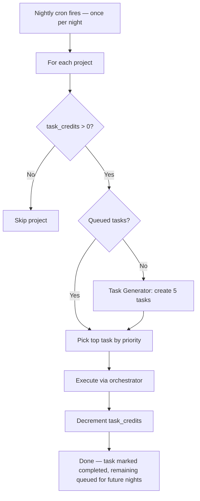
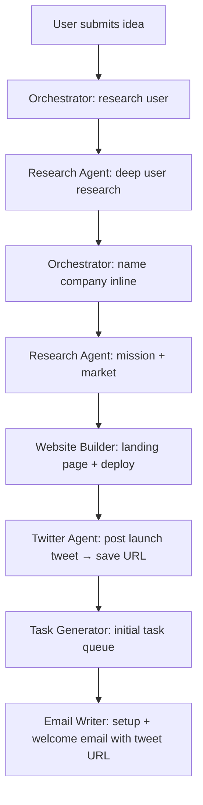
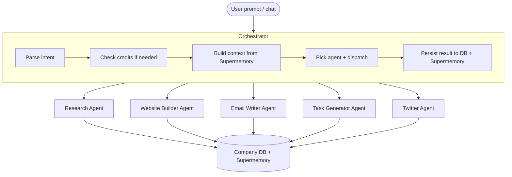
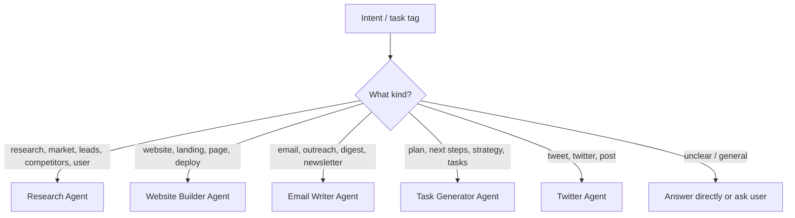
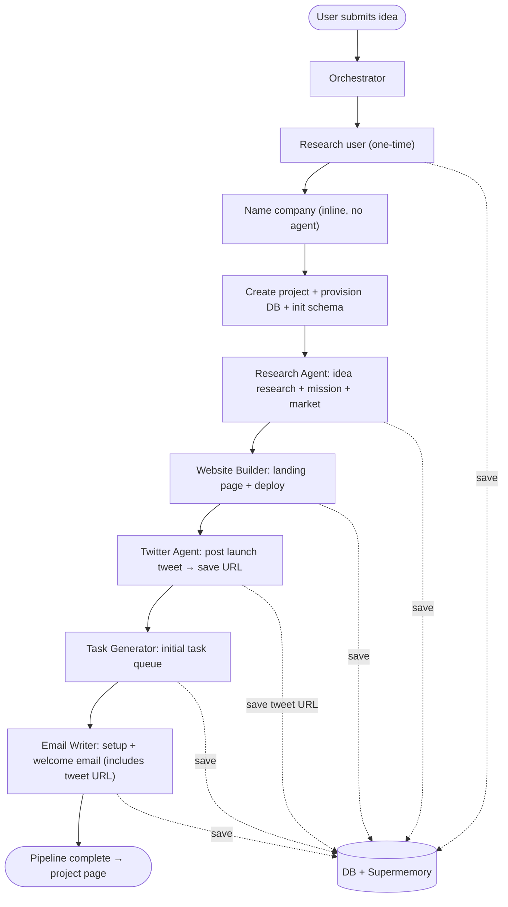
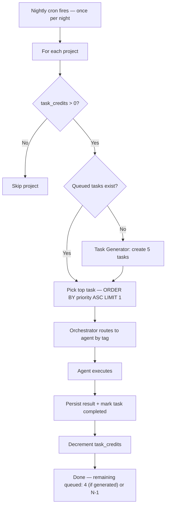
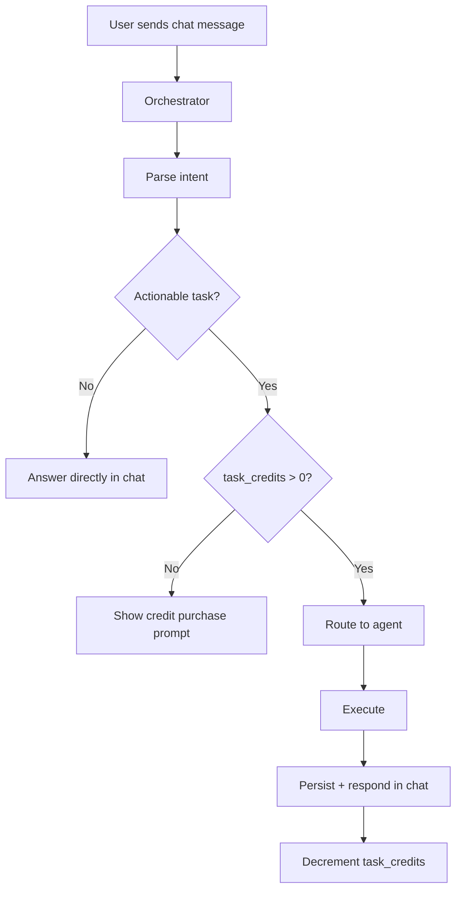
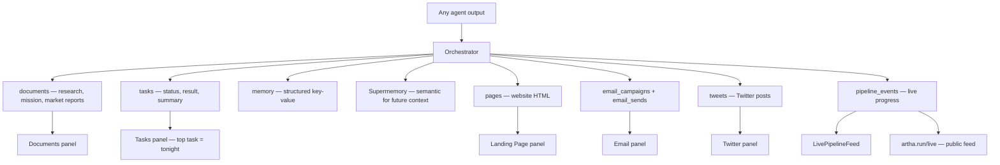

# Artha — Multi-agent architecture

How the company-building pipeline is broken into specialized agents, how the orchestrator delegates, and how data flows through the system.

**Agent docs:**

- [Research Agent](./research-agent.md)
- [Website Builder Agent](./website-builder-agent.md)
- [Email Writer Agent](./email-writer-agent.md)
- [Task Generator Agent](./task-generator-agent.md)
- [Twitter Agent](./twitter-agent.md)
- [Chat & Email interaction](./chat-and-email.md)
- [Credits & Pricing](../pricing/credits-and-pricing.md)

---

## Decisions log

Answers to design questions raised during architecture review.

### 1. Unified credit pool + subscription gating

One credit pool per project: `task_credits`. Every task execution — nightly, manual, chat, email — decrements the same number. No split pools, no confusion.

See [credits-and-pricing.md](../pricing/credits-and-pricing.md) for full pricing, cost analysis, and model selection strategy.

**Credit model:**

- **Subscription**: $49/month → 35 credits/month (40 first month with 5 bonus) — the only recurring plan
- **Credit pack**: $25 one-time → 15 credits — same pool, not a subscription
- Any trigger (nightly, manual, chat, email) decrements `task_credits`
- When `task_credits` hits 0, show a single modal with options (subscribe if no sub, or buy a credit pack)
- Nightly cron checks `task_credits > 0` only — not subscription status

**Automatic monthly credit renewal:**

- Stripe handles the billing cycle — every month, `invoice.paid` fires automatically for active subscriptions
- The webhook adds 35 credits to `task_credits` on each renewal (40 on first month via `billing_reason: subscription_create`)
- No cron job needed for credit renewal — it's entirely Stripe-driven
- If payment fails (`invoice.payment_failed`), no credits are added and subscription goes to `past_due`
- Credit pack purchases are handled separately via `checkout.session.completed` with `metadata.type === 'credit_pack'`




**Note:** No subscription check — credit-gated only. If queue is empty, generate 5 tasks first then execute top one.

### 2. No naming agent — each agent names inline

Removed as a standalone agent. Company naming during onboarding is handled by the Research Agent as part of its first response (it already has the idea context — asking it to also return a name + tagline is one extra field in the JSON, not an extra call). When any other agent needs a short name (product name, campaign name, feature name), it generates one inline as part of its own prompt. No extra agent call, no extra cost.

Note: `generateJSON` is an AI call (OpenAI structured output) — it's not a utility function. Every `generateJSON` call costs tokens.

### 3. Twitter agent (not social media agent)

We only support Twitter right now. Calling it "Twitter Agent" directly — no social media router layer. The agent is built as a module (`src/lib/agents/twitter.ts`) so when we add LinkedIn later, we create `src/lib/agents/linkedin.ts` and add a lightweight social router at that point. Until then, the orchestrator routes `social`/`twitter` tags directly to the Twitter Agent.

For now, all tweets post to **Artha's own Twitter handle** about user companies. When users can connect their own Twitter, we add an `oauth_tokens` table and the agent checks if the project has a connected account.

### 4. Email Writer: research vs writing split

**Research Agent** finds the people (lead research, ICP, contact discovery).
**Email Writer Agent** writes and sends emails to those people.

Flow:

```
Research Agent → finds leads → saves to contacts table
Email Writer Agent → reads contacts → writes personalized emails → sends via Postmark
```

The Email Writer never does research. It receives a list of contacts (or a task like "email the 10 leads from yesterday's research") and writes + sends.

### 5. Chat message = user prompt (same thing)

There is no distinction. The chat sidebar IS the prompt interface. When a user types in the chat, the orchestrator interprets it and may:

- Answer directly (general question)
- Route to an agent (actionable request like "build a pricing page")
- Create a task (deferred action)

There is no separate "prompt" input on the dashboard. The chat is the single interface for all user interactions with the AI.

### 6. Live feed at artha.run/live

A public page showing real-time activity across ALL user companies:

- Tasks executing right now
- Websites going live
- Emails being sent
- Companies being created

This reads from `pipeline_events` and `job_queue` across all projects (no auth required, but anonymized — show company first name or slug, not full details).

New route: `/live` — SSE or polling from a new API endpoint `/api/live-feed` that queries recent pipeline events and job completions across all projects.

### 7. Storage: Neon text columns (no object storage needed)

Documents are Markdown text. Landing pages are HTML strings. Both fit in Neon `TEXT` columns (up to 1GB per value, practically 10-50KB per document).

**No object storage needed** for now. Reasons:

- Documents are text (Markdown), not binary files
- Landing pages are self-contained HTML (inline CSS, no images yet)
- Neon TEXT columns handle this fine at our scale
- Avoids extra infra (S3/R2), extra latency, extra cost

**When to add object storage later:**

- User-uploaded images (logos, product photos)
- Generated images (AI-created graphics for landing pages)
- PDF exports of documents
- Large media files

At that point, add Cloudflare R2 (cheapest) and store URLs in a `files` table. Documents/pages keep a `TEXT` column for content and an optional `attachments JSONB` for file URLs.

### 8. Website Builder: beautiful UI is critical

The landing page prompt must produce genuinely beautiful, modern pages. This means:

- Detailed system prompt with specific design requirements (gradients, animations, typography, spacing)
- Reference modern design patterns (glassmorphism, subtle shadows, micro-interactions)
- Use a high-quality model (gpt-4o, not gpt-4o-mini) for landing page generation specifically
- Include the `made with ❤️ on artha.run` footer link on every page
- See [website-builder-agent.md](./website-builder-agent.md) for full prompt strategy

### 9. Hosting: Cloudflare Pages (cheapest, like Lovable/Bolt)

Lovable and Bolt.new both use **Cloudflare Pages** for hosting user sites. It's the cheapest option:


|                    | Cloudflare Pages                            | Vercel                      | Wildcard DNS + our app |
| ------------------ | ------------------------------------------- | --------------------------- | ---------------------- |
| **Cost**           | Free (500 builds/month, unlimited requests) | $20/mo per project at scale | Free but loads our app |
| **CDN**            | 300+ edge locations                         | Edge network                | Single origin          |
| **SSL**            | Automatic, free                             | Automatic                   | Need wildcard cert     |
| **Custom domains** | Free                                        | Free on paid plans          | Manual                 |
| **Isolation**      | Each site is independent                    | Each site is independent    | All sites = one app    |


**Approach:**

1. Each company gets a Cloudflare Pages project (created via API during onboarding)
2. HTML is pushed to a GitHub repo → Cloudflare auto-deploys
3. `{slug}.tryartha.com` is added as a custom domain on the Pages project
4. Cost: $0 for free users, scales to thousands of sites at no hosting cost

We already push to GitHub (step 12 in pipeline). Just need to:

- Connect repos to Cloudflare Pages via API
- Add custom domain `{slug}.tryartha.com` via Cloudflare API
- DNS: single `*.tryartha.com` CNAME → Cloudflare Pages

### 10. Explore each section in detail later

Each agent doc below covers its section in full detail. This is the starting architecture — we'll refine each agent as we build.

### 11. No tonight flag — top task in list = tonight

There is no `tonight` boolean column. The "tonight" task is simply the first queued task in the list, ordered by `priority ASC` (lowest number = highest priority). The nightly cron queries `WHERE status = 'queued' ORDER BY priority ASC LIMIT 1`.

On the frontend, the first task in the returned list gets a highlighted "TONIGHT" badge. No special DB flag needed — it's just list position.

### 12. Twitter agent is direct (no social router)

See point 3 above. Built as a standalone module. When we add more platforms, we add a lightweight router. The module structure (`src/lib/agents/twitter.ts`) makes this trivial.

### 13. First prompt: research user BEFORE naming

The pipeline order changes. Before naming the company, we research the user:




User research includes:

- Google profile data (name, email, avatar)
- Search their name + email across LinkedIn, Twitter, GitHub, personal sites
- Past projects, skills, strengths, experience
- How the project relates to their background
- What the user is strong at, where they should focus more

All saved to `users.google_data` (JSONB) and ingested into Supermemory with `userTag`. This research is done **once per user** (not per company). If the user creates a second company, we already have their profile — the same user research is linked to all their companies. Each company has its own separate data (documents, tasks, leads, research), but the user profile is shared. The `relevanceToProject` field is regenerated per company to capture how the user's background maps to each specific business.

### 14. No lead research in first prompt (cost saving)

Lead & customer research is expensive (multiple AI calls) and the user hasn't paid yet. The first prompt pipeline does:

- User research (one-time, valuable for all future context)
- Idea research (competitors, market — lightweight)
- Mission & strategy
- Landing page + deploy
- Email setup + welcome
- Task queue (which INCLUDES a "lead research" task suggestion)

Lead research, customer research, and outreach happen as on-demand tasks when the user triggers them (requires credits, not subscription specifically). The Research panel shows suggestions for these research types.

### 15. Chat is the primary interface (like Cursor)

The chat sidebar is the single input for all user interactions. It works like Cursor's chat:

- Always visible in the project dashboard sidebar
- Full chat history persisted in `chat_messages`
- Streams "thinking" steps while agents work (SSE, not single JSON response)
- Agent responses show what was done + links to results
- System messages appear for automated events (nightly tasks, inbound emails)

See [chat-and-email.md](./chat-and-email.md) for full details.

### 16. Email replies execute immediately

When a user replies to a company email (digest, welcome, etc.), the task executes immediately — don't make them wait for nightly cron. After completion, send a reply email with the result and log a system message in chat history. If no credits, reply with a "buy credits" link instead of silently failing.

### 17. Unified timeline in chat

Chat history is the single timeline for everything: user messages, agent responses, nightly task results, email-triggered tasks, manual task runs. All appear as messages (user/assistant/system) so the user has one place to see what happened.

---

## Overview (updated)




**5 agents** (down from 6 — naming removed, social media replaced with Twitter direct):


| Agent                     | Responsibility                                                                                   |
| ------------------------- | ------------------------------------------------------------------------------------------------ |
| **Research Agent**        | User research, idea research, mission, market research, lead finding, customer research, content |
| **Website Builder Agent** | Landing pages, full websites, deploy to Cloudflare Pages via GitHub                              |
| **Email Writer Agent**    | Welcome, digests, cold outreach (with confirmation), newsletters, inbound replies — writing + sending only (not research) |
| **Task Generator Agent**  | Decide what to do next, maintain 5 queued tasks, assign tags + agents                            |
| **Twitter Agent**         | Compose + post tweets on Artha's handle (later: user's connected handle)                         |


---

## Orchestrator

The orchestrator is the single entry point for all AI work.

### When does it run?


| Trigger                       | What happens                                                                                                                |
| ----------------------------- | --------------------------------------------------------------------------------------------------------------------------- |
| **First prompt** (onboarding) | Run pipeline: user research → name (inline) → idea research → mission → market → landing page → deploy → **launch tweet** → task queue → welcome email |
| **User sends chat message**   | Parse intent → route to agent or answer directly                                                                            |
| **User runs a task manually** | Check `task_credits` → route to agent by task tag → decrement                                                               |
| **Nightly cron**              | Check `task_credits > 0` → if queue empty, generate 5 tasks → execute top task → mark done → decrement credit               |
| **Inbound email**             | Route through orchestrator — parse intent, assign to appropriate agent, reply in same email thread                           |


### How it picks an agent




### Orchestrator responsibilities

1. **Credit check** — Before any task execution, verify `task_credits > 0` (same pool for all triggers)
2. **Context building** — Pull from Supermemory (company profile, relevant memories, user profile) + company DB memory table
3. **sAgent dispatch** — Call the right agent with `AgentInput`
4. **Persistence** — Write `AgentOutput` to all relevant stores (documents, tasks, memory, Supermemory, pages, emails, tweets, pipeline events)
5. **Follow-up** — After task completes, call Task Generator to top up queue back to 5 queued tasks

---

## First prompt pipeline (updated)



**Why tweet before welcome email:** The launch tweet URL is included in the welcome email ("What's live → Tweet from @tryarthaHQ"). The tweet step runs after the landing page is built (so the landing page URL is available to include in the tweet), and before the welcome email is sent (so the tweet URL is available to include in the email).

### Step breakdown

| Step | Who | What | AI calls |
| ---- | --- | ---- | -------- |
| Research user | Research Agent | Search user's name/email, find socials, background, skills, strengths | 1 call (or skip if already researched) |
| Name company | Research Agent (inline) | Returns name + tagline as part of idea research response | 0 extra calls (bundled) |
| Create project | Orchestrator (direct) | Insert project, provision Neon DB, init schema (includes `tweets` table) | 0 AI calls |
| Idea research + mission + market | Research Agent | Competitors, market size, timing, mission doc, market research doc | 3-4 calls (batched in one agent run) |
| Landing page + deploy | Website Builder | Generate beautiful HTML, push to GitHub, deploy to Cloudflare Pages | 1 call (gpt-4o for quality) |
| **Launch tweet** | **Twitter Agent** | **Post intro tweet from @tryarthaHQ with company name, tagline, landing page URL. Save tweet URL to `tweets` table + `projects.first_tweet_url`** | **0 AI calls — template-built tweet** |
| Task queue | Task Generator | Generate 5 initial tasks with tags, ordered by priority | 1 call |
| Email setup + welcome | Email Writer | Configure email, send welcome from agents@artha.run to founder's Gmail — includes tweet URL in "What's live" list (template, no AI) | 0 AI calls |

**Total AI calls for first prompt: ~6-7** (welcome email and launch tweet are both templates — 0 AI calls each)

**What's NOT in first prompt (deferred to post-subscription tasks):**

- Lead & customer research
- Cold outreach
- Complex website pages (beyond the landing page)

---

## Ongoing operation

### Nightly cycle (credit-gated, not subscription-gated)

The nightly cron runs once per night. It only checks `task_credits > 0` — not subscription status. This means cancelled subscribers with remaining credits still get nightly execution. If the queue is empty, it generates 5 new tasks first, then executes the top one.




**Key rules:**

- No subscription check — only `task_credits > 0` matters
- If queue is empty → generate 5 tasks first, then execute top one (4 remain for future nights)
- One task per project per night
- After execution, the completed task is marked done and removed from the queue

### User-triggered execution




---

## Data flow




### What user sees vs what's saved


| Data                               | User sees?                                     | Where saved                            |
| ---------------------------------- | ---------------------------------------------- | -------------------------------------- |
| Research documents                 | Yes — Documents panel                          | documents + Supermemory                |
| Task list + results                | Yes — Tasks panel (top 3 shown, top = tonight) | tasks + Supermemory                    |
| Landing page                       | Yes — Landing Page panel + live URL            | projects + pages + GitHub + Cloudflare |
| Emails sent                        | Yes — Email panel                              | email_campaigns + email_sends          |
| Tweets posted                      | Yes — Twitter panel                            | tweets table + projects.first_tweet_url |
| Company name + tagline             | Yes — everywhere                               | projects + company_profile + memory    |
| User research (skills, background) | No                                             | users.google_data + Supermemory        |
| Agent reasoning / raw context      | No                                             | Supermemory + memory table             |
| Competitor raw data                | No (only in research doc)                      | memory + Supermemory                   |


---

## Agent implementation

```
src/lib/agents/
├── orchestrator.ts       — routing, context, persistence, credit checks
├── research.ts           — Research Agent
├── website-builder.ts    — Website Builder Agent
├── email-writer.ts       — Email Writer Agent
├── task-generator.ts     — Task Generator Agent
├── twitter.ts            — Twitter Agent (standalone module)
└── types.ts              — AgentInput, AgentOutput, TaskTag, AgentName
```

### Agent interface

```typescript
interface AgentInput {
  prompt: string;
  context: string;           // built by orchestrator from Supermemory
  projectId: string;
  userId: string;
  taskId?: string;           // if triggered by a task
  metadata?: Record<string, unknown>;
}

interface AgentOutput {
  success: boolean;
  summary: string;
  documents?: { type: string; title: string; content: string; metadata?: Record<string, unknown> }[];
  memoryUpdates?: { key: string; value: unknown }[];
  supermemoryIngestions?: { content: string; customId: string; metadata?: Record<string, unknown> }[];
  tasksCreated?: { title: string; description: string; tag: string; agent: string }[];
  emails?: { to: string; subject: string; html: string }[];
  tweets?: { content: string; threadId?: string }[];
  pages?: { slug: string; title: string; html: string }[];
  error?: string;
}

type TaskTag = "research" | "marketing" | "cold-outreach" | "engineering" | "social" | "content";
type AgentName = "research" | "website_builder" | "email_writer" | "task_generator" | "twitter";
```

---

## Schema changes

### Platform DB: unified credits

```sql
-- Replace split credit columns with one pool
ALTER TABLE projects DROP COLUMN IF EXISTS nightly_tasks_remaining;
ALTER TABLE projects DROP COLUMN IF EXISTS ondemand_credits_remaining;
ALTER TABLE projects ADD COLUMN task_credits INTEGER DEFAULT 0;
```

```sql
-- Replace both decrement functions with one
CREATE OR REPLACE FUNCTION decrement_task_credits(p_project_id UUID)
RETURNS VOID AS $$
BEGIN
  UPDATE projects
  SET task_credits = GREATEST(task_credits - 1, 0)
  WHERE id = p_project_id AND task_credits > 0;
END;
$$ LANGUAGE plpgsql;
```

### Modify `tasks` table (company DB)

```sql
ALTER TABLE tasks ADD COLUMN tag TEXT;
ALTER TABLE tasks ADD COLUMN agent TEXT;
-- No tonight column — top task by priority is tonight
```

### Modify `chat_messages` table (company DB)

```sql
ALTER TABLE chat_messages ADD COLUMN type TEXT DEFAULT 'chat';
ALTER TABLE chat_messages ADD COLUMN metadata JSONB DEFAULT '{}';
```

### New table: `tweets` (company DB)

```sql
CREATE TABLE tweets (
    id UUID PRIMARY KEY DEFAULT uuid_generate_v4(),
    content TEXT NOT NULL,
    thread_id UUID,
    status TEXT DEFAULT 'draft',
    scheduled_for TIMESTAMPTZ,
    posted_at TIMESTAMPTZ,
    external_id TEXT,
    engagement JSONB DEFAULT '{}',
    task_id UUID,
    posted_on TEXT DEFAULT 'artha',
    created_at TIMESTAMPTZ DEFAULT NOW()
);
```

### Platform DB: live feed support

The existing `pipeline_events` and `job_queue` tables already support the `/live` feed. New endpoint reads recent events across all projects with anonymized data.