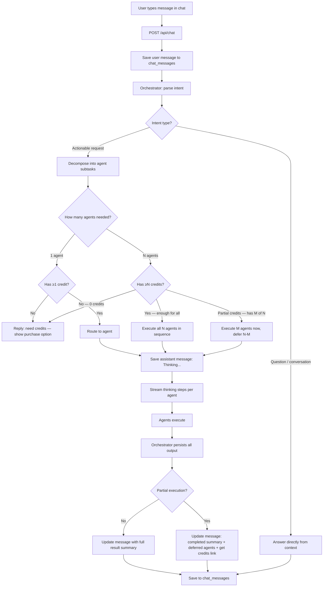
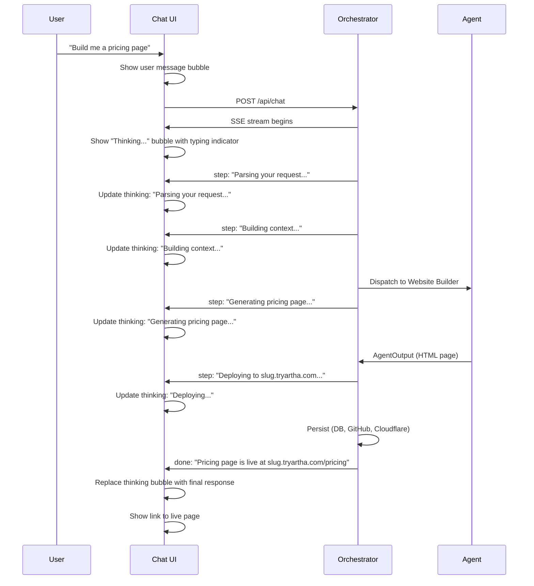
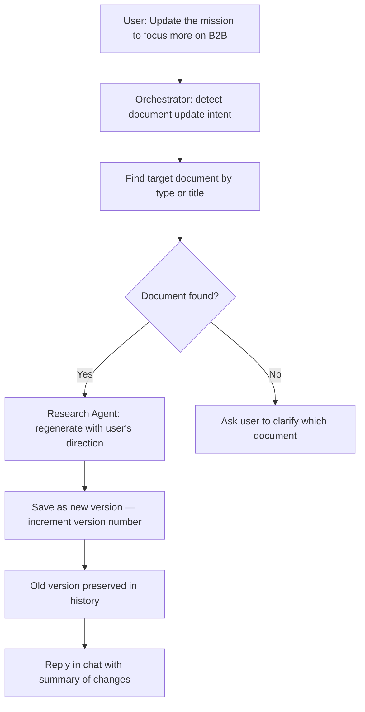
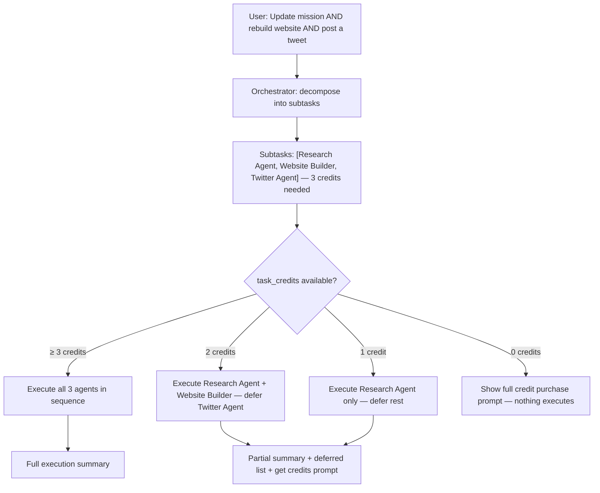
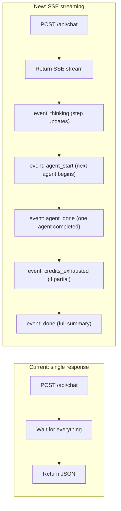
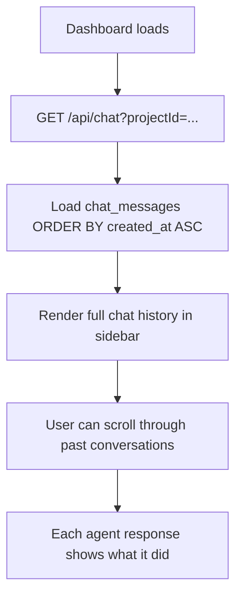
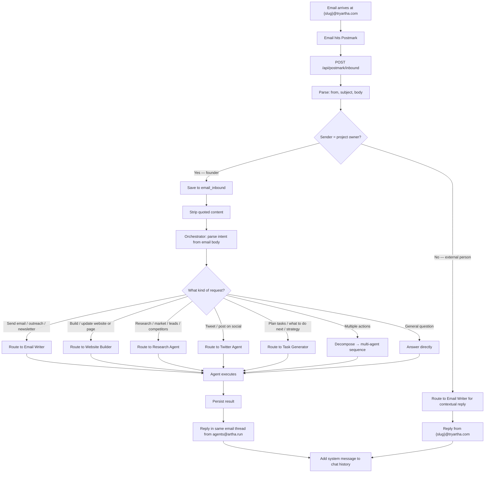
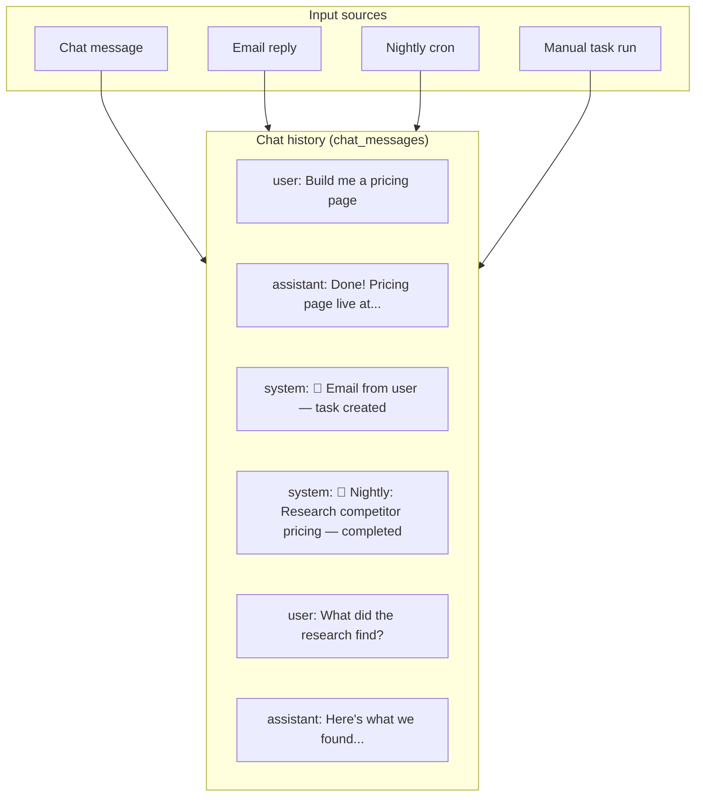

# Chat & email interaction model

The chat sidebar is the primary interface for users to interact with their company's AI. Email replies to company updates are a secondary input that triggers the same execution pipeline.

---

## Chat interface

The chat lives in the project dashboard sidebar — like Cursor's chat, always accessible while viewing any panel. It features a fixed input at the bottom and a scrollable message area. The width is set to `w-96` (384px) to accommodate detailed task information.

### Chat flow (full lifecycle)



### What the user sees during execution



### Document updates via chat

Users can update any existing document (mission, market research, etc.) by asking in chat. The user controls their company — they can refine, rewrite, or extend any document at any time.



**How it works:**
- User says "update the mission statement" or "rewrite the market research to include fintech"
- Orchestrator identifies the target document (by type, title, or context)
- The relevant agent regenerates the document incorporating the user's feedback
- The document is saved as a **new version** (version number incremented), preserving history
- Uses 1 credit per document update

**Examples:**
- "Update the mission to be more focused on enterprise customers"
- "Add a section about AI trends to the market research"
- "Rewrite the competitor analysis — we have a new competitor called Acme"
- "Change the pricing strategy to include a freemium tier"

### Multi-agent requests

When a user asks for something that spans multiple agents — e.g. "update the mission and rebuild the website" — the orchestrator decomposes the request into sequential subtasks, each costing 1 credit, and executes as many as the user's credit balance allows.

#### Credit check for multi-agent requests



#### What the user sees after partial execution

When the user has 4 credits and a request needs 5 agents, the chat response shows:

```
✅ Done — here's what completed:

1. Mission updated → v3 saved
2. Website rebuilt → live at slug.tryartha.com
3. Market research refreshed → 3 new findings
4. Tweet posted → view on Twitter

⚠️ 1 task needs more credits:
   • Email campaign draft (Email Writer Agent)

You used 4 credits. Add more to run the remaining task.
→ [Get more credits](https://artha.run/pricing)   or   [Subscribe — $49/mo for 35 credits](https://artha.run/pricing#subscribe)
```

#### Execution rules for multi-agent requests

- Agents run **sequentially** (each agent's output may be context for the next — e.g. mission update feeds into website rebuild)
- Credits are decremented **per agent** as each one completes — not all upfront
- If the user runs out of credits mid-sequence, remaining agents are listed as deferred
- Deferred agents are surfaced as queued tasks so they can run next nightly cycle or when credits are added
- The summary always shows: **completed** (with links), **deferred** (with agent names), and a **credit purchase link**

#### Credit purchase prompt (in chat)

```typescript
// Shown inline in chat when credits run out mid-sequence or before execution
{
  type: "credit_prompt",
  completed: ["Research Agent", "Website Builder"],
  deferred: ["Twitter Agent"],
  creditsUsed: 2,
  creditsNeeded: 1,
  links: {
    creditPack: "https://artha.run/pricing#credit-pack",  // $25 → 15 credits
    subscribe: "https://artha.run/pricing#subscribe"       // $49/mo → 35 credits/mo
  }
}
```

The UI renders this as an inline card in the chat bubble — not a modal — so it doesn't interrupt the flow.

---

### Thinking steps (what to show)

The chat streams intermediate steps so the user knows what's happening:

| Phase | What user sees |
|-------|---------------|
| Intent parsing | "Understanding your request..." |
| Credit check | (silent — only shows if no credits) |
| Context building | "Gathering company context..." |
| Agent dispatch | "Working on it..." or specific like "Generating pricing page..." |
| Agent working | Agent-specific steps (e.g. "Designing layout...", "Writing copy...") |
| Persistence | "Saving..." / "Deploying..." / "Sending email..." |
| Done | Final response with result summary + links |

### Streaming implementation

The current `/api/chat` returns a single JSON response. This needs to change to **Server-Sent Events (SSE)** for streaming:



**SSE event format (single agent):**

```typescript
// Thinking step — streamed as agent works
event: thinking
data: {"step": "Generating pricing page...", "agent": "website_builder"}

// Task created as a side-effect of the agent
event: task_created
data: {"taskId": "uuid", "title": "Build pricing page", "tag": "engineering"}

// Single agent done
event: done
data: {
  "message": "Pricing page is live!",
  "links": [{"label": "View page", "url": "..."}],
  "taskId": "uuid"
}

### Live Task Synchronization
When a chat interaction finishes (Server-Sent Event closes), the frontend calls `liveTask.syncActiveTask()` to ensure any newly triggered tasks appear immediately in the **Live Pipeline Feed** card on the dashboard.

```

**SSE event format (multi-agent):**

```typescript
// Orchestrator signals how many agents will run
event: plan
data: {
  "agents": ["research", "website_builder", "twitter"],
  "creditsRequired": 3,
  "creditsAvailable": 5,
  "willExecute": ["research", "website_builder", "twitter"],
  "deferred": []
}

// Each agent announces itself when it starts
event: agent_start
data: {"agent": "research", "agentIndex": 1, "totalAgents": 3, "step": "Updating mission..."}

// Thinking steps continue per-agent (same format as single agent)
event: thinking
data: {"step": "Analysing B2B market fit...", "agent": "research"}

// Each agent announces its result when done (credits decremented here)
event: agent_done
data: {
  "agent": "research",
  "agentIndex": 1,
  "summary": "Mission updated to v3 — B2B focus added",
  "links": [{"label": "View document", "url": "/docs/mission"}],
  "creditsRemaining": 4
}

// Emitted if credits run out before all agents finish
event: credits_exhausted
data: {
  "completed": ["research", "website_builder"],
  "deferred": ["twitter"],
  "creditsUsed": 2,
  "creditsNeeded": 1,
  "purchaseUrl": "https://artha.run/pricing#credit-pack",
  "subscribeUrl": "https://artha.run/pricing#subscribe"
}

// Final event — always emitted, summarises everything
event: done
data: {
  "message": "Done! 2 of 3 tasks completed.",
  "completed": [
    {"agent": "research", "summary": "Mission updated", "links": [...]},
    {"agent": "website_builder", "summary": "Website rebuilt", "links": [...]}
  ],
  "deferred": [
    {"agent": "twitter", "reason": "out_of_credits"}
  ],
  "creditsUsed": 2,
  "creditsRemaining": 0,
  "showCreditPrompt": true
}
```

**UI behaviour for `done` event:**

| Field | What UI does |
|-------|-------------|
| `completed[]` | Render a result card per agent with summary + links |
| `deferred[]` | Render a muted "pending" row per deferred agent with reason |
| `showCreditPrompt: true` | Render inline credit card below the result (not a modal) |
| `creditsRemaining` | Update credit counter in sidebar header |

---

## Chat history

All messages are stored in the company DB `chat_messages` table and loaded on dashboard open.



### Message types in history

| Role | Content | UI treatment |
|------|---------|-------------|
| `user` | User's message | Right-aligned bubble |
| `assistant` | AI response (question answer) | Left-aligned bubble |
| `assistant` | AI response (task executed) | Left-aligned bubble with result card (link to doc/page/task) |
| `system` | Automated event ("Nightly task completed") | Centered, muted, smaller text |

### System messages

When things happen outside of chat (nightly tasks, inbound emails), system messages appear in the chat so the user has a complete timeline:

```
────────────────────────────────────
  🌙 Nightly task completed: "Research competitor pricing"
  View result →
────────────────────────────────────
```

```
────────────────────────────────────
  📧 Email received from john@acme.com
  Subject: "Interested in your product"
  Task created: Reply to John →
────────────────────────────────────
```

---

## Email-triggered execution

When a user replies to a company update email (digest, welcome, etc.) or sends a new email to `{slug}@tryartha.com`, it goes through the **main orchestrator** — the same routing logic as chat messages. The orchestrator parses intent and assigns to the appropriate agent (not always the Email Writer).

### Flow



### Key behavior

- **Founder emails go through the orchestrator** — same routing as chat. The orchestrator decides which agent handles it.
- **External emails** (from leads, customers) go to the Email Writer for a contextual reply.
- **Reply-in-thread** — after the assigned agent completes, the orchestrator replies in the **same email thread** so the founder sees the result where they asked.
- **Immediate execution** — email replies execute immediately because the user is actively engaged. Don't make them wait for nightly cron.

### Result email (reply in thread)

After the task completes, send a reply in the same email thread:

```
From: Artha <agents@artha.run>
To: founder@gmail.com
In-Reply-To: <original-message-id>
Subject: Re: {original subject}

Done! Here's what happened:

{task summary}

{links to results if any}

---
View full details in your dashboard:
https://artha.run/dashboard/{slug}
```

For external person replies (not the founder):

```
From: {companyName} <{slug}@tryartha.com>
To: external@email.com
In-Reply-To: <original-message-id>
Subject: Re: {original subject}

{contextual reply body}
```

### Credit handling for email-triggered tasks

- If the routed task costs credits → check `task_credits > 0` before executing
- If no credits → reply in the email thread: "You're out of credits. Purchase more to keep your company running: {link}"
- Answering questions (no agent dispatch) is free — no credit cost
- Don't silently fail — always respond to the email

---

## Chat + email unified timeline

The chat history becomes the single source of truth for everything that happened:



### Schema update for chat_messages

```sql
ALTER TABLE chat_messages ADD COLUMN type TEXT DEFAULT 'chat';
-- type: 'chat' (normal), 'system' (automated events), 'email' (from email)

ALTER TABLE chat_messages ADD COLUMN metadata JSONB DEFAULT '{}';
-- metadata: {agent, taskId, links[], thinkingSteps[], emailId, source}
```

This lets the UI render different message types differently and link to relevant results.

---

## Summary

| Input | Execution | Response | Shows in chat? |
|-------|-----------|----------|---------------|
| Chat: question | Instant (no agent) | Chat reply | Yes |
| Chat: single actionable request | 1 agent executes, streams thinking | Chat reply with result card | Yes |
| Chat: multi-agent request (enough credits) | N agents execute sequentially, one `agent_start`/`agent_done` event each | Full summary card per agent | Yes |
| Chat: multi-agent request (partial credits) | M of N agents execute, rest deferred | Summary of completed + deferred list + inline credit prompt | Yes |
| Chat: actionable request (0 credits) | Nothing executes | Inline credit purchase prompt | Yes |
| Email reply | Immediate task execution (all 5 agents routable) | Reply email + system message in chat | Yes (system msg) |
| Nightly cron | Auto task execution | Digest email next morning | Yes (system msg) |
| Manual task run (click Run) | Agent executes | Task status updates in panel | Yes (system msg) |
