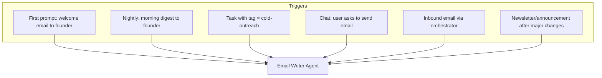
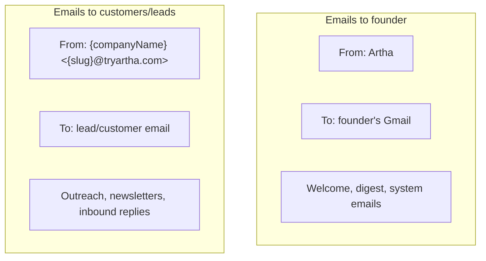
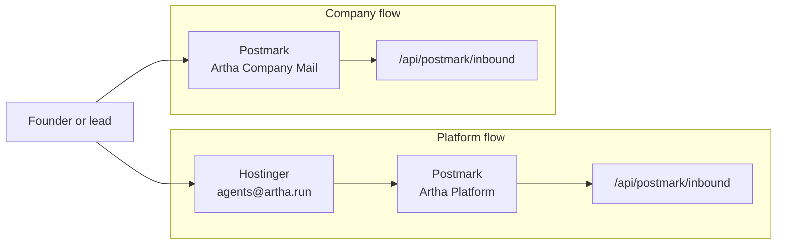
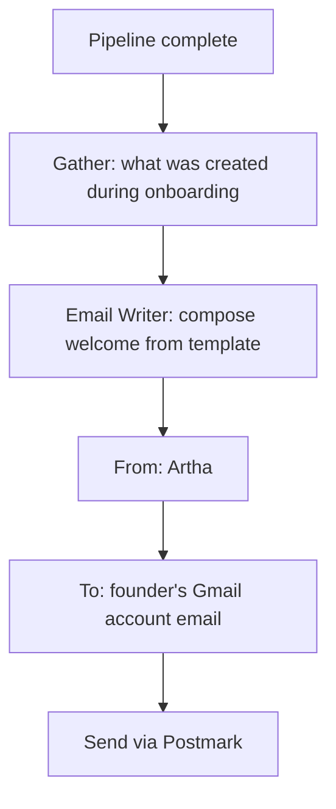
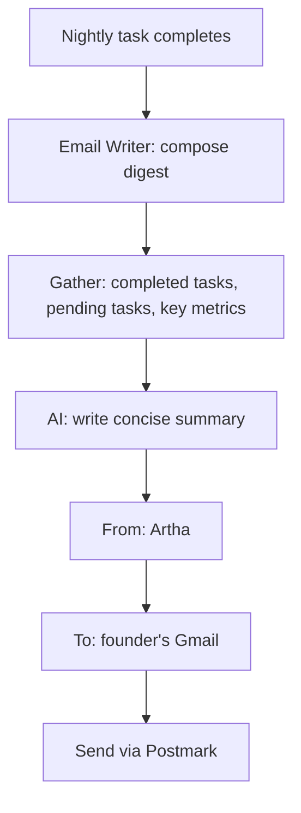
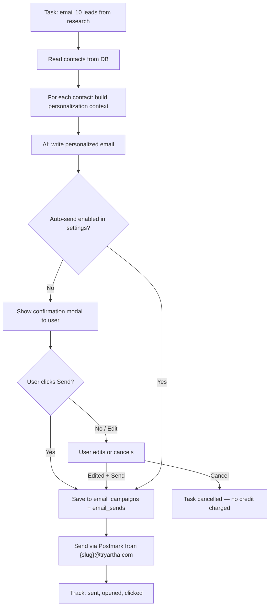
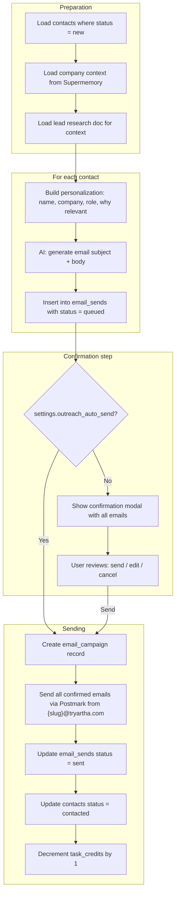
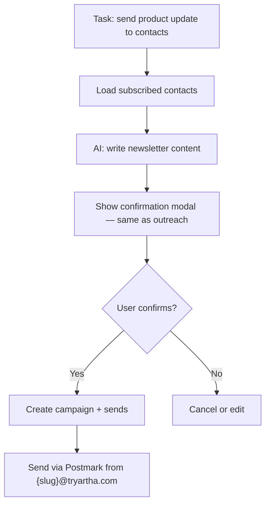
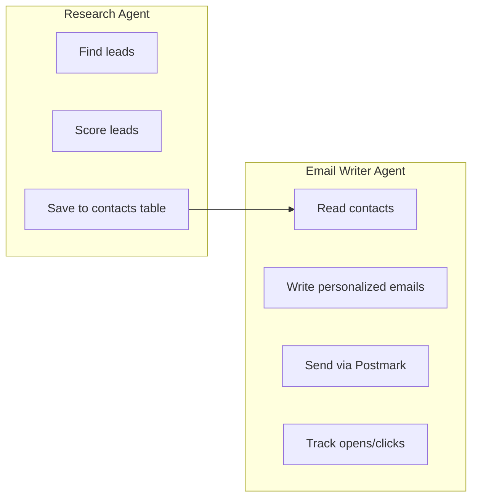
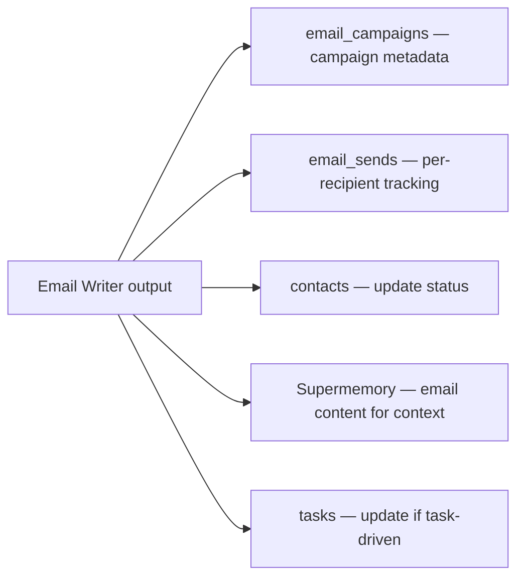

# Email Writer Agent

Writes and sends emails. Does NOT research or find contacts — it receives a target (or reads from the `contacts` table) and writes + sends.

**Code:** `src/lib/agents/email-writer.ts`

---

## When does it run?



---

## Email addresses: who sends from where

Two distinct email identities:

| Address | Purpose | Used for |
|---------|---------|----------|
| `agents@artha.run` | Artha platform → founder | Welcome email, morning digest, system notifications |
| `{slug}@tryartha.com` | Company → customers/leads | Cold outreach, newsletters, inbound replies |

**Rules:**
- Emails TO the founder always come from `agents@artha.run` (Artha talking to the founder)
- Emails TO customers/leads always come from `{slug}@tryartha.com` (the company talking to its audience)
- The founder can see history of `{slug}@tryartha.com` emails in the Email panel, send from this address via the agent, etc.

**Delivery / receiving path:**
- `agents@artha.run`: Hostinger receives the mail, forwards only that address to the Postmark platform inbound stream, and Artha processes the inbound webhook
- `{slug}@tryartha.com`: Postmark receives the entire domain directly via MX and Artha maps the recipient slug to the project
- `{slug}.tryartha.com`: website only, served by Cloudflare Pages and unrelated to email routing





---

## Email types

### 1. Welcome email (first prompt)

Sent at the end of onboarding after the pipeline completes. Template email — no AI needed. Includes a summary of everything that was just built for the founder, similar to how Polsia sends a "Foundry is ready" email.



**Template content:**

```
Subject: {companyName} is ready

{founderFirstName}, here's what I built for {companyName} today:

**Research:** {researchSummary}
(e.g. "Dug into the AI agent market ($7.4B and growing 41% annually). Mapped 6 competitors. {companyName}'s angle is depth over breadth, running fewer companies with higher-quality autonomous execution.")

**What's live:**
• Landing page: {slug}.tryartha.com
• Company email: {slug}@tryartha.com
• Tweet from @tryarthaHQ
• Mission document

**{taskCount} tasks queued for cycle 1:**
1. {task1Title} — {task1Description}
2. {task2Title} — {task2Description}
3. {task3Title} — {task3Description}

Subscribe to start your first operating cycle and I'll get to work.

— {companyName} (Powered by Artha)

[View Dashboard →]
```

**Data sources (all from DB, no AI):**

| Field | Source |
|-------|--------|
| `founderFirstName` | `users.name` (split first name) |
| `companyName` | `projects.name` |
| `researchSummary` | `documents` where type = 'market_research' — first 1-2 lines |
| `slug` | `projects.slug` |
| Landing page URL | `{slug}.tryartha.com` |
| Company email | `{slug}@tryartha.com` |
| Tweet link | `projects.first_tweet_url` — set during the pipeline's `tweet_launch` step; falls back to omitting the line if no Twitter creds configured |
| Mission document | Link to dashboard documents panel |
| Task list | `tasks` table — top 3 queued tasks by priority |
| `taskCount` | Count of queued tasks |

**AI calls:** 0 — pure template, fill in the blanks from DB values gathered during the pipeline.

---

## Twitter / X integration

The pipeline posts a launch tweet from **@tryarthaHQ** as one of the onboarding steps (step 10b, between email setup and GitHub repo creation). The tweet announces the new company, links to the landing page, and is saved so it can be included in the welcome email.

### Tweet format

```
Introducing {companyName} — {tagline}

{oneLiner — first sentence of idea research summary}

{landingPageUrl}

— @tryarthaHQ
```

### Where the tweet URL is stored

| Location | Column / table | Used for |
|----------|---------------|----------|
| Platform DB | `projects.first_tweet_url` | Welcome email, dashboard display |
| Company DB | `tweets` table (`tweet_id`, `tweet_url`, `content`, `type='launch'`) | Per-company tweet history |

### Company DB `tweets` table schema

```sql
CREATE TABLE tweets (
  id        UUID PRIMARY KEY DEFAULT uuid_generate_v4(),
  tweet_id  TEXT NOT NULL,
  tweet_url TEXT NOT NULL,
  content   TEXT,
  type      TEXT DEFAULT 'launch',  -- 'launch' | 'update' | 'milestone'
  posted_at TIMESTAMPTZ DEFAULT NOW()
);
```

### Required environment variables

| Variable | Description |
|----------|-------------|
| `TWITTER_CLIENT_ID` | OAuth 2.0 client ID for the production X app |
| `TWITTER_CLIENT_SECRET` | OAuth 2.0 client secret for the production X app |
| `TWITTER_REFRESH_TOKEN` | Refresh token for Artha's production platform X account |
| `TWITTER_TEST_CLIENT_ID` | OAuth 2.0 client ID used locally when `NODE_ENV` is not `production` |
| `TWITTER_TEST_CLIENT_SECRET` | OAuth 2.0 client secret used locally when `NODE_ENV` is not `production` |
| `TWITTER_TEST_REFRESH_TOKEN` | Refresh token used locally when `NODE_ENV` is not `production` |
| `TWITTER_ACCOUNT_USERNAME` / `TWITTER_TEST_ACCOUNT_USERNAME` | Optional handles used for display and tweet URLs |

These credentials must be set to enable tweeting. Artha posts from its own configured X account, not from user accounts. Local/dev prefers `TWITTER_TEST_*` and production uses `TWITTER_*`. If the active app credentials or platform refresh token are missing, the `tweet_launch` pipeline step is skipped and the welcome email omits the tweet line.

**Code:** `src/lib/twitter.ts` — `postCompanyLaunchTweet()`

---

## Twitter dashboard panel

The **Twitter** tab in the dashboard (`src/components/panels/twitter-panel.tsx`) lets the founder post tweets directly from the dashboard without using any task credits.

### What it shows

- **Compose box** — free-text textarea with a live character counter (280-char limit). Posts immediately to @tryarthaHQ on submit.
- **Tweet history** — all tweets ever posted for this company, newest first, each with a "View ↗" link to the live tweet on X.

### How it works

```
User types tweet → POST /api/tweets { projectId, content }
  → Twitter API v2 posts the tweet
  → Saved to company DB `tweets` table
  → Row returned and prepended to history in UI
```

### API

```
GET  /api/tweets?projectId=...   → Tweet[]   (list all, newest first)
POST /api/tweets                 → Tweet     (post new, save, return)
  body: { projectId, content }
```

**Cost:** Free — no task credits, no AI calls. Direct Twitter API write.

### `tweets` table (company DB)

| Column | Type | Notes |
|--------|------|-------|
| `id` | UUID | Primary key |
| `tweet_id` | TEXT | Twitter's tweet ID |
| `tweet_url` | TEXT | Full `https://x.com/tryarthaHQ/status/...` URL |
| `content` | TEXT | Tweet text as posted |
| `type` | TEXT | `launch` \| `update` \| `milestone` \| `custom` |
| `posted_at` | TIMESTAMPTZ | Auto-set on insert |

Launch tweets (posted during onboarding pipeline) have `type = 'launch'`. All tweets composed from the dashboard have `type = 'custom'`.

### 2. Morning digest (nightly cron, subscribers only)

Sent every morning after the nightly task runs.



**Content includes:**
- What was done last night (task result summary)
- What's coming up (next 3 tasks, tonight's task)
- Key metrics (website visits, emails sent, revenue if any)
- One actionable suggestion

**AI calls:** 1 `generateCompletion` call

### 3. Cold outreach (post-subscription task)

The Research Agent finds leads and saves them to `contacts`. The Email Writer reads those contacts and writes personalized emails.

**Costs 1 task credit per outreach batch.**



**Confirmation modal (default behavior):**

Before sending any cold outreach email, show a confirmation modal to the user:

```
┌─────────────────────────────────────────────────────────┐
│ Review outreach email                            [✕]    │
├─────────────────────────────────────────────────────────┤
│                                                         │
│ To: john@acme.com (John Smith, CEO at Acme)             │
│                                                         │
│ Subject: Quick question about your workflow              │
│                                                         │
│ ┌─────────────────────────────────────────────────────┐ │
│ │ Hi John,                                            │ │
│ │                                                     │ │
│ │ I noticed Acme is scaling its ops team...           │ │
│ │ [full email body, editable]                         │ │
│ └─────────────────────────────────────────────────────┘ │
│                                                         │
│ Sending from: {companyName} <{slug}@tryartha.com>       │
│                                                         │
│                          [Cancel]  [Edit]  [Send ✓]     │
└─────────────────────────────────────────────────────────┘
```

For batch outreach (multiple contacts), show a list view with each email expandable, and a "Send All" button at the bottom.

**Auto-send setting:**

Users can enable auto-send in project settings (`settings.outreach_auto_send = true`). When enabled:
- Outreach emails send without confirmation
- Task completes automatically
- User still sees results in the Email panel after the fact

Default is `false` (always confirm).

**Flow detail:**



**AI calls:** 1 call per batch (generate all emails in one prompt with contact list), not 1 per contact. This keeps costs down.

### 4. Newsletter / announcement (post-subscription task)

Sent when the user wants to notify customers/contacts about significant changes — website redesign, new features, pricing updates, major milestones.

The Task Generator should **proactively suggest** newsletter tasks when it detects significant changes:
- Website was rebuilt or significantly updated
- New product feature was added
- Pricing changed
- Major milestone reached (first 100 users, revenue milestone, etc.)



**Task Generator integration:**

When the Task Generator runs and detects changes worth announcing, it should include a newsletter task in the queue:

```typescript
{
  title: "Send product update: website redesigned with new pricing page",
  description: "Notify subscribed contacts about the website redesign and new pricing page. Highlight key changes and include CTA.",
  tag: "cold-outreach",
  agent: "email_writer"
}
```

### 5. Inbound email → orchestrator → agent routing

When someone emails `{slug}@tryartha.com`, the email goes through the **main orchestrator** first — not directly to the Email Writer. The orchestrator parses intent and routes to the appropriate agent.

When the **founder** sends an email or replies to an existing email thread, it also goes through the orchestrator. If the intent is about sending an email (e.g., "send this to John"), the orchestrator assigns it to the Email Writer. After execution, the orchestrator replies in the **same email thread** where the founder originally wrote.

```mermaid
flowchart TD
    A[Inbound email received at {slug}@tryartha.com] --> B[POST /api/postmark/inbound]
    B --> C[Save to email_inbound]
    C --> D{Who sent it?}

    D -->|Founder / project owner| E[Orchestrator: parse intent from email body]
    D -->|External person| F[Orchestrator: parse intent — likely needs reply]

    E --> G{What kind of request?}
    G -->|Send email to someone| H[Route to Email Writer Agent]
    G -->|Build/update website| I[Route to Website Builder Agent]
    G -->|Research something| J[Route to Research Agent]
    G -->|General question| K[Answer directly]

    H --> L[Email Writer executes]
    L --> M[Send the requested email]
    M --> N["Reply to founder in same email thread with confirmation"]

    F --> O[Email Writer: draft contextual reply]
    O --> P["Send reply from {slug}@tryartha.com"]

    N --> Q[Log system message in chat history]
    P --> Q
```

**Key behavior:**
- Founder emails go through the orchestrator like any other input (chat, manual task)
- The orchestrator decides which agent handles it — not always the Email Writer
- After the assigned agent completes, the orchestrator sends a **reply in the same email thread** so the founder sees the result where they asked
- External emails (from leads, customers) are routed to Email Writer for contextual reply
- All email-triggered actions appear as system messages in the chat timeline

**Reply-in-thread format:**

```
From: Artha <agents@artha.run>
To: founder@gmail.com
In-Reply-To: <original-message-id>
Subject: Re: {original subject}

Done! Here's what happened:

{task summary}

{links to results if any}

---
View full details in your dashboard:
https://artha.run/dashboard/{slug}
```

**Credit handling:**
- If the routed task costs credits → check `task_credits > 0` before executing
- If no credits → reply in the email thread: "You're out of credits. Purchase more: {link}"
- Answering questions (no agent dispatch) is free — no credit cost

---

## Research Agent vs Email Writer: who does what?



| Task | Who | Why |
|------|-----|-----|
| Find people to email | Research Agent | Research is its specialty |
| Decide who to email | Task Generator (creates the task) | Strategy is its job |
| Write the email | Email Writer | Writing is its specialty |
| Send the email | Email Writer | It owns the Postmark integration |
| Track results | Email Writer | It owns the email tables |

---

## Execution flow

```mermaid
flowchart TD
    Orch[Orchestrator] --> Input[AgentInput]
    Input --> Classify{Email type?}
    Classify -->|welcome| Welcome[Template: welcome email]
    Classify -->|digest| Digest[AI: morning digest]
    Classify -->|outreach| Outreach[AI: personalized outreach batch]
    Classify -->|newsletter| Newsletter[AI: newsletter content]
    Classify -->|reply| Reply[AI: contextual reply]

    Welcome --> Output[AgentOutput with emails[]]
    Digest --> Output
    Outreach --> Output
    Newsletter --> Output
    Reply --> Output
```

The agent returns `AgentOutput.emails[]` — the orchestrator handles sending via Postmark and saving to `email_campaigns` / `email_sends`.

---

## Outreach confirmation settings

### Project settings schema

```typescript
interface ProjectSettings {
  outreach_auto_send: boolean;  // default: false
}
```

### API

```
PATCH /api/projects/:id/settings
{ "outreach_auto_send": true }
```

### Frontend

In the project Settings panel, add a toggle:

```
┌─────────────────────────────────────────────────────────┐
│ Email Settings                                          │
├─────────────────────────────────────────────────────────┤
│                                                         │
│ Auto-send outreach emails                    [  OFF  ]  │
│ When enabled, cold outreach and newsletter              │
│ emails send without confirmation. You can               │
│ still review them in the Email panel.                   │
│                                                         │
└─────────────────────────────────────────────────────────┘
```

---

## Data persistence



| What | Where | User sees? |
|------|-------|-----------|
| Campaign (subject, body, stats) | `email_campaigns` | Yes — Email panel |
| Per-send tracking | `email_sends` (sent_at, opened_at, clicked_at) | Yes — Email panel details |
| Contact status updates | `contacts.status` → 'contacted' | Future — Contacts panel |
| Inbound emails | `email_inbound` | Yes — Email panel |
| Email content | Supermemory | No — context for future agents |

---

## Cost optimization

| Email type | AI calls | Model | Credit cost | Notes |
|-----------|----------|-------|-------------|-------|
| Welcome | 0 | — | 0 (part of onboarding pipeline) | Template, no AI |
| Digest | 1 | gpt-4o-mini | 0 (free, runs after nightly task) | Short summary |
| Outreach (batch of 10) | 1 | gpt-4o-mini | 1 credit | All emails in one prompt |
| Newsletter | 1 | gpt-4o-mini | 1 credit | Single content piece |
| Reply (inbound) | 1 | gpt-4o-mini | 1 credit (if agent dispatch needed) | Short reply |

**Postmark cost:** $1.25 per 1000 emails (very cheap). The AI call is the main cost, not sending.

---

## Postmark setup for agents@artha.run

To send founder-facing emails from `agents@artha.run`:

1. **Domain verification:** Add `artha.run` as a verified sender domain in Postmark (DKIM + Return-Path DNS records)
2. **Sender signature:** Create a sender signature for `agents@artha.run` in Postmark
3. **Server token:** Use the platform Postmark server for founder-facing email
4. **Inbound forwarding:** Keep normal `artha.run` mail on your existing provider and forward only `agents@artha.run` to the Postmark platform inbound address

This keeps normal inboxes like `parth@artha.run` on the existing mailbox provider while still letting Artha process replies sent to `agents@artha.run`.
