# Research Agent

Responsible for all research, analysis, and strategic thinking. This is the most versatile agent — it handles user research, idea validation, mission generation, market analysis, lead finding, customer research, and general on-demand research.

**Code:** `src/lib/agents/research.ts`

---

## When does it run?

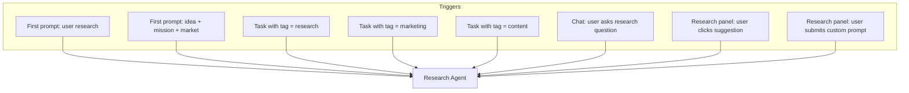

| Trigger | Research type | When |
|---------|-------------|------|
| First prompt (onboarding) | User research | Always (one-time per user) |
| First prompt (onboarding) | Idea research + mission + market | Always (per company) |
| Research panel suggestion | Ads, leads, customer, target audience, etc. | On-demand (uses credits) |
| Research panel custom prompt | Any research with optional tag | On-demand (uses credits) |
| Chat message | Any research question | On-demand (uses credits) |
| Task execution | Lead research, customer research, content | On-demand (uses credits) |

### Credit gating (not subscription gating)

Research tasks are **credit-gated, not subscription-gated**. As long as the user has `task_credits > 0`, they can run research — regardless of whether they have an active subscription. This covers:

- Active subscriber with credits remaining
- Cancelled subscriber who still has unused credits from their last billing cycle
- User who purchased a one-time credit pack

If `task_credits = 0`, show a single modal with all available options based on the user's subscription state.

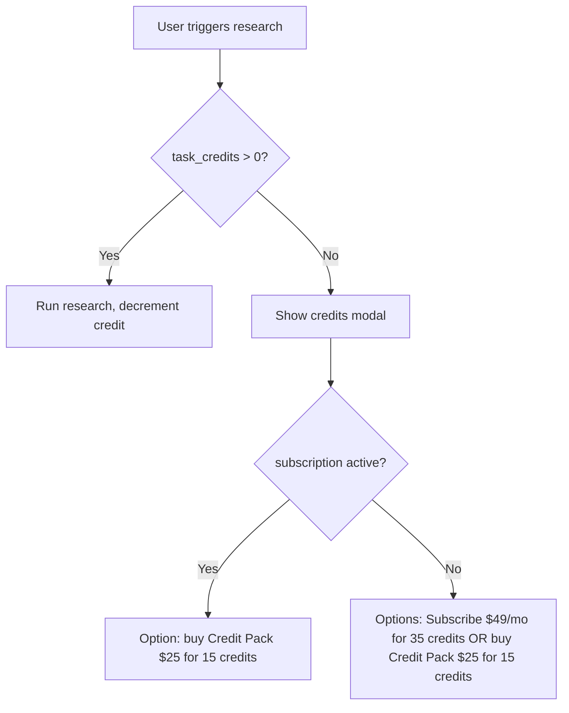

**Pricing options:**

| Option | Type | Price | Credits |
|--------|------|-------|---------|
| Pro Subscription | Recurring ($49/mo) | $49/month | 35 credits (40 first month) |
| Credit Pack | One-time purchase | $25 | 15 credits |

The modal adapts based on context — if the user has an active subscription, it only shows the credit pack (since they already subscribe). If no subscription, it shows both the subscription and the credit pack so the user can pick what works best. The $49/mo subscription is the only recurring plan. The $25 credit pack is a one-time purchase that adds credits to the same pool.

---

## Research panel (dashboard)

The Research panel is a dedicated tab in the project dashboard. It provides:

1. **Research suggestions** — pre-built research types based on the user's company
2. **Custom research modal** — user can write a prompt and optionally tag it
3. **Research history** — all past research documents with visual elements
4. **Quick access from chat** — user can also trigger research from the right chat sidebar

### Research suggestions

Based on the company the user created, we show contextual research suggestions. Clicking one triggers the research agent and produces a document on the dashboard.

| Suggestion | Tag | What it produces |
|-----------|-----|-----------------|
| Ads Research | `ads_research` | Ad platform analysis, budget recommendations, audience targeting, ROI projections with charts |
| Lead Finding | `lead_research` | Potential leads list saved to Leads table + research report |
| Customer Research | `customer_research` | ICP, pain points, buying triggers, customer journey map with visual flow |
| Target Audience Analysis | `target_audience` | Demographics, psychographics, behavior patterns with graphs |
| Competitor Analysis | `competitor_analysis` | Competitor breakdown, SWOT, market positioning chart |
| Market Trends | `market_trends` | Growing market indicators, trend graphs, opportunity sizing |
| Pricing Strategy | `pricing_research` | Competitor pricing, willingness-to-pay analysis, pricing model recommendations |
| Content Strategy | `content_research` | Content gaps, topic clusters, channel recommendations |

Each research document includes **visual elements where necessary**: graphs, analytics charts, market size visualizations, growth trend charts, user demographic breakdowns, and competitive positioning maps. These are rendered as embedded chart components in the document view.

### Custom research (modal + chat)

User can open a research modal from the Research panel or ask via chat sidebar:

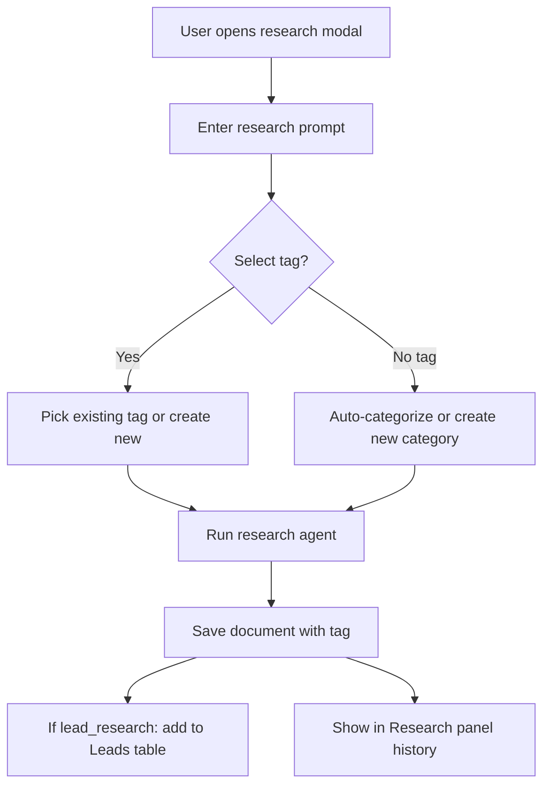

**From chat sidebar:** User can type research questions directly. The orchestrator detects research intent and routes to the Research Agent. Results appear in both chat and the Research panel.

### Custom research tags

Users can create custom research tags beyond the defaults. Custom tags are saved per project and appear in the tag picker for future research.

Default tags: `market_research`, `lead_research`, `customer_research`, `ads_research`, `target_audience`, `competitor_analysis`, `market_trends`, `pricing_research`, `content_research`

Custom tags: user-defined, stored in `research_tags` table.

---

## Research types

### 1. User research (one-time, first prompt)

Runs BEFORE naming the company. This is done once per user and reused across all their companies.

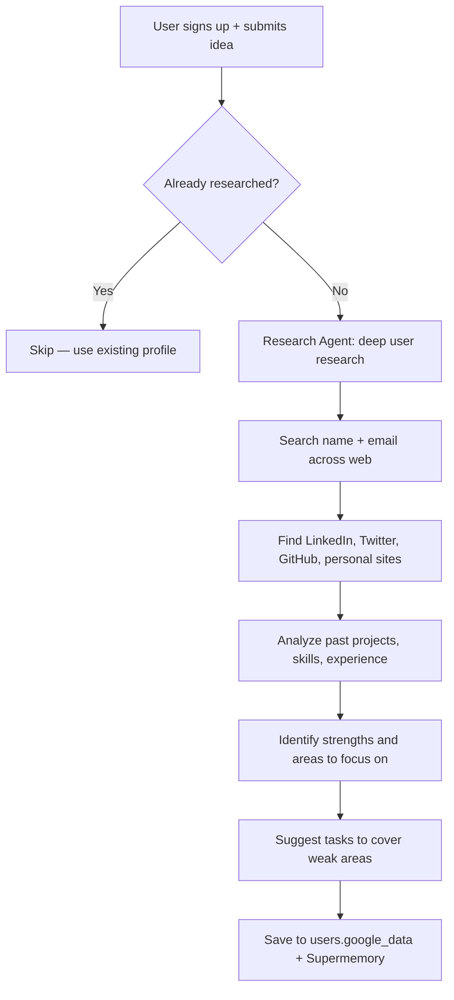

**What we search:**
- User's full name + email domain
- LinkedIn profile (title, experience, skills, connections)
- Twitter/X (bio, recent tweets, interests)
- GitHub (repos, languages, contributions)
- Personal website / blog
- Any public projects, companies, or products

**What we extract and save:**

```typescript
interface UserResearch {
  linkedinUrl?: string;
  twitterHandle?: string;
  githubUsername?: string;
  personalSite?: string;
  currentRole?: string;
  pastExperience: string[];       // "CTO at Acme Corp (2020-2023)"
  skills: string[];               // "React, Python, ML, Sales"
  strengths: string[];            // "Strong technical background", "Marketing experience"
  areasToFocusOn: string[];       // "Design skills", "Sales outreach", "Financial planning"
  suggestedTasks: string[];       // "Set up brand identity", "Create sales funnel", "Build financial model"
  interests: string[];            // "AI, SaaS, developer tools"
  relevanceToProject: string;     // "User has 5 years in fintech, project is a fintech tool — strong fit"
  socialProfiles: Record<string, string>;
}
```

**Key change:** Instead of "areas needing support", we identify **areas to focus on** — things the user may not have much experience with. Based on these, we generate suggested tasks so the user can cover gaps they might not think of on their own.

**Where it's saved:**

| Data | Where | Purpose |
|------|-------|---------|
| Full research JSON | `users.google_data.research` | Permanent user profile |
| Summary text | Supermemory (`userTag`) | Context for all future agent calls |
| Strengths + focus areas | `users.google_data.research.strengths` / `areasToFocusOn` | Task Generator uses this to suggest tasks for areas user should focus on |
| Suggested tasks | `users.google_data.research.suggestedTasks` | Pre-populate task queue with tasks covering user's blind spots |

**Multi-company linking:** User research is stored at the **user level** (`users.google_data.research`), not the company level. When a user has multiple companies:

- The same user research profile is shared across ALL their companies
- Each company's agents have access to the user's full background, skills, and strengths
- Each company has its own separate data (documents, tasks, leads, research history)
- The user profile is ingested into Supermemory with a `userTag` that all companies reference
- If the user's background is especially relevant to one company (e.g., fintech experience + fintech startup), the `relevanceToProject` field captures this per-company

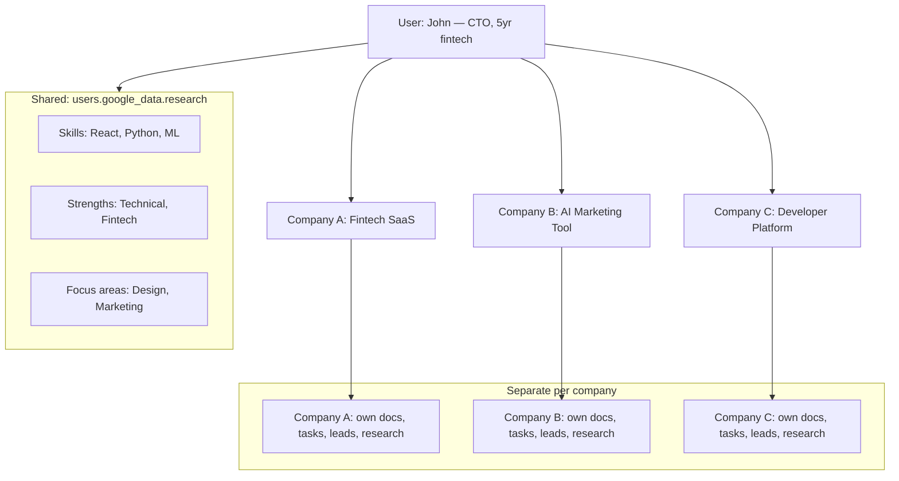

**Skip logic:** If `users.google_data.research` already exists, skip the web research. This means creating a second company doesn't re-research the user — it reuses the existing profile. The `relevanceToProject` field is regenerated per company to capture how the user's background maps to each specific business.

### 2. Idea research + company naming (first prompt)

Quick validation of the business idea. Also generates the company name + tagline inline (no separate naming agent — it's one extra field in the JSON response).

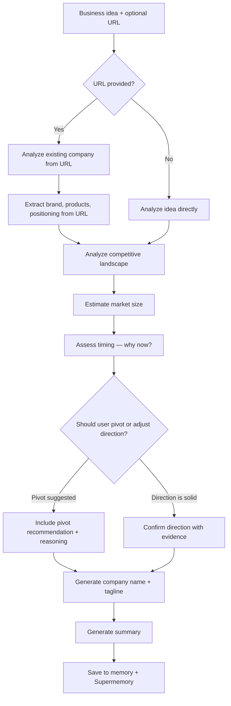

**If user provides a company URL:** We scrape/analyze the existing company website to understand their current brand, products, positioning, and market. This context is used throughout — including by the Website Builder agent to inform design decisions and maintain brand consistency.

**Pivot / direction suggestions:** The research agent does NOT blindly validate whatever the user asks for. If the data suggests the user should pivot, take a different route, or adjust their approach for better chances of success, the agent will say so with evidence and reasoning. This includes:
- Market too saturated → suggest a niche or adjacent market
- Timing is wrong → suggest waiting or a different entry strategy
- Better opportunity nearby → suggest pivoting to capture it
- Business model issues → suggest alternative monetization

**Output:** JSON with `companyName`, `tagline`, `competitors[]`, `marketSize`, `timing`, `summary`, `pivotSuggestion?`, `existingCompanyAnalysis?`

**AI calls:** 1 call (name + research bundled — no extra cost for naming)

### 3. Mission & strategy (first prompt)

Comprehensive mission document.

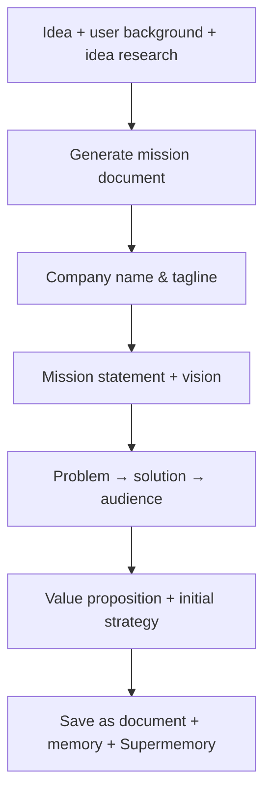

**Output:** Full Markdown document saved to `documents` table with `type = 'mission'`

**AI calls:** 1 `generateCompletion` call (max 3000 tokens)

### 4. Market research (first prompt)

Deeper competitive analysis with visual elements.

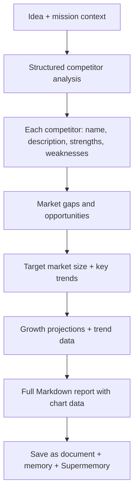

**Output:**
- JSON metadata: `competitors[]`, `gaps[]`, `targetMarketSize`, `keyTrends[]`, `growthData[]`, `chartData{}`
- Markdown report with embedded chart data: Executive Summary, Market Overview (with market size chart), Competitive Analysis (with positioning map), Gaps, Target Customer (with demographic breakdown), Growth Trends (with trend graph), Risks, Recommendations

**AI calls:** 2 calls (1 `generateJSON` for structured data, 1 `generateCompletion` for report)

### 5. Lead research (on-demand task)

Runs when user triggers it from the Research panel, chat, or task queue. NOT automatic.

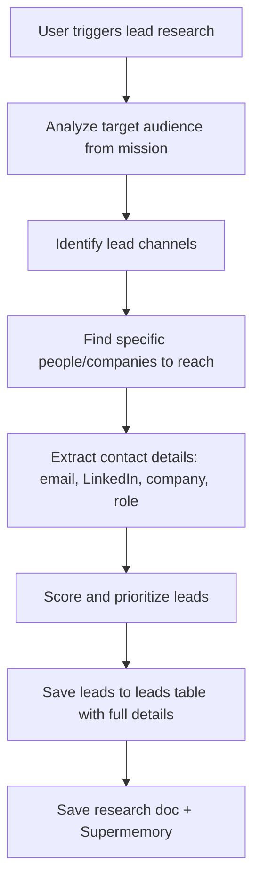

**Output:**
- `documents.type = 'lead_research'` — full report with analytics
- `leads` table — individual leads with name, email, linkedin_url, company, role, phone, source, score, notes, metadata
- Memory: `leadChannels`, `leadSources`, `outreachStrategy`

**Leads table integration:** When lead research finds new people, they are added to the existing leads list (not replaced). If a subsequent research finds the same person, their record is updated/merged rather than duplicated.

### 6. Customer research (on-demand task)

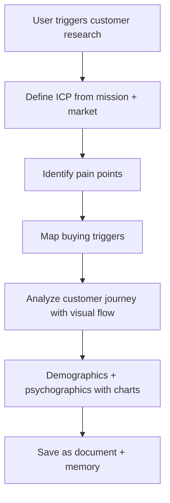

**Output:**
- `documents.type = 'customer_research'` with embedded chart data for demographics, journey map
- Memory: `icp`, `painPoints`, `buyingTriggers`

### 7. General research (any time)

Open-ended research triggered by chat, Research panel modal, or task.

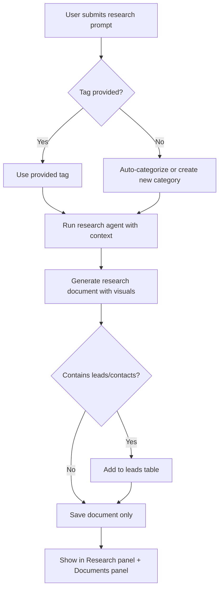

Examples: "Research competitor pricing models", "What's the best tech stack for our product?", "Find potential investors in our space", "Analyze social media trends in our niche"

**From chat sidebar:** User can ask research questions directly in chat. The orchestrator detects research intent and routes to the Research Agent. The result appears in chat AND is saved as a document in the Research panel.

### 8. Custom research tags and agents

Users can create custom research tags that persist per project. When a user creates a custom tag:

1. Tag is saved to `research_tags` table
2. Future research can use this tag
3. Research panel shows documents grouped by tag
4. The Research Agent adapts its behavior based on the tag context

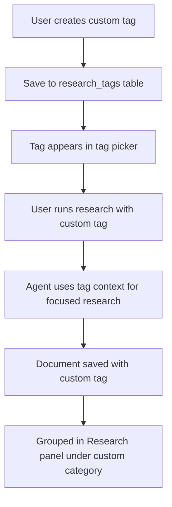

---

## Execution flow

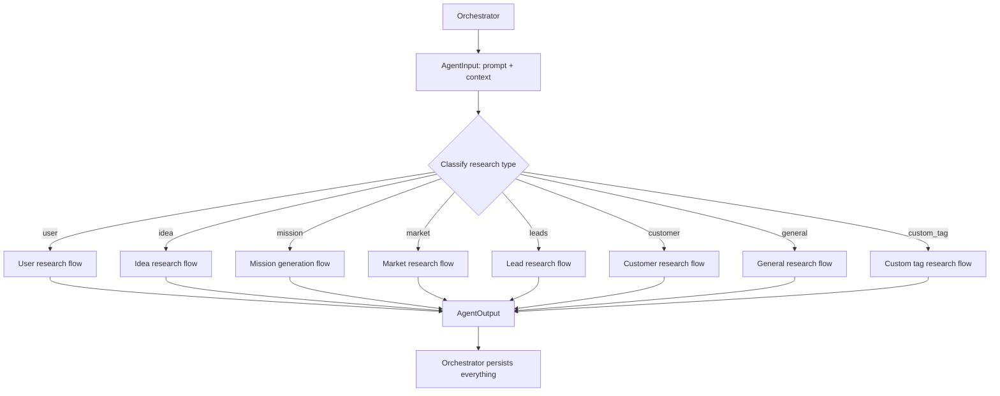

The agent receives a prompt and context. It classifies what kind of research is needed (or the orchestrator tells it via `metadata.researchType`), runs the appropriate flow, and returns an `AgentOutput`.

---

## Combined first-prompt research

During onboarding, the Research Agent is called with `metadata.researchType = 'onboarding'` and runs idea research + mission + market in a single agent invocation (3-4 AI calls total, not 3 separate agent calls).

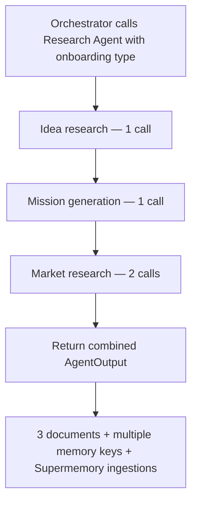

This batching reduces overhead — one agent invocation, one context build, multiple outputs.

---

## Leads management

The Leads panel provides a full CRM-like table for managing contacts discovered through research.

### Leads table schema

```sql
CREATE TABLE IF NOT EXISTS leads (
    id UUID PRIMARY KEY DEFAULT uuid_generate_v4(),
    name TEXT,
    email TEXT,
    linkedin_url TEXT,
    company TEXT,
    role TEXT,
    phone TEXT,
    website TEXT,
    source TEXT,                    -- 'lead_research', 'manual', 'chat', etc.
    source_research_id UUID,       -- links to the research document that found this lead
    score INTEGER DEFAULT 0,       -- 0-100 priority score
    status TEXT DEFAULT 'new',     -- 'new', 'contacted', 'replied', 'qualified', 'converted', 'lost'
    contacted BOOLEAN DEFAULT FALSE,
    contacted_at TIMESTAMPTZ,
    notes TEXT,                    -- user can leave notes
    tags TEXT[] DEFAULT '{}',      -- custom tags for filtering
    metadata JSONB DEFAULT '{}',   -- any extra data: social profiles, company size, etc.
    created_at TIMESTAMPTZ DEFAULT NOW(),
    updated_at TIMESTAMPTZ DEFAULT NOW()
);
```

### Leads panel features

- **Table view** with sortable columns: name, company, role, email, LinkedIn, score, status, contacted, last note
- **Inline editing**: user can tick "contacted", change status, leave notes directly in the table
- **Filters**: by status, score range, source, tags
- **Search**: full-text search across name, company, email
- **Bulk actions**: mark multiple as contacted, change status
- **Detail modal**: click a lead to see full details, all notes, research source
- **Auto-merge**: when research finds someone already in the table, update their record instead of creating a duplicate
- **Save to DB**: all changes persist immediately

### How leads are populated

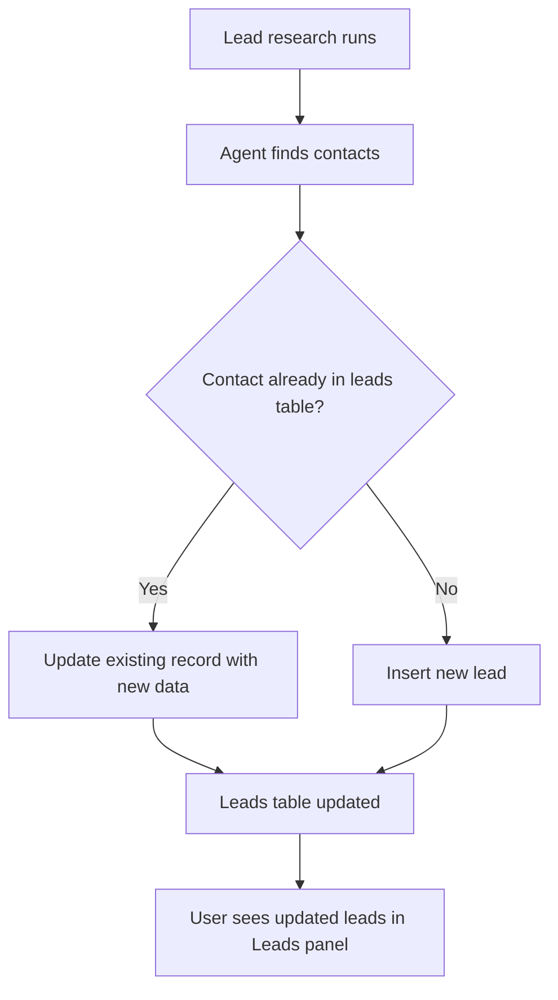

---

## Nightly execution

The nightly cron runs **once per night** and executes **one task per project**. It checks credits only (not subscription status). If the queue is empty, it generates 5 new tasks first, then picks the top one to execute.

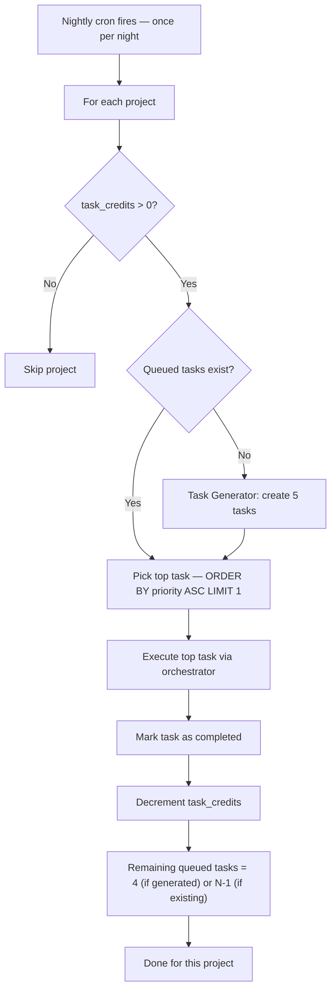

**How it works step by step:**
1. Cron fires once per night
2. For each project with `task_credits > 0`:
   - Check if queued tasks exist
   - If NO queued tasks → Task Generator creates 5 new tasks (research, marketing, content, etc. based on company context)
   - Pick the top task (lowest priority number = highest priority)
   - Execute it via the orchestrator
   - Mark the task as completed
   - Decrement `task_credits` by 1
   - After execution: if 5 were generated, 4 remain queued for future nights

**Key rules:**
- **No subscription check** — only `task_credits > 0` matters. Cancelled subscribers with remaining credits still get nightly execution.
- **Auto-generate when empty** — if the queue has no tasks, we generate 5 new ones so there's always work to do.
- **One task per night** — exactly one queued task is executed per project per night.
- **No automatic post-subscription tasks** — nothing runs automatically the moment a user subscribes. The nightly cron handles it on schedule.

---

## Data persistence

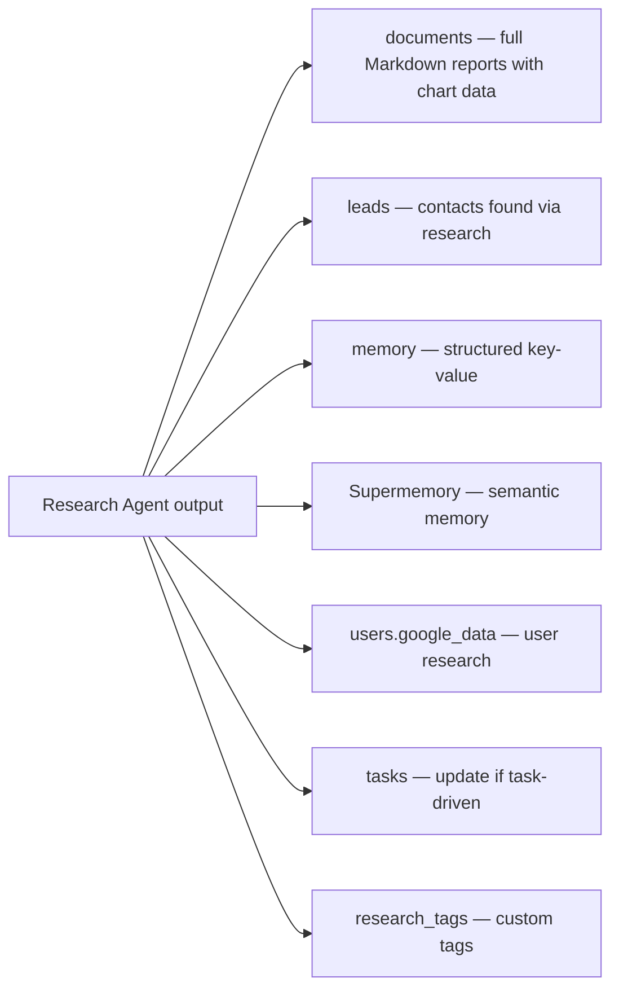

| Research type | documents | leads | memory keys | Supermemory | User sees? |
|--------------|-----------|-------|-------------|-------------|-----------|
| User research | — | — | — | Yes (user tag) | No |
| Idea research | — | — | `ideaResearch`, `competitors` | Yes | No (used by other agents) |
| Mission | `type='mission'` | — | `mission`, `vision`, `targetAudience` | Yes | Yes — Documents panel |
| Market research | `type='market_research'` | — | `competitors`, `marketSize`, `keyInsights`, `chartData` | Yes | Yes — Research + Documents panel |
| Lead research | `type='lead_research'` | Yes — new/updated leads | `leadChannels`, `leadSources` | Yes | Yes — Research + Leads panel |
| Customer research | `type='customer_research'` | — | `icp`, `painPoints`, `buyingTriggers` | Yes | Yes — Research + Documents panel |
| Ads research | `type='ads_research'` | — | `adStrategy`, `adBudget`, `targetPlatforms` | Yes | Yes — Research panel |
| Target audience | `type='target_audience'` | — | `demographics`, `psychographics` | Yes | Yes — Research panel |
| General | `type='research'` | Maybe | Varies | Yes | Yes — Research + Documents panel |
| Custom tag | `type=custom_tag` | Maybe | Varies | Yes | Yes — Research panel |

---

## Visual elements in research documents

Every research document MUST include visual elements — graphs, charts, analytics summaries — to make the research interactive and easy to digest. Raw text walls are not acceptable. The AI prompt for each research type explicitly requests structured chart data alongside the narrative.

### Required visuals per research type

| Research type | Required visuals |
|--------------|-----------------|
| Market research | Market size bar chart, growth trend line chart, competitor positioning map |
| Lead research | Lead score distribution bar chart, leads-by-source pie chart, leads summary table |
| Customer research | Customer journey funnel, demographic pie charts, pain point severity radar |
| Ads research | Platform comparison bar chart, budget allocation pie chart, projected ROI line chart |
| Target audience | Age/gender demographic charts, behavior pattern radar, geographic distribution |
| Competitor analysis | Feature comparison radar, pricing comparison bar chart, market share pie chart |
| Market trends | Trend line charts (multi-year), opportunity sizing bar chart, adoption curve |
| Pricing research | Competitor pricing comparison table + bar chart, willingness-to-pay distribution |
| Content research | Topic cluster map, channel effectiveness bar chart, content gap analysis table |

### Chart types supported

| Chart type | Used in | Example |
|-----------|---------|---------|
| Bar chart | Market size, competitor comparison, budget allocation | Market size by segment |
| Line chart | Growth trends, revenue projections, market trends | TAM growth over 5 years |
| Pie chart | Market share, audience demographics, channel distribution | Competitor market share |
| Funnel chart | Customer journey, conversion rates | Awareness → Interest → Decision → Action |
| Radar chart | Competitor SWOT, skill assessment | Competitor feature comparison |
| Table | Competitor details, lead lists, pricing comparison | Competitor pricing table |
| Metric card | Key stats (market size, growth rate, lead count) | "$2.4B TAM", "23% CAGR" |

### Analytics summary block

Every research document includes a top-level analytics summary rendered as metric cards at the top of the document view:

```typescript
interface AnalyticsSummary {
  metrics: {
    label: string;      // "Total Addressable Market"
    value: string;      // "$2.4B"
    trend?: string;     // "+12% YoY"
    trendDirection?: 'up' | 'down' | 'flat';
  }[];
}
```

### Chart data format in documents

```typescript
interface ResearchDocument {
  type: string;
  title: string;
  content: string;  // Markdown with <!-- chart:chartId --> placeholders
  metadata: {
    tag: string;
    charts: {
      [chartId: string]: {
        type: 'bar' | 'line' | 'pie' | 'funnel' | 'radar' | 'table' | 'metric';
        title: string;
        data: Record<string, unknown>;
        description?: string;
      };
    };
    analytics: {
      metrics: { label: string; value: string; trend?: string; trendDirection?: 'up' | 'down' | 'flat' }[];
      marketSize?: string;
      growthRate?: string;
      competitorCount?: number;
      leadCount?: number;
    };
  };
}
```

### How charts are rendered

The Markdown content uses `<!-- chart:chartId -->` placeholders. The frontend document viewer:
1. Parses the Markdown content
2. When it encounters a chart placeholder, looks up the chart data in `metadata.charts`
3. Renders the appropriate chart component (using recharts or similar)
4. Renders the analytics summary as metric cards at the top of the document

---

## URL analysis for existing companies

When a user provides a URL during onboarding (their existing company website), the Research Agent:

1. Scrapes/analyzes the website content, branding, products, pricing
2. Extracts brand identity (colors, tone, positioning)
3. Identifies current market positioning
4. Saves this as `existingCompanyAnalysis` in memory

This data is then used by:
- **Website Builder Agent** — to maintain brand consistency, use similar design language
- **Research Agent** — to provide more accurate competitive analysis
- **Email Writer Agent** — to match brand voice in communications
- **Task Generator** — to suggest tasks relevant to the existing business

---

## Cost optimization

| Research type | AI calls | Model | When |
|--------------|----------|-------|------|
| User research | 1 | gpt-4o-mini | First prompt (one-time) |
| Idea research | 1 | gpt-4o-mini | First prompt |
| Mission | 1 | gpt-4o-mini | First prompt |
| Market research | 2 | gpt-4o-mini | First prompt |
| Lead research | 2-3 | gpt-4o-mini | On-demand (uses credits) |
| Customer research | 1-2 | gpt-4o-mini | On-demand (uses credits) |
| Ads research | 1-2 | gpt-4o-mini | On-demand (uses credits) |
| Target audience | 1-2 | gpt-4o-mini | On-demand (uses credits) |
| General / custom | 1-2 | gpt-4o-mini | On-demand (uses credits) |

**First prompt total: 5 AI calls** (user research + idea + mission + market)
