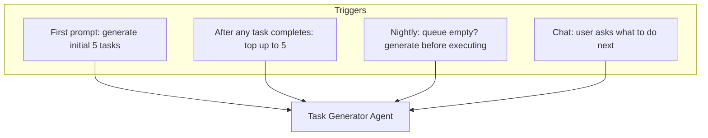
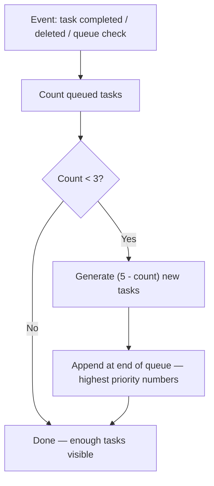
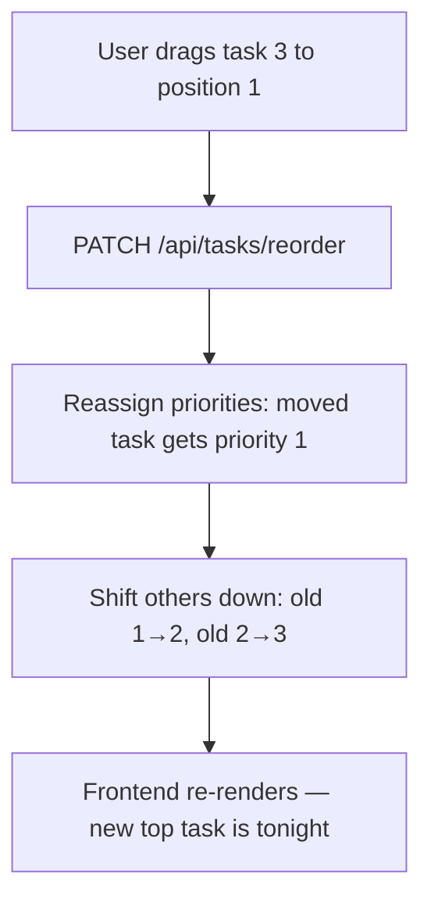
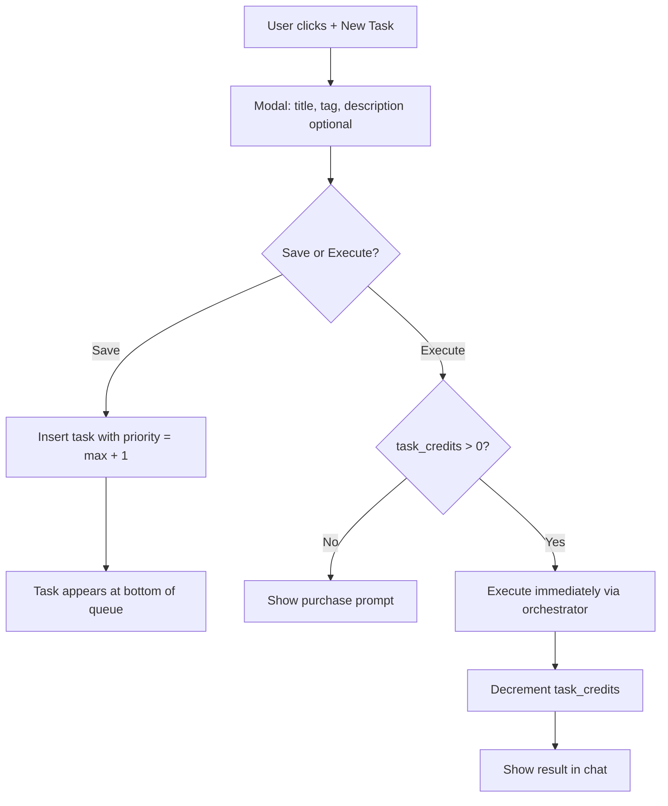
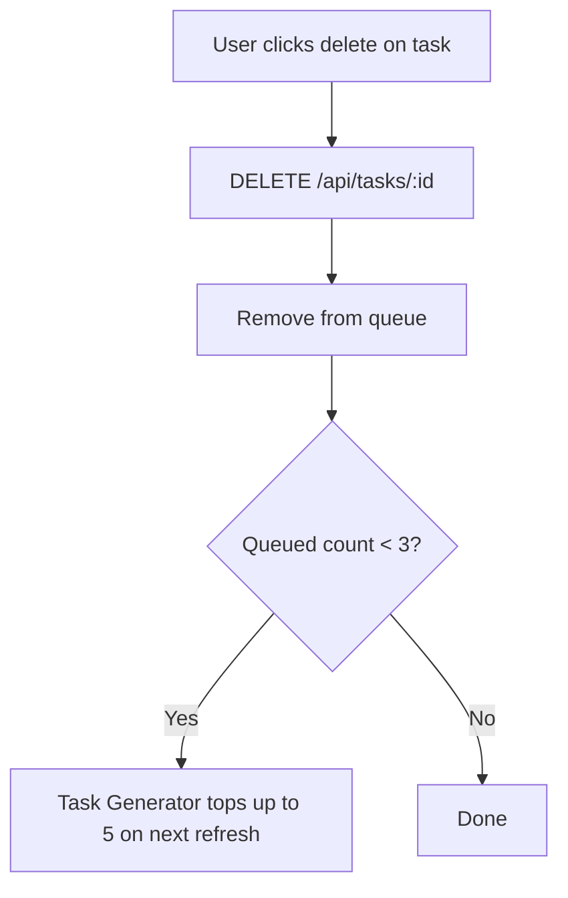
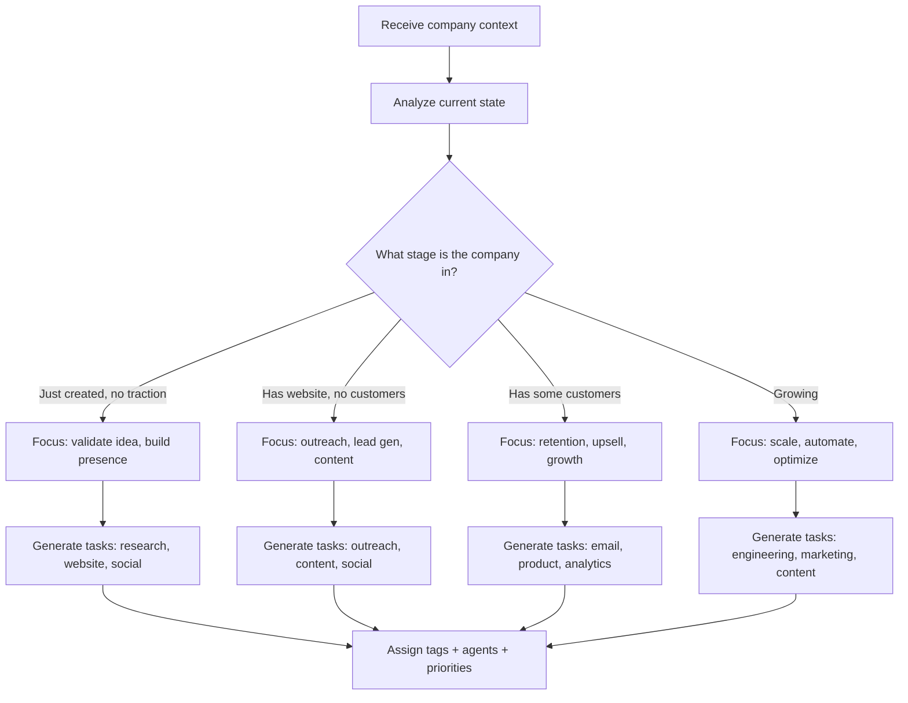
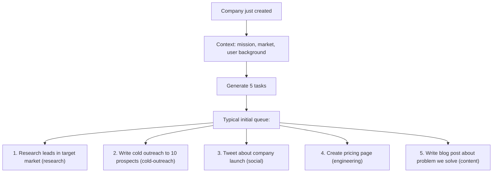
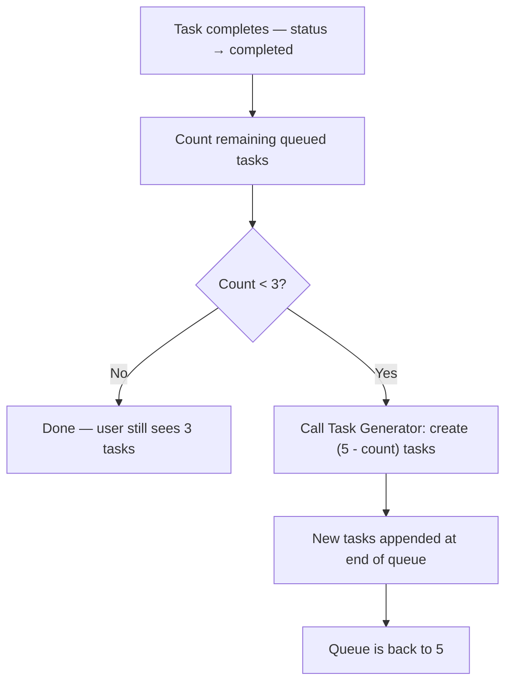
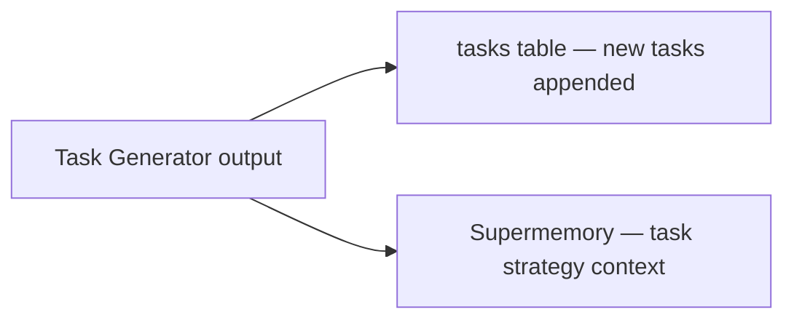

# Task Generator Agent

The most important agent. It decides **what the company should do next** to grow — generate revenue, reach customers, build product, create content. Every other agent executes; this one thinks.

**Code:** `src/lib/agents/task-generator.ts`

---

## Core rules

1. **Maintain 5 queued tasks.** The queue targets 5 tasks. When the count drops below 3, generate enough new tasks to bring it back to 5. New tasks are appended at the end (lowest priority). This means the user always sees at least 3 tasks.
2. **Show 3 on frontend.** The dashboard shows the top 3 queued tasks. The other 2 are in the DB but not displayed — they're the buffer so there's always something ready after execution.
3. **Top task = tonight.** No `tonight` boolean column. The nightly cron picks `WHERE status = 'queued' ORDER BY priority ASC LIMIT 1`. The frontend highlights the first task in the list as "TONIGHT".
4. **Never skip.** If subscription is active and credits > 0, the nightly cron MUST execute. If the queue is empty, generate 5 tasks first, then execute the top one.
5. **Users can reorder.** Users can drag tasks up/down, which updates `priority`. The top task after reorder becomes tonight.
6. **Users can add tasks.** Modal with title, tag, optional description. User chooses "Save" (add to queue) or "Execute now" (run immediately, costs 1 credit).
7. **Users can delete tasks.** Remove from queue. If queue drops below 3 on next check, Task Generator tops it up to 5.

---

## When does it run?



| Trigger | What it does | AI calls |
|---------|-------------|----------|
| First prompt (onboarding) | Generate 5 initial tasks | 1 |
| After task completes | If queued < 3, generate to reach 5 | 1 (or 0 if still ≥ 3) |
| Nightly (queue empty) | Generate 5 tasks, then cron executes top | 1 |
| Chat "what should I do?" | Suggest next actions | 1 |

---

## Task structure

```typescript
interface GeneratedTask {
  title: string;          // short, actionable title
  description: string;    // detailed prompt for the executing agent
  tag: TaskTag;           // what kind of work
  agent: AgentName;       // who executes it
}
```

Tasks are inserted with `priority` set to maintain order. New tasks get priority values higher than existing ones (appended at end of queue).

### Tags → agents mapping

| Tag | Executing agent | Examples |
|-----|----------------|----------|
| `research` | Research Agent | "Research competitor pricing", "Analyze target market" |
| `marketing` | Research Agent | "Create marketing strategy doc", "Analyze conversion funnel" |
| `cold-outreach` | Email Writer | "Email 10 SaaS founders about our product" |
| `engineering` | Website Builder | "Add pricing page", "Redesign hero section" |
| `social` | Twitter Agent | "Tweet about product launch" |
| `content` | Research Agent | "Write blog post about industry trends" |

---

## Queue management

### How the queue stays at 5



### Priority ordering

Tasks are ordered by `priority ASC` — lower number = higher priority = runs first.

```
priority 1: Research leads in target market     ← TONIGHT (top, shown)
priority 2: Write cold outreach to 10 prospects ← shown
priority 3: Tweet about company launch          ← shown
priority 4: Create pricing page                 ← hidden (buffer)
priority 5: Write blog post                     ← hidden (buffer)
```

Frontend shows top 3. Nightly cron executes priority 1.

### User reorder

When user drags task #3 to position #1:



### User adds task



### User deletes task



---

## How it decides what to generate

The Task Generator receives full company context and makes strategic decisions.



### Context it uses

| Context | Source | How it helps |
|---------|--------|-------------|
| User background + strengths | Supermemory (user tag) | Assign tasks user can't do themselves |
| Completed tasks | `tasks` table (status = completed) | Don't repeat, build on results |
| Failed tasks | `tasks` table (status = failed) | Retry with different approach |
| Existing queued tasks | `tasks` table (status = queued) | Don't duplicate what's already queued |
| Research findings | Supermemory (company tag) | Use competitor data, market gaps |
| Revenue data | `projects.revenue_balance_cents` | If no revenue, prioritize revenue tasks |
| Website status | `projects.landing_page_published` | If no site, prioritize website |
| Email status | `email_campaigns` count | If no outreach, prioritize outreach |

### Prompt strategy

1. Company stage assessment
2. Task diversity (don't generate 3 outreach tasks in a row)
3. User strength/weakness consideration
4. Priority logic (revenue-generating > awareness > infrastructure)
5. Don't duplicate existing queued tasks
6. Build on completed task results

---

## Initial task queue (first prompt)

During onboarding, generates exactly 5 tasks.



Frontend shows tasks 1-3. Tasks 4-5 are the buffer. Task 1 is tonight.

Note: tasks only execute when user has credits (subscription or pack).

---

## Top-up cycle

After every task completion:



Example: task 1 completes → 4 queued remain → still ≥ 3, no generation needed. Task 2 completes → 3 queued remain → still ≥ 3, no generation. Task 3 completes → 2 queued remain → below 3, generate 3 new tasks → queue is 5 again.

---

## Dashboard display

### Tasks panel

The Tasks panel (`src/components/panels/tasks-panel.tsx`) shows tasks with filter tabs (All / Queued / Completed / Failed), pending-confirmation alerts, and a **"Manage Tasks"** button that opens the full Tasks Modal.

```
┌─────────────────────────────────────────────────────────┐
│ Tasks         [Manage Tasks]  [All] [Queued] [Done] ...  │
├─────────────────────────────────────────────────────────┤
│ ⚠ Awaiting Confirmation                                  │
│ ┌─────────────────────────────────────────────────────┐ │
│ │ Send outreach emails                [Review & Send] │ │
│ └─────────────────────────────────────────────────────┘ │
│                                                         │
│ Task Queue (runs nightly)                               │
│ ┌─────────────────────────────────────────────────────┐ │
│ │ #1  Research leads in target market    [Run Now]    │ │
│ │ #2  Write cold outreach to 10 prospects [Run Now]   │ │
│ │ #3  Tweet about company launch          [Run Now]   │ │
│ └─────────────────────────────────────────────────────┘ │
└─────────────────────────────────────────────────────────┘
```

### Tasks Modal (full management)

Opened via "Manage Tasks" button or "View all" in the overview panel. Component: `src/components/modals/tasks-modal.tsx`.

```
┌─────────────────────────────────────────────────────────┐
│ Tasks                                             Close  │
├─────────────────────────────────────────────────────────┤
│ To Do (3) | ↻ Recurring (5) | In Progress | Done | ...  │
├─────────────────────────────────────────────────────────┤
│                                                         │
│ ┌─────────────────────────────────────────────────────┐ │
│ │ ↑↓  #1  [research] [queued]                         │ │
│ │      Research leads in target market          View→  │ │
│ │      Identify and cold-email 5-10 potential...       │ │
│ └─────────────────────────────────────────────────────┘ │
│                                                         │
│ ┌─────────────────────────────────────────────────────┐ │
│ │ ↑↓  #2  [cold-outreach] [queued]                    │ │
│ │      Write cold outreach to 10 prospects      View→  │ │
│ └─────────────────────────────────────────────────────┘ │
└─────────────────────────────────────────────────────────┘
```

**Tabs:**
- **To Do** — queued/pending, non-recurring tasks sorted by priority. Up/down arrows to reorder.
- **↻ Recurring** — tasks with `is_recurring = true` (any status).
- **In Progress** — running or pending_confirmation tasks.
- **Completed** — completed tasks sorted by completion date (newest first).
- **Rejected / Failed** — failed or rejected tasks.

### Task detail (within modal)

Clicking "View →" on any task opens the detail view within the modal (push navigation with "← Back"):

```
┌─────────────────────────────────────────────────────────┐
│ ← Back                                            Close  │
├─────────────────────────────────────────────────────────┤
│ Build the Love AI Founder Dashboard MVP                  │
│ [engineering] [queued]                                   │
│                                                         │
│ Build ONE core feature: a real-time analytics...        │
│ • Display key metrics: DAU estimate, session...         │
│ • Connect to App Store data if available...             │
│ • Clean, dark-themed UI matching the brand              │
│                                                         │
│ How should I change this task?                          │
│ [e.g., focus on mobile users                    ] [→]   │
│                                                         │
│ ─────────────────────────────────────────────────────── │
│ [🗑 Delete]  [✏ Edit]  [↺ Repeat]          [▶ Run Now] │
│                    To run tasks, subscribe →            │
└─────────────────────────────────────────────────────────┘
```

**Actions:**
- **Up / Down arrows** (To Do tab only) — reorder by swapping priority values
- **View →** — opens task detail within modal
- **← Back** — returns to task list
- **AI instruction input** — type natural-language change ("focus on mobile users") → AI rewrites description/prompt via `PATCH /api/tasks/:id` with `aiInstruction`
- **Edit** — inline edit title and description directly
- **Delete** — permanently removes task via `DELETE /api/tasks/:id`
- **Reject** — marks task as `rejected` (appears in Rejected/Failed tab)
- **Repeat** — re-queues a completed/failed/rejected task (sets status back to `queued`)
- **Run Now** — executes task immediately (costs 1 credit)
- **Review & Send** — for `pending_confirmation` tasks, opens the outreach confirmation modal

---

## API endpoints

### GET /api/tasks?projectId=...

Returns all tasks ordered by `created_at DESC`. Frontend groups and sorts client-side.

### POST /api/tasks/run

Execute a task now. Deducts 1 credit and enqueues a `run_task` job.

```typescript
{ taskId: string; projectId: string }
```

### PATCH /api/tasks/:id

Update a task's fields. Supports AI-assisted rewrite via `aiInstruction`.

```typescript
{
  projectId: string;
  title?: string;
  description?: string;
  prompt?: string;
  priority?: number;
  status?: TaskStatus;
  aiInstruction?: string;  // if provided, AI rewrites description + prompt
}
```

### DELETE /api/tasks/:id?projectId=...

Permanently delete a task.

### POST /api/tasks/reorder

Reorder To Do tasks by updating their priorities in bulk.

```typescript
{
  projectId: string;
  taskIds: string[];  // ordered array — first item gets priority 1
}
```

---

## Data persistence



| What | Where | User sees? |
|------|-------|-----------|
| Task list (5 queued) | `tasks` table | Yes — top 3 in Tasks panel |
| Task tags | `tasks.tag` | Yes — tag badges |
| Task results | `tasks.result` + `tasks.summary` | Yes — completed task detail |
| Strategy reasoning | Supermemory | No — context for future generation |

---

## Cost optimization

| Trigger | AI calls | Model |
|---------|----------|-------|
| Initial queue (5 tasks) | 1 | Haiku 4.5 |
| Top-up (1-5 tasks) | 1 | Haiku 4.5 |
| Chat suggestion | 1 | Haiku 4.5 |

Cheap agent — one call per invocation regardless of how many tasks it generates.
