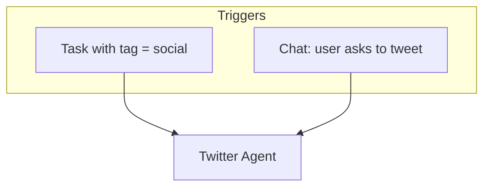
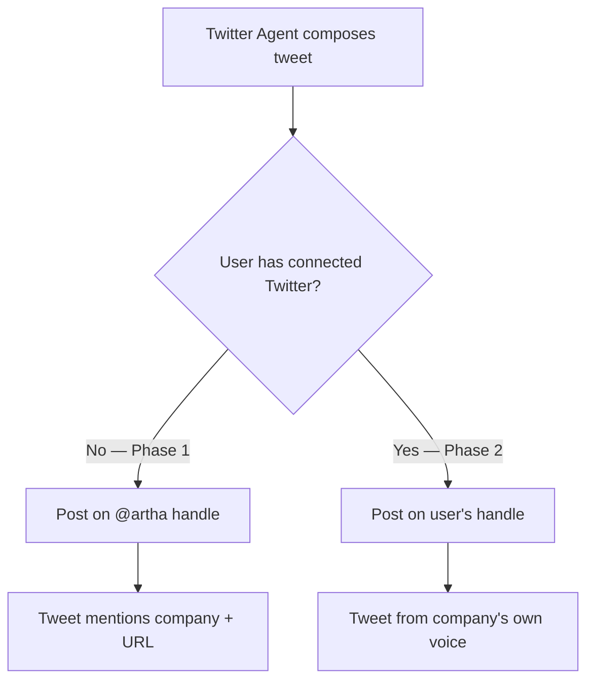
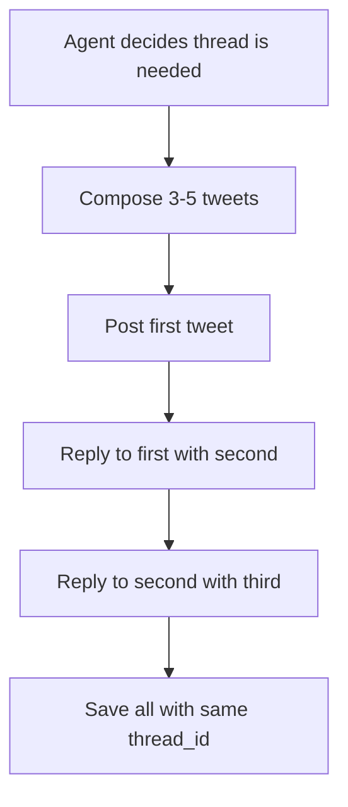
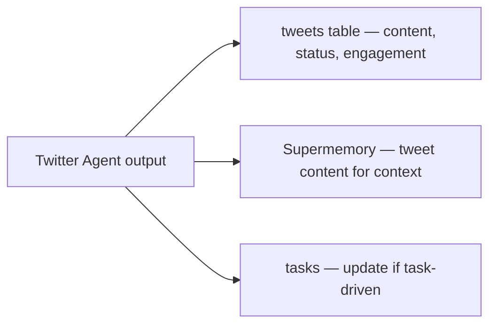

# Twitter Agent

Composes and posts tweets about user companies. Currently posts on **Artha's own Twitter handle** (@arabortha or similar). When users connect their own Twitter accounts, posts on their handle instead.

Built as a standalone module — no social media router layer. When we add LinkedIn, we create `linkedin.ts` and add a lightweight router at that point.

**Code:** `src/lib/agents/twitter.ts`

---

## When does it run?



| Trigger | What it does | Credits? |
|---------|-------------|----------|
| Task execution | Compose + post tweet | Yes (1 credit) |
| Chat command | Compose + post tweet | Yes (1 credit) |

> **Milestones (website live, first customer, first revenue, etc.)** → Instead of auto-tweeting on Artha's behalf, the Task Generator creates actionable tasks for the user — e.g. "Reach out to 10 potential customers now that your site is live" or "Set up a referral program after landing your first paying customer." These tasks cost standard credits; there are no free credits for milestone tasks.

---

## What it posts

### Tweet types

| Type | When | Example |
|------|------|---------|
| **Launch announcement** | Company goes live | "We just launched {company}! {tagline}. Check it out: {url}" |
| **Progress update** | Build-in-public style | "{company} just completed market research — found 5 competitors and 3 market gaps. Here's what we learned..." |
| **Product update** | New feature/page | "New pricing page live for {company}! {url}" |
| **Milestone** | First customer, revenue, etc. | "{company} just got their first customer! 🎉" |
| **Engagement** | Questions, polls | "Building {company} — what's the biggest pain point in {industry}?" |
| **Promotion** | Selling | "{company} solves {problem} for {audience}. Try it: {url}" |

### Tweet composition rules

- Max 280 characters (hard limit)
- Include company name or handle
- Include URL when relevant (uses `{slug}.tryartha.com`)
- Tone: professional but human, build-in-public energy
- No hashtag spam (max 2 relevant hashtags)
- Thread for longer content (launch stories, lessons learned)

---

## Posting strategy

### Phase 1: Post on Artha's handle (current)

All tweets go to Artha's Twitter account. This serves double duty:
- Promotes the user's company
- Promotes Artha itself ("built with Artha")



**Phase 1 tweet format:**
```
{companyName} — {tagline}

{one sentence: what it does and who it's for}

{slug}.tryartha.com
```

### Phase 2: Post on user's handle (future)

When users connect their Twitter via OAuth:
1. Store OAuth tokens in new `oauth_connections` table
2. Twitter Agent checks if project has a connected Twitter
3. If yes, post as the user's company (different voice/tone)
4. If no, fall back to Artha's handle

**New table needed (future):**
```sql
CREATE TABLE oauth_connections (
    id UUID PRIMARY KEY DEFAULT uuid_generate_v4(),
    project_id UUID NOT NULL,
    platform TEXT NOT NULL,        -- 'twitter'
    access_token TEXT NOT NULL,
    refresh_token TEXT,
    account_id TEXT,               -- Twitter user ID
    account_name TEXT,             -- @handle
    expires_at TIMESTAMPTZ,
    created_at TIMESTAMPTZ DEFAULT NOW()
);
```

---

## Thread support

For longer content (launch stories, weekly updates), the agent composes a thread.



Thread tweets share a `thread_id` in the `tweets` table. The first tweet has `thread_id = NULL`, subsequent tweets reference the first tweet's ID.

---

## Execution flow

```mermaid
flowchart TD
    Orch[Orchestrator] --> Input[AgentInput: prompt + context]
    Input --> Classify{What kind of tweet?}
    Classify -->|Single tweet| Single[Compose ≤280 chars]
    Classify -->|Thread| Thread[Compose 3-5 tweets]
    Classify -->|Scheduled| Schedule[Compose + set schedule time]

    Single --> Output[AgentOutput with tweets[]]
    Thread --> Output
    Schedule --> Output
```

The agent returns `AgentOutput.tweets[]` — the orchestrator handles:
1. Posting via Twitter API
2. Saving to `tweets` table
3. Updating task if task-driven

### Twitter API integration

```typescript
// Post a tweet
POST https://api.twitter.com/2/tweets
{
  "text": "tweet content here"
}

// Post a reply (for threads)
POST https://api.twitter.com/2/tweets
{
  "text": "reply content",
  "reply": { "in_reply_to_tweet_id": "previous_tweet_id" }
}
```

Using Twitter API v2 with OAuth 2.0. For Artha's own handle, we use app-level credentials. For user handles (future), we use their OAuth tokens.

---

## Data persistence



| What | Where | User sees? |
|------|-------|-----------|
| Tweet content | `tweets.content` | Future — Twitter panel |
| Tweet status | `tweets.status` (draft/posted/failed) | Future — Twitter panel |
| External tweet ID | `tweets.external_id` | No (for API reference) |
| Engagement metrics | `tweets.engagement` (likes, retweets) | Future — Twitter panel |
| Thread grouping | `tweets.thread_id` | Future — Twitter panel |
| Which handle | `tweets.posted_on` ('artha' or 'user') | Future — Twitter panel |

### `tweets` table (company DB)

```sql
CREATE TABLE tweets (
    id UUID PRIMARY KEY DEFAULT uuid_generate_v4(),
    content TEXT NOT NULL,
    thread_id UUID,                    -- NULL for single/first tweet, references first tweet for thread
    status TEXT DEFAULT 'draft',       -- draft, scheduled, posted, failed
    scheduled_for TIMESTAMPTZ,
    posted_at TIMESTAMPTZ,
    external_id TEXT,                  -- tweet ID from Twitter API
    engagement JSONB DEFAULT '{}',     -- {likes, retweets, replies, impressions}
    task_id UUID,                      -- which task triggered this
    posted_on TEXT DEFAULT 'artha',    -- 'artha' = our handle, 'user' = their connected handle
    created_at TIMESTAMPTZ DEFAULT NOW()
);
```

---

## Module design (future-proof for more platforms)

Current structure:
```
src/lib/agents/
├── twitter.ts            ← Twitter Agent (standalone)
```

When we add LinkedIn:
```
src/lib/agents/
├── twitter.ts            ← Twitter Agent
├── linkedin.ts           ← LinkedIn Agent
├── social-router.ts      ← lightweight router (added at this point)
```

The router would be ~20 lines:
```typescript
export function routeSocialTask(tag: string, platform?: string) {
  if (platform === 'linkedin' || tag.includes('linkedin')) return linkedinAgent;
  return twitterAgent; // default
}
```

We don't build this router until we have a second platform. Until then, the orchestrator routes `social` tags directly to `twitter.ts`.

---

## Cost optimization

| Action | AI calls | Model | Notes |
|--------|----------|-------|-------|
| Single tweet | 1 | GPT-4o | Punchy hooks, great at short-form text |
| Thread (3-5 tweets) | 1 | GPT-4o | All tweets in one prompt |
| Scheduled tweet | 1 | GPT-4o | Same as single, just delayed posting |

**Twitter API cost:** Free tier allows 1,500 tweets/month (more than enough). Basic tier ($100/month) if we scale past that.

For Phase 1 (Artha's handle only), we're well within the free tier since we control posting frequency.
