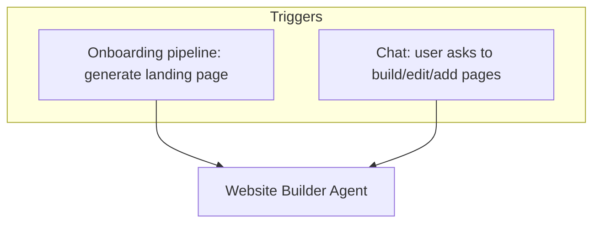
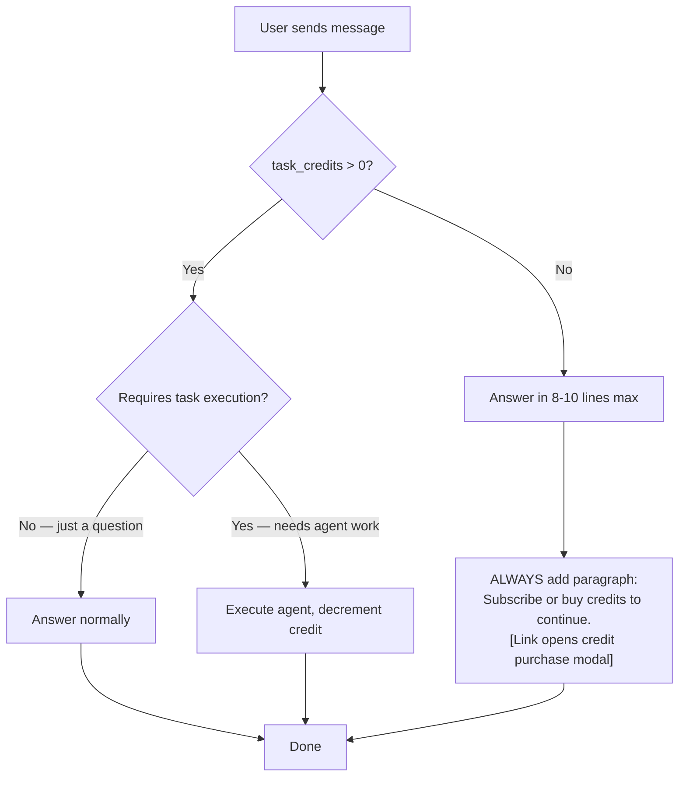
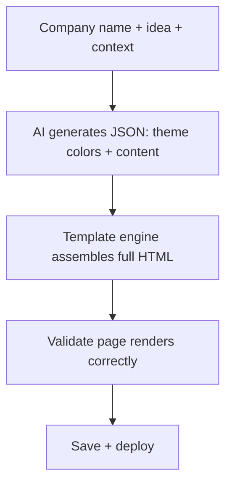
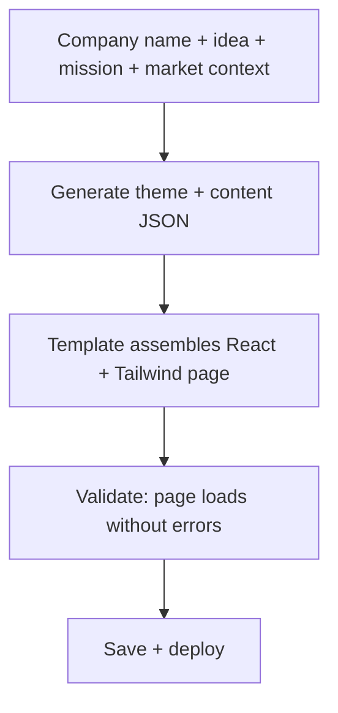
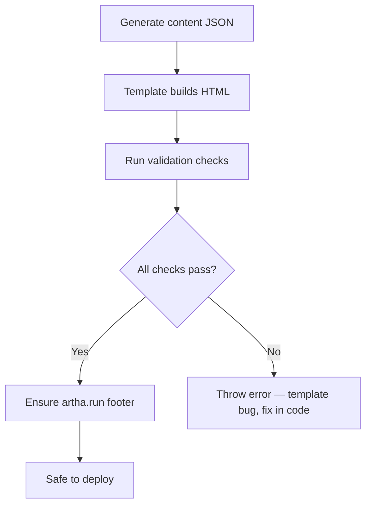
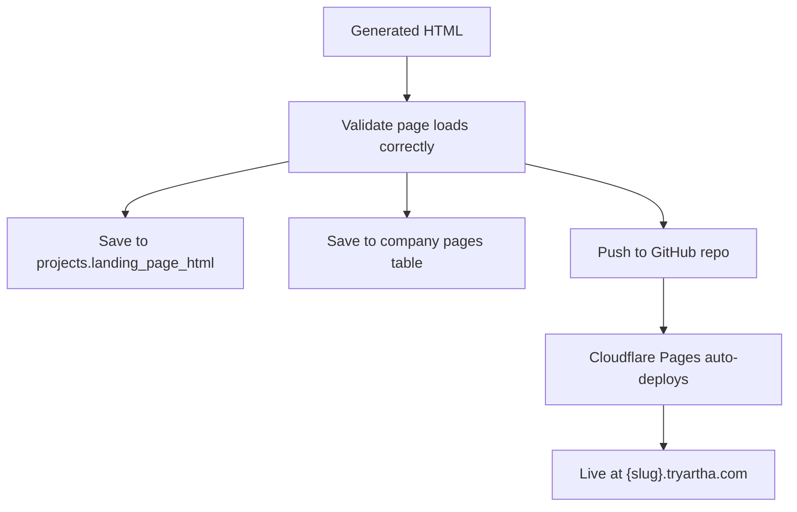
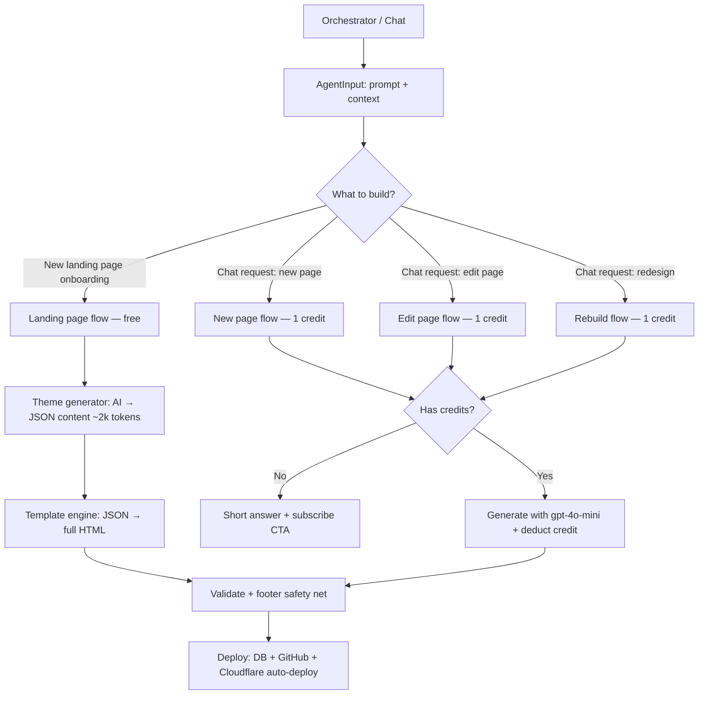
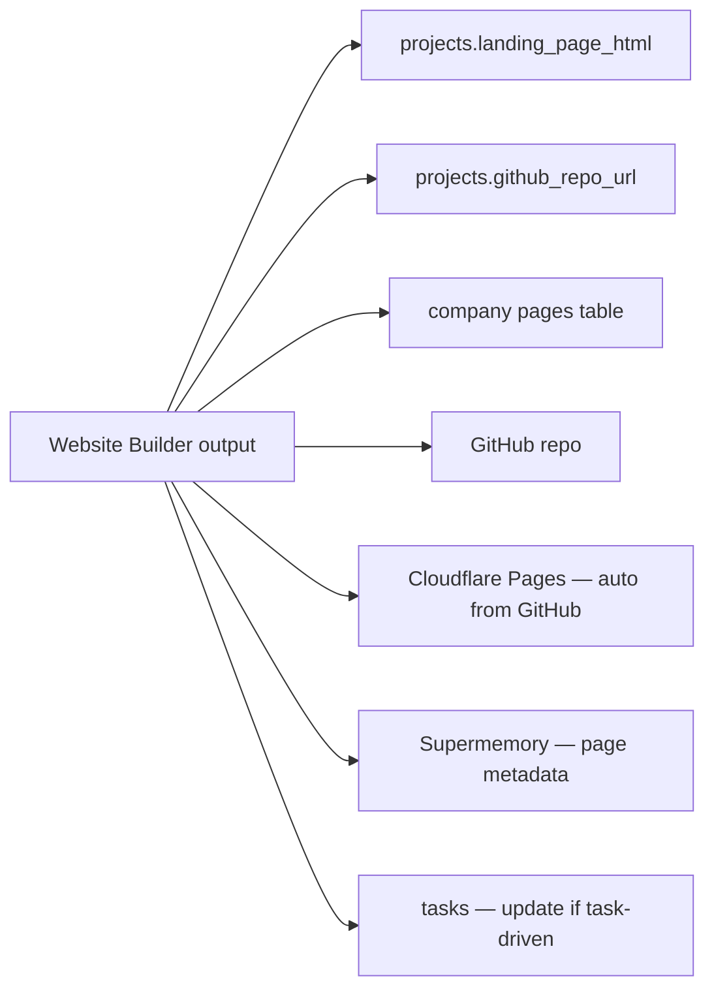

# Website Builder Agent

Builds and deploys beautiful websites for user companies. During onboarding, it generates a landing page (free). After that, website updates are **on-demand only** — the user asks in chat to improve, add pages, or customize, and the agent executes (1 credit per request).

**Code:** `src/lib/ai/website-builder/` (landing-page-builder, website-template, theme-generator, validation), `src/lib/cloudflare.ts`, `src/lib/github.ts`

---

## When does it run?




| Trigger             | What it builds                                          | Credits?       |
| ------------------- | ------------------------------------------------------- | -------------- |
| Onboarding pipeline | Landing page only                                       | No (free)      |
| Chat command        | Whatever user asks for (new page, edit, redesign, etc.) | Yes (1 credit) |


There is **no automatic page generation after subscription**. The user must explicitly ask in chat to update, add, or customize pages. This is an on-demand service.

---

## Credit gating in chat

When a user sends a message in the chat sidebar:




**Rules when user has no credits (applies to EVERY message — questions, requests, anything):**

- Answer with a short summary (8-10 lines max)
- Do NOT run any agent, task, or agentic workflow
- **ALWAYS** append a paragraph asking the user to subscribe or buy credits — on every single response, no exceptions
- The paragraph includes a `[Get Credits]` marker that the chat sidebar renders as a clickable button opening `CreditPurchaseModal`

**Rules when user has credits:**

- Answer questions normally (no length restriction)
- Execute requested tasks, deduct 1 credit per task execution

---

## Template-based architecture (cost optimization)

Instead of asking the AI to generate an entire HTML document from scratch every time (~8000 tokens), we use a **template + theme** system:




### How it works

1. **Theme Generator** (`theme-generator.ts`) — a lightweight AI call (~2000 tokens) that produces a JSON payload:
  - Color palette (primary, accent, background, surface, text, etc.)
  - Light or dark mode selection based on industry
  - Hero copy (headline, subheadline, CTA)
  - Content sections (features, benefits, how-it-works) with items
2. **Base Template** (`website-template.ts`) — pre-built React components that never need regeneration:
  - **Navbar** — responsive with mobile hamburger menu, scroll-aware background
  - **Hero** — gradient background, animated headline, CTA button
  - **Sections** — grid-based feature/benefit cards with icons
  - **CTA** — gradient call-to-action banner
  - **Footer** — company name, email, artha.run attribution
  - **Animations** — fade-in-up on scroll, hover effects, micro-interactions
  - **Theme system** — Tailwind config dynamically set from color palette
3. **Validation** (`validation.ts`) — shared validation logic used by both pipeline and run-task

### Cost savings


| Approach                  | AI tokens | Cost per page   |
| ------------------------- | --------- | --------------- |
| Old: full HTML generation | ~8000     | ~$0.04          |
| New: JSON content only    | ~2000     | ~$0.01          |
| **Savings**               | **75%**   | **~$0.03/page** |


At scale (1000 users), this saves ~$30 per cohort on onboarding alone. On-demand edits save similarly.

### Why this works

- The boilerplate (CDN scripts, React mount, Tailwind config, animations, responsive nav, footer) is **identical across all sites** — no reason to regenerate it
- The AI focuses on what it's good at: **choosing colors, writing copy, structuring content**
- The template guarantees **consistent quality** — no broken layouts, no missing CDN scripts, no validation failures from malformed HTML
- Every site still looks **unique** because the theme colors, copy, and section structure are AI-generated per company

---

## What it builds

### Landing page (onboarding — free)

The landing page is the first thing the user's customers see. It MUST look phenomenal.




**Tech stack: React + Tailwind CSS (via CDN)**

The generated website uses:

- **React 18** via CDN (`unpkg.com/react@18`, `unpkg.com/react-dom@18`)
- **Tailwind CSS** via CDN (`cdn.tailwindcss.com`)
- **Babel standalone** for JSX transformation in-browser
- Single `index.html` file — self-contained, no build step needed

This matches what tools like Lovable, Bolt.new, and Emergent use — React + Tailwind gives us component-based structure, utility-first styling, and a modern look without needing a build pipeline. The CDN approach means zero build time and instant deployment.

**Why not plain HTML/CSS?**

- Plain HTML produces generic-looking pages
- Tailwind utilities enable rapid, consistent, beautiful styling
- React components make the code maintainable and editable by the AI
- CDN approach = no build step = instant deploy = no build errors

**Why not full Next.js?**

- Requires a build step (risk of build failures on deploy)
- Overkill for landing pages — no SSR/routing needed
- CDN React + Tailwind gives 95% of the benefit with 0% build risk

**Pre-built components (in the template):**


| Component  | What it does                              | Customized by AI?                                |
| ---------- | ----------------------------------------- | ------------------------------------------------ |
| Navbar     | Responsive nav, mobile menu, scroll-aware | Nav links from section names                     |
| Hero       | Full-screen gradient, headline, CTA       | Headline, subheadline, CTA text, gradient colors |
| Sections   | Grid cards with icons                     | Section titles, items, icons, descriptions       |
| CTA        | Gradient banner with contact button       | Colors from theme                                |
| Footer     | Company name, email, artha.run            | Company name, email                              |
| Animations | Fade-in-up, hover effects                 | N/A (always included)                            |
| Theme      | Tailwind config, CSS variables            | Full color palette from AI                       |


**Design principles (baked into template + theme generator prompt):**

- **Unique to each business** — the AI picks colors, copy, and section structure per company. No two sites look the same
- **One theme only** — pick either light or dark based on what suits the business (e.g., a cybersecurity company → dark, a wellness brand → light). No theme toggle
- **No fake data** — no fake numbers, no placeholder testimonials, no made-up stats. If the business genuinely needs social proof (e.g., a SaaS product), include a testimonials section with a clear "coming soon" or "join our early users" framing. Otherwise, skip it entirely
- **No user input forms** — we have no database for the user's customers. No signup forms, no email capture, no contact forms. The only contact method is the company email: `{project-name}@tryartha.com`
- **Contact via email only** — display `{slug}@tryartha.com` as the contact method. No forms, no chat widgets
- Modern, premium feel — not a generic template
- System font stack: Inter / -apple-system (loaded via Google Fonts)
- Generous whitespace and padding
- Subtle CSS animations (fade-in on scroll, hover effects via Tailwind + inline JS)
- Mobile-first responsive design (Tailwind breakpoints)
- Micro-interactions on buttons and cards
- Professional color scheme derived from the company's industry
- Hero section with clear value proposition and CTA button
- Features/benefits with icons (emoji or SVG inline)
- Footer: company name, contact email, and `made with ❤️ on <a href="https://artha.run">artha.run</a>`

**Model:** Uses `gpt-4o-mini` for the JSON content generation call. Since the AI only generates structured JSON (not full HTML), the quality is excellent even with mini — and the template guarantees the visual output is premium.

**Token budget:** 2000 max tokens (JSON content), temperature 0.8

### On-demand changes (chat requests — 1 credit each)

After onboarding, users can ask in chat for **any frontend change**. This is completely open-ended — whatever the user asks for, the agent builds it. Examples:

- Add a new page (pricing, about, blog, team, FAQ, etc.)
- Redesign the landing page
- Change colors, fonts, layout, copy
- Add new sections to existing pages
- Rearrange content
- Full site redesign

**Scope: frontend only.** We generate static HTML pages (React + Tailwind via CDN). There is no backend, no database, no server-side logic for the user's company website. If a user asks for something that requires a backend (e.g., user authentication, a database, payment processing), the agent should explain that we currently support frontend/static pages only and suggest alternatives (e.g., link to a third-party service, use email for contact).

Each page follows the same React + Tailwind CDN approach and includes the artha.run footer. The agent receives the existing site context (current pages, design language) and generates pages that match.

### Page editing (chat requests — 1 credit each)

When editing an existing page, the agent receives the current HTML + the user's edit request, and returns modified HTML. It preserves the overall design while making the requested changes.

---

## Validation — never deploy a broken page




**Validation checks (in `website-builder/validation.ts`):**

1. **HTML structure** — valid `<!DOCTYPE html>`, `<html>`, `<head>`, `<body>`, `</html>` tags
2. **React CDN** — `unpkg.com/react@18` and `unpkg.com/react-dom@18` script tags present
3. **Tailwind CDN** — `cdn.tailwindcss.com` script tag present
4. **Babel** — `@babel/standalone` script and `type="text/babel"` on JSX script block
5. **React mount** — `createRoot` or `ReactDOM.render` call present
6. **Tag balance** — opening/closing div tags roughly balanced (tolerance of 2)
7. **Footer safety net** — if artha.run footer missing, inject it (only on passing pages)

**With the template approach, validation failures should be extremely rare** — the template itself is pre-validated. If validation fails, it's a template bug that should be fixed in code, not retried via AI.

The theme generator (JSON content) has its own retry loop (3 attempts) for JSON parsing/validation errors.

---

## Deploy flow




### GitHub setup

**Organization:** `artha-companies` (configurable via `GITHUB_ORG` env var)

The repo name is the **project name** (slugified), kept as clean and minimal as possible. A short suffix is only added if the name is already taken.

**Naming rules:**

1. Slugify the company name: `"TrueLoveOS"` → `trueloveos`, `"Engineering Club"` → `engineering-club`
2. Check if the slug already exists in the `projects` table
3. If unique → use as-is
4. If taken → append a short 4-character suffix: `engineering-club-a1b2`

**Examples:**

- Project "TrueLoveOS" → repo `artha-companies/trueloveos` → site `trueloveos.tryartha.com`
- Project "Engineering Club" → repo `artha-companies/engineering-club` → site `engineering-club.tryartha.com`
- Second "Engineering Club" → repo `artha-companies/engineering-club-a1b2` → site `engineering-club-a1b2.tryartha.com`

The slug is the same everywhere: repo name, subdomain, email prefix. This keeps URLs clean and readable.

The `github_repo_url` and `github_repo_full_name` are saved to the `projects` table in the platform DB.

**If you rename the GitHub org later:** You would need to update `GITHUB_ORG` in env vars. Existing repos would need to be transferred to the new org (GitHub supports org transfers). The `github_repo_full_name` stored in the DB would need updating too. This is a manual migration — changing the env var alone won't move existing repos.

### How `{slug}.tryartha.com` works

**Approach: Cloudflare Pages** (same as Lovable, Bolt.new — cheapest option)

```mermaid
flowchart TD
    subgraph Onboarding["During onboarding"]
        O1[Create GitHub repo in artha-companies org]
        O2[Commit website files to main]
        O3[Create or reuse Cloudflare Pages project via API]
        O4[Connect to GitHub repo]
        O5["Add custom domain: {slug}.tryartha.com"]
    end

    subgraph Update["On every website update via chat"]
        U1[Generate new HTML]
        U2[Validate page loads correctly]
        U3[Push to GitHub repo]
        U4[Cloudflare auto-deploys from GitHub]
        U5[Site is live in ~30 seconds]
    end

    O1 --> O2 --> O3 --> O4 --> O5
    U1 --> U2 --> U3 --> U4 --> U5
```



- During onboarding, Artha generates a unique slug, creates `artha-companies/{slug}`, commits the generated site to `main`, and wires Cloudflare Pages to serve it at `{slug}.tryartha.com`.
- After onboarding, any direct commit to that repo’s `main` branch triggers a Cloudflare Pages redeploy automatically.
- Chat-generated edits inside Artha stay in preview until the user clicks deploy. That deploy action commits the latest generated files to GitHub so Cloudflare can redeploy them.
- If onboarding hosting setup only partially completed, a later deploy can still recover by reconnecting Cloudflare and reusing the already-created repo.


**DNS setup (one-time):**

- `*.tryartha.com` CNAME → Cloudflare Pages (wildcard)
- Each project gets `{slug}.tryartha.com` as a custom domain on its Cloudflare Pages project

**Required API credentials:**


| Env var                 | What                                  | Where to get                                                                        |
| ----------------------- | ------------------------------------- | ----------------------------------------------------------------------------------- |
| `CLOUDFLARE_API_TOKEN`  | API token with Pages edit permissions | Cloudflare dashboard → API Tokens → Create Token → "Edit Cloudflare Pages" template |
| `CLOUDFLARE_ACCOUNT_ID` | Your Cloudflare account ID            | Cloudflare dashboard → right sidebar on any domain                                  |
| `GITHUB_TOKEN`          | Personal access token with repo scope | GitHub → Settings → Developer settings → Tokens                                     |
| `GITHUB_ORG`            | GitHub organization name              | Default: `artha-companies`                                                          |


**Cost:**


| Component        | Cost                                                             |
| ---------------- | ---------------------------------------------------------------- |
| Cloudflare Pages | Free (500 builds/month, unlimited requests, unlimited bandwidth) |
| Custom domains   | Free (included with Cloudflare)                                  |
| SSL certificates | Free (automatic)                                                 |
| CDN              | Free (300+ edge locations)                                       |
| GitHub repos     | Free (private repos, unlimited)                                  |


**Total hosting cost per user: $0**

### Cloudflare Pages API calls

**Code:** `src/lib/cloudflare.ts`

During onboarding:

```typescript
// 1. Create Pages project connected to GitHub repo
POST https://api.cloudflare.com/client/v4/accounts/{account_id}/pages/projects
{
  "name": "{slug}",
  "production_branch": "main",
  "source": {
    "type": "github",
    "config": {
      "owner": "artha-companies",
      "repo_name": "{slug}",
      "production_branch": "main"
    }
  }
}

// 2. Add custom domain
POST https://api.cloudflare.com/client/v4/accounts/{account_id}/pages/projects/{slug}/domains
{
  "name": "{slug}.tryartha.com"
}
```

On every update: just push to GitHub. Cloudflare auto-deploys.

---

## Execution flow




### Footer injection

Every page must include the artha.run footer. The template includes it by default, but as a safety net, the validation layer also checks the output HTML and injects the footer if missing:

```html
<footer style="text-align:center;padding:2rem;opacity:0.6;font-size:0.85rem;">
  made with ❤️ on <a href="https://artha.run" style="color:inherit;">artha.run</a>
</footer>
```

---

## File architecture

```
src/lib/ai/
├── website-builder/              ← Everything for building & deploying company websites
│   ├── landing-page-builder.ts   ← Orchestrator: calls theme-generator → feeds into template → validates.
│   │                               Used by both pipeline (onboarding) and run-task (on-demand).
│   ├── website-template.ts       ← Base HTML template with pre-built React components
│   │                               (Navbar, Hero, Sections, CTA, Footer, animations, theme system).
│   │                               This file is NEVER sent to the AI — it's pure TypeScript.
│   ├── theme-generator.ts        ← Lightweight AI call that produces JSON:
│   │                               theme colors, hero copy, section content, feature items.
│   │                               ~2000 tokens output. Has its own retry loop.
│   └── validation.ts             ← Shared validation + footer injection.
│
├── research/                     ← Market & strategy research agents
│   ├── market-researcher.ts      ← Competitive landscape analysis, market sizing, trends
│   └── mission-generator.ts      ← Company mission, vision, strategy document
│
└── tasks/                        ← Task execution engine
    └── task-runner.ts            ← Executes outreach, custom tasks; generates task suggestions
```

---

## Data persistence




| What              | Where                                                         | User sees?                                   |
| ----------------- | ------------------------------------------------------------- | -------------------------------------------- |
| Landing page HTML | `projects.landing_page_html` + `pages` table                  | Yes — Landing Page panel (iframe + live URL) |
| All pages         | `pages` table (one row per slug)                              | Yes — Landing Page panel lists all pages     |
| GitHub repo URL   | `projects.github_repo_url` + `projects.github_repo_full_name` | Yes — visible in project settings            |
| Source code       | GitHub repo `website/` folder                                 | No (but in their repo)                       |
| Live site         | `{slug}.tryartha.com`                                         | Yes — live URL link                          |
| Deploy status     | Pipeline event / task result                                  | Yes — task shows "deployed"                  |
| Page metadata     | Supermemory                                                   | No — context for future agent calls          |


---

## Website repo structure

```
website/
├── index.html          ← landing page (React + Tailwind via CDN)
├── pricing.html        ← pricing page (if user requests via chat)
├── about.html          ← about page (if user requests via chat)
└── blog/
    └── index.html      ← blog listing (if user requests via chat)
config/
└── artha.json          ← project config
.artha/
└── metadata.json       ← platform metadata
```

Each page is a row in the `pages` table with a unique `slug`. The Cloudflare Pages project serves all files from the repo root.

---

## Email as contact method

Since we don't have a database for the user's company customers, the only contact method on generated websites is email:

- Format: `{slug}@tryartha.com` (e.g., `trueloveos@tryartha.com`, `engineering-club@tryartha.com`). The slug matches the project name — clean and readable
- This is the same `company_email` set up during onboarding via Postmark
- No contact forms, no signup forms, no email capture widgets

---

## Cost optimization


| Action                                      | Model       | Tokens | Cost estimate |
| ------------------------------------------- | ----------- | ------ | ------------- |
| Landing page — theme + content (onboarding) | gpt-4o-mini | ~2000  | ~$0.01        |
| Landing page — old approach (deprecated)    | gpt-4o      | ~8000  | ~$0.04        |
| New page (chat request)                     | gpt-4o-mini | ~4000  | ~$0.02        |
| Edit page (chat request)                    | gpt-4o-mini | ~3000  | ~$0.015       |
| Deploy (GitHub + Cloudflare)                | —           | —      | $0            |


The template-based approach saves **~75% on landing page generation costs**. The AI only generates the unique content (colors, copy, sections) as structured JSON — the boilerplate HTML, React components, animations, and responsive layout are all pre-built in the template.
