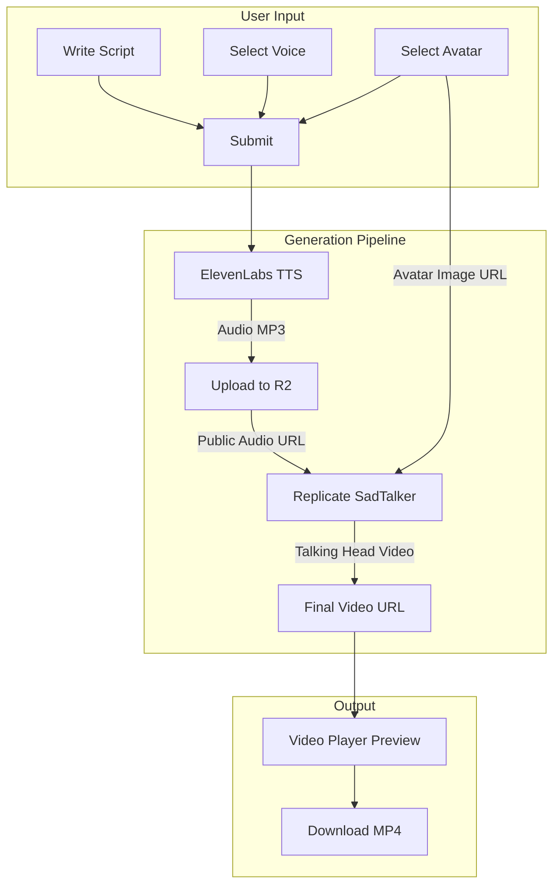
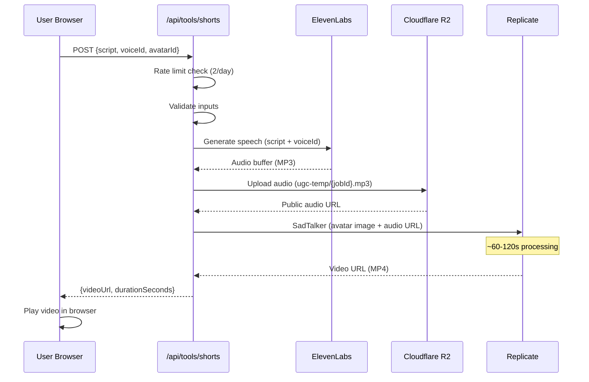
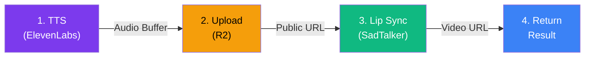
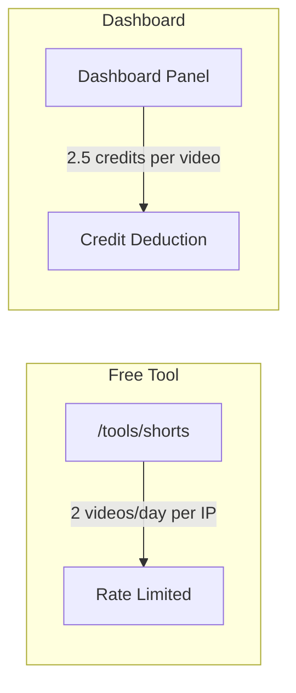
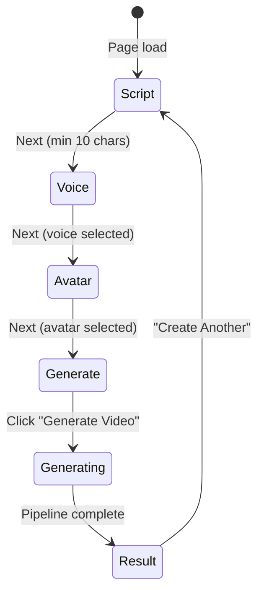

# UGC Shorts Video Generator

AI-powered UGC (User Generated Content) short video tool. Users write a script, pick a voice and avatar, and get a professional talking-head video with captions — ready for TikTok, Reels, or YouTube Shorts.

## Architecture Overview



## Request Flow



## File Structure

```
src/
├── lib/ugc-shorts/
│   ├── index.ts          # Barrel re-exports
│   ├── voices.ts         # ElevenLabs voice presets (6 voices)
│   ├── avatars.ts        # Avatar presets (6 avatars) + getAvatarUrl()
│   ├── tts.ts            # ElevenLabs TTS wrapper
│   ├── lip-sync.ts       # Replicate SadTalker wrapper
│   ├── captions.ts       # Word-level timestamps + ASS subtitle generation
│   └── pipeline.ts       # Orchestrator: TTS → R2 → SadTalker → result
│
├── app/api/tools/shorts/
│   ├── route.ts           # POST — main generation endpoint (300s timeout)
│   ├── voices/route.ts    # GET — list available voices
│   └── avatars/route.ts   # GET — list available avatars (with resolved URLs)
│
└── app/tools/shorts/
    ├── layout.tsx         # Custom dark-themed layout (standalone feel)
    ├── page.tsx           # Server component with SEO metadata
    └── client.tsx         # Multi-step form UI (Script → Voice → Avatar → Generate)
```

## Pipeline Steps



| Step | Service | Input | Output | Duration |
|------|---------|-------|--------|----------|
| 1. TTS | ElevenLabs | Script text + voice ID | MP3 audio buffer | ~5s |
| 2. Upload | Cloudflare R2 | Audio buffer | Public URL | ~1s |
| 3. Lip Sync | Replicate (SadTalker) | Avatar image URL + audio URL | MP4 video URL | ~60-120s |
| 4. Return | — | Video URL | API response | immediate |

## Voices

6 preset voices from ElevenLabs (3 male, 3 female):

| ID | Name | Gender | Style | ElevenLabs Voice ID |
|----|------|--------|-------|---------------------|
| adam | Adam | Male | Deep & Authoritative | pNInz6obpgDQGcFmaJgB |
| antoni | Antoni | Male | Calm & Warm | ErXwobaYiN019PkySvjV |
| arnold | Arnold | Male | Professional & Clear | VR6AewLTigWG4xSOukaG |
| bella | Bella | Female | Energetic Creator | EXAVITQu4vr4xnSDxMaL |
| rachel | Rachel | Female | Calm & Professional | 21m00Tcm4TlvDq8ikWAM |
| domi | Domi | Female | Confident & Bold | AZnzlk1XvdvUeBnXmlld |

## Avatars

6 preset AI-generated avatars (3 male, 3 female), stored in R2 at `ugc-avatars/`.

Users can also upload their own face photo (JPG/PNG). The uploaded image is stored in R2 at `ugc-temp/face-{uuid}.{ext}` and passed to SadTalker.

## Access Model



| Channel | Rate Limit | Cost |
|---------|-----------|------|
| Free tool (`/tools/shorts`) | 2 videos/day per IP | Free |
| Dashboard | Unlimited | 2.5 task credits |

## Environment Variables

| Variable | Service | Required |
|----------|---------|----------|
| `REPLICATE_API_TOKEN` | Replicate (SadTalker lip-sync) | Yes |
| `ELEVENLABS_API_KEY` | ElevenLabs (TTS) | Yes |
| `R2_ACCESS_KEY_ID` | Cloudflare R2 (already configured) | Yes |
| `R2_SECRET_ACCESS_KEY` | Cloudflare R2 (already configured) | Yes |

## Cost per Video

| Component | Cost |
|-----------|------|
| ElevenLabs TTS | ~$0.30/1k chars (free tier: 10k chars/mo) |
| Replicate SadTalker | ~$0.03-0.05/run |
| R2 Storage | Negligible (free tier) |
| **Total** | **~$0.05-0.10/video** |

## Database

Table `ugc_video_jobs` in platform DB tracks all generation jobs:

```sql
ugc_video_jobs
├── id (PK)
├── user_id              -- NULL for free tool
├── project_id           -- NULL for free tool
├── ip_address           -- rate limiting
├── script, voice_id, avatar_type, avatar_id, avatar_image_url
├── status               -- pending|tts|lip_sync|composing|done|failed
├── tts_audio_key, raw_video_url, final_video_key, final_video_url
├── duration_seconds, error, credits_charged
└── created_at, updated_at
```

## UI Design

The tool page has its own **dark-themed standalone layout** (`/tools/shorts/layout.tsx`) separate from Artha's normal white theme. The UI uses:

- Dark background (#0a0a0f)
- Violet/purple gradient accents
- Glassmorphism cards (backdrop-blur, semi-transparent borders)
- 4-step wizard: Script → Voice → Avatar → Generate



## Future Enhancements

- [ ] Caption burning with FFmpeg (ASS subtitles are generated but not yet composited)
- [ ] Voice preview audio clips on the voice selection step
- [ ] Face enhancement with GFPGAN/CodeFormer for uploaded photos
- [ ] Dashboard panel integration (2.5 credits/video)
- [ ] Video history and re-download
- [ ] Background music options
- [ ] Multiple caption styles (TikTok, Hormozi, subtitle)
