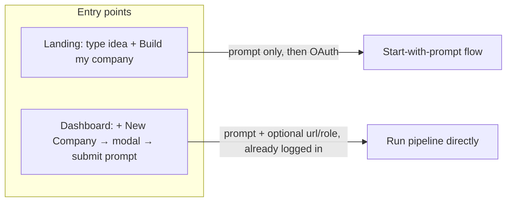
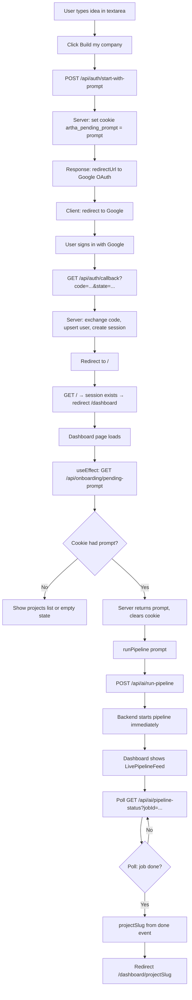
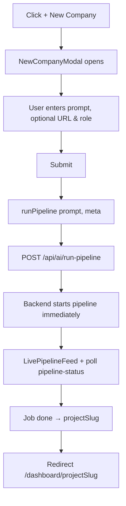
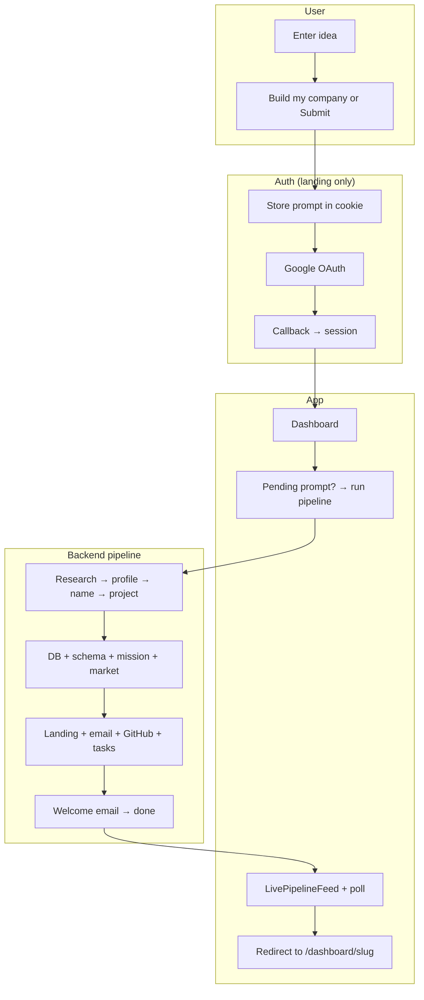

# First prompt — Build my company flow

End-to-end: what happens from the moment the user submits their idea until they land on the project page.

See [user-flow.md](./user-flow.md) for the initial visit and sign-in flows.
See [agents/](./agents/) for the multi-agent architecture that powers the pipeline.

---

## Where “Build my company” can start

- **From landing** — User is not logged in. Prompt is stored in a cookie, then they go through Google OAuth. After sign-in they hit the dashboard, which reads the cookie and starts the pipeline.
- **From dashboard** — User is already logged in. They open “+ New Company”, enter prompt (and optionally URL, role), submit; dashboard calls the pipeline API directly (no cookie, no OAuth).

---

## Path from landing (not logged in)

---

## Path from dashboard (already logged in)

---

## What the pipeline does (backend steps)

Once the pipeline job starts, these steps execute in order. The dashboard shows progress via **LivePipelineFeed** by polling **`/api/ai/pipeline-status`** and mapping step IDs to labels.

```mermaid
flowchart TB
    subgraph Pipeline["Onboarding pipeline (worker)"]
        S1[research_idea] --> S2[save_profile]
        S2 --> S3[name_company]
        S3 --> S4[create_project]
        S4 --> S5[provision_db]
        S5 --> S6[init_schema]
        S6 --> S7[mission]
        S7 --> S8[market_research]
        S8 --> S9[landing_page]
        S9 --> S10[email_setup]
        S10 --> S11[github_repo]
        S11 --> S12[push_website]
        S12 --> S13[task_queue]
        S13 --> S14[welcome_email]
        S14 --> Done[done]
    end
```

| Step | What happens |
|------|----------------|
| **research_idea** | AI analyzes the idea: competitors, market size, timing, summary; result stored in user memory. |
| **save_profile** | Persist optional `role`/`url` to user; ingest profile into Supermemory (user tag). |
| **name_company** | AI generates company name + tagline from prompt (and optional domain hint). |
| **create_project** | Insert row in `projects` (name, slug, status `onboarding`, company email, memory). |
| **provision_db** | Create Neon project, get connection URL; save to `projects.neon_connection_url`. |
| **init_schema** | In company DB: create tables (company_profile, documents, tasks, chat_messages, pages, contacts, email_*, analytics, memory); seed profile + prompt, name, tagline, research. Ingest foundation into company Supermemory. |
| **mission** | AI generates mission/strategy doc (Markdown); insert into company `documents`, set memory, ingest. |
| **market_research** | AI produces competitor analysis + gaps/trends; write market research doc, update memory. |
| **landing_page** | AI generates full HTML landing; save to `projects.landing_page_html` and company `pages`; set `landing_page_published`; ingest. |
| **email_setup** | Set company email on project; store in company memory. |
| **github_repo** | Create private repo in GitHub org; save `github_repo_url` / `github_repo_full_name`. |
| **push_website** | Push `website/index.html`, `config/artha.json`, `.artha/metadata.json` to repo. |
| **task_queue** | AI suggests 5–8 recurring tasks (outreach/custom); insert into company `tasks`; set project `status` to `active`. |
| **welcome_email** | Send Postmark email from company to founder: “Company is live”, link to site + dashboard. |
| **done** | Emit final event with `projectId` and `slug`; front end uses `slug` to redirect to `/dashboard/{projectSlug}`. |

---

## One-page flow (high level)

