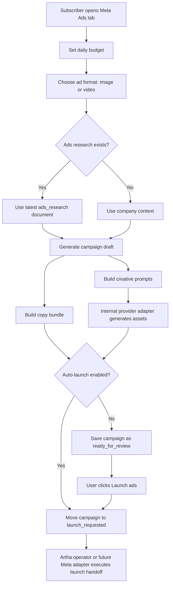
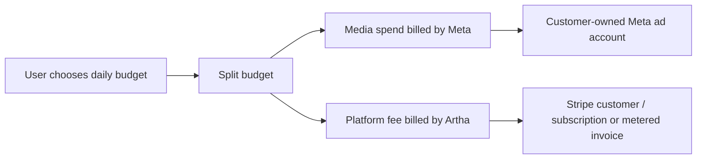

# Meta Ads flow

How the Meta Ads tab works, what Artha charges for, and which env vars matter if we later replace placeholder adapters with live provider integrations.

---

## Product decisions

- Only subscribed projects can access the ads workflow.
- The user should only choose:
  - daily budget
  - ad format: `image` or `video`
- Artha should choose the internal creative model/provider automatically.
- Ads should run in the **customer's Meta ad account**, not an Artha-owned ad account.
- Meta should bill the actual media spend.
- Artha should bill only the platform/management fee through Stripe.
- Ads are research-first:
  - use the latest `ads_research` document if it exists
  - otherwise fall back to company context
- Default behavior is auto-launch after generation.
- If the user disables auto-launch in Settings, Artha generates the draft and waits for manual confirmation.

---

## Why the account should be customer-owned

We chose a customer-owned Meta ad account with Artha added as the operating partner.

This is the better default for us because:

- account ownership stays with the customer
- spend is billed directly by Meta to the customer
- policy risk is isolated per customer account
- campaign history remains portable if the customer leaves
- Artha does not need to front ad spend or hold card liability for media

Artha should manage campaigns in that account rather than running spend from an Artha-owned pooled account.

---

## End-to-end flow



---

## UI flow

### 1. Access gate

- Non-subscribed users can see the tab shell, but the panel shows a subscription gate.
- Subscribed users can:
  - move the budget slider
  - choose `Image ad` or `Video ad`
  - run ads research
  - generate a draft

### 2. Budget selection

- Budget is chosen with a slider.
- The UI shows:
  - total daily budget
  - estimated media spend portion
  - estimated Artha platform fee

Current defaults:

- minimum: `$10/day`
- maximum: `$1000/day`
- platform fee: `20%`

### 3. Format selection

The user selects one format:

- `Image ad`
- `Video ad`

The user does **not** choose:

- model
- provider
- API
- generation backend

That remains internal so we can swap providers without changing the product UX.

### 4. Research dependency

Before ads run, Artha should use the latest `ads_research` document if one exists.

That research should inform:

- audience
- offer positioning
- creative hook
- channel assumptions
- budget framing

If no ads research exists, the user can run it from the same panel.

### 5. Generation and review

When the user clicks generate:

1. Save ads settings for the project.
2. Build a campaign strategy from:
   - company profile
   - latest ads research if available
   - budget
   - chosen format
3. Generate:
   - headlines
   - primary text
   - description
   - caption
   - CTA
   - format-specific creative prompts
4. Store the campaign in the company DB.

Campaign status logic:

- `auto-launch = true` → immediately move to `launch_requested`
- `auto-launch = false` → save as `ready_for_review`

### 6. Launch handoff

Right now, launch is a placeholder handoff state, not a live Meta publish.

Current behavior:

- campaign is created
- launch notes are stored
- campaign moves to `launch_requested`

Future live behavior:

- create/update campaign in the customer-owned Meta ad account
- attach creative and copy
- set daily budget in Meta
- activate the campaign or ad set

---

## Billing flow



### Recommended billing split

For a total daily budget:

- `media spend` goes to Meta
- `platform fee` goes to Artha

Example:

- total: `$140/day`
- Meta media spend: `$112/day`
- Artha fee: `$28/day`

### Recommended Stripe setup

Best default:

- keep the normal Artha subscription as the feature gate
- bill the ads management fee separately in Stripe

Recommended options:

1. **Metered billing**
   - Track Artha's fee usage daily.
   - Bill in arrears through Stripe Billing.
   - Best if the fee scales with active ad days.

2. **Prepaid wallet / credit balance**
   - User prepays an ads management balance.
   - Artha decrements it as ads run.
   - Best if you want tighter risk control before live launch.

Not recommended:

- charging the full ad budget in Stripe and then paying Meta yourself

That creates unnecessary liability because Artha would become the merchant of record for media spend instead of just the platform fee.

---

## Current implementation status

Implemented now:

- subscriber-only panel access
- budget slider
- image vs video choice
- ads settings persistence in `company_profile.settings`
- campaign storage in `ad_campaigns`
- latest `ads_research` lookup
- auto-launch vs manual review
- internal creative provider adapters

Implemented:

- live Meta Marketing API publishing (Campaign → Ad Set → Ad Creative → Ad)
- Meta OAuth for customer-owned ad account connection
- ad account and Facebook Page selection
- campaign activate/pause controls
- live performance metrics (impressions, clicks, spend, CTR, CPC, reach, conversions)
- graceful fallback to manual handoff when Meta account not connected

Not implemented yet:

- live card charging for ads management fee
- automated daily fee ledger
- approval audit trail

---

## Environment variables

### Required right now

These are enough for the current implementation:

```bash
OPENAI_API_KEY=sk-...
STRIPE_SECRET_KEY=sk_live_...
STRIPE_WEBHOOK_SECRET=whsec_...
STRIPE_PRO_PRICE_ID=price_...
STRIPE_CREDIT_PACK_PRICE_ID=price_...
```

Notes:

- `OPENAI_API_KEY` is currently used for campaign strategy drafting.
- No extra ads-specific provider key is required yet because creative generation and launch handoff are still adapter-based placeholders.

### Optional future ads envs

Add these only when wiring live adapters:

```bash
# Meta Marketing API
META_APP_ID=...
META_APP_SECRET=...
META_SYSTEM_USER_ACCESS_TOKEN=...
META_ADS_PARTNER_BUSINESS_ID=...

# Google image/video adapters
GOOGLE_GENAI_API_KEY=...

# Optional alternate providers if we wire them later
SORA_API_KEY=...
SEEDANCE_API_KEY=...
BANANA_API_KEY=...
```

Suggested usage:

- `META_*` for live campaign creation and partner account operations
- `GOOGLE_GENAI_API_KEY` for image/video generation if Google becomes the live default
- `SORA_API_KEY`, `SEEDANCE_API_KEY`, `BANANA_API_KEY` only if we add dedicated adapters for those providers

---

## File map

Core files for this feature:

- [src/components/panels/ads-panel.tsx](/Users/parthnandaniya/Desktop/Parth/artha/src/components/panels/ads-panel.tsx)
- [src/app/api/ads/route.ts](/Users/parthnandaniya/Desktop/Parth/artha/src/app/api/ads/route.ts)
- [src/app/api/ads/launch/route.ts](/Users/parthnandaniya/Desktop/Parth/artha/src/app/api/ads/launch/route.ts)
- [src/lib/ads/config.ts](/Users/parthnandaniya/Desktop/Parth/artha/src/lib/ads/config.ts)
- [src/lib/ads/service.ts](/Users/parthnandaniya/Desktop/Parth/artha/src/lib/ads/service.ts)
- [src/lib/ads/providers.ts](/Users/parthnandaniya/Desktop/Parth/artha/src/lib/ads/providers.ts)
- [src/lib/ads/schema.ts](/Users/parthnandaniya/Desktop/Parth/artha/src/lib/ads/schema.ts)
- [src/components/panels/settings-panel.tsx](/Users/parthnandaniya/Desktop/Parth/artha/src/components/panels/settings-panel.tsx)

