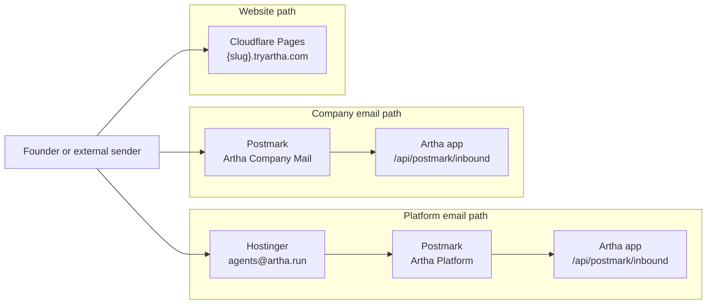
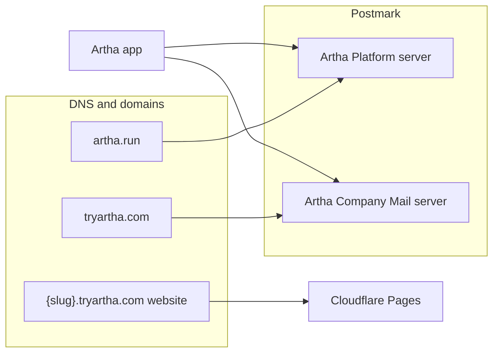
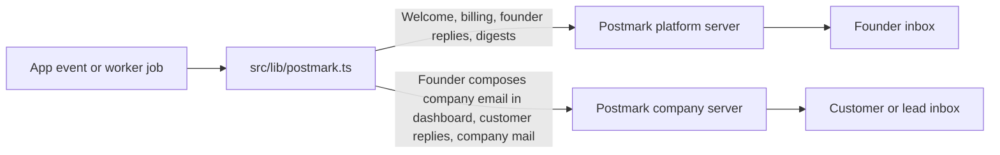
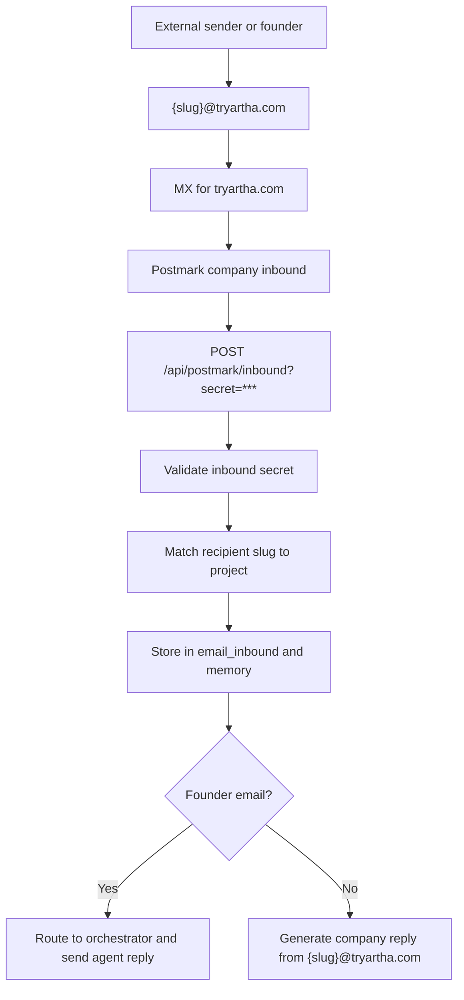
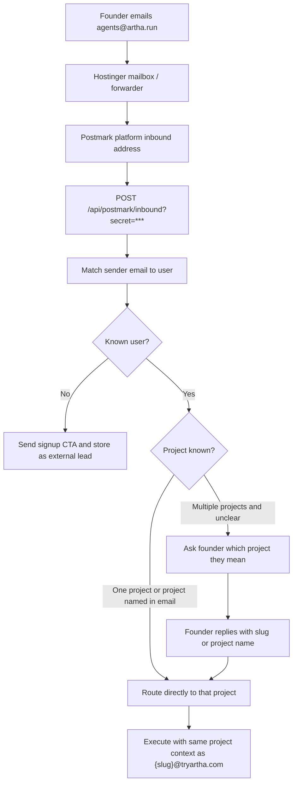
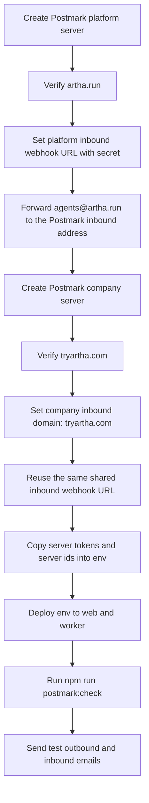
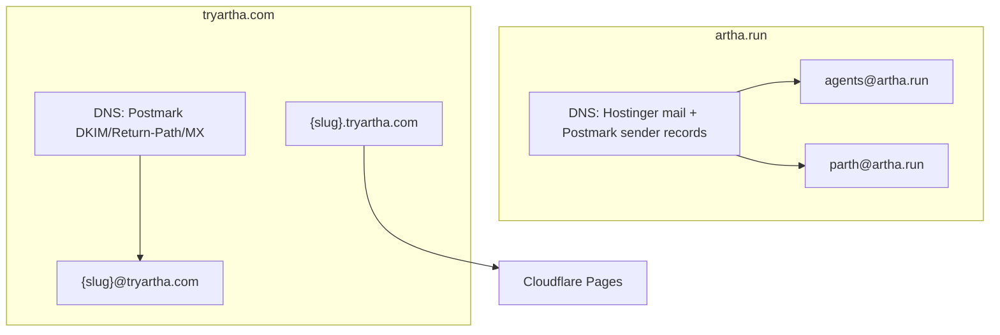

# Postmark Setup

This app has two different email jobs. They should not share the same setup blindly.

## 1. Email model

### Routing summary

| Surface | Address pattern | Receiving service | Delivery method | Sending service |
| --- | --- | --- | --- | --- |
| Platform founder inbox | `agents@artha.run` | Hostinger | Hostinger forwarder -> Postmark platform inbound stream -> `/api/postmark/inbound` | Postmark `Artha Platform` |
| Company inboxes | `{slug}@tryartha.com` | Postmark | `tryartha.com` MX -> Postmark company inbound stream -> `/api/postmark/inbound` | Postmark `Artha Company Mail` |
| Company websites | `{slug}.tryartha.com` | Cloudflare Pages | Cloudflare Pages custom domain | N/A |

### Service ownership



### Platform mail

Use `agents@artha.run` for Artha-originated email:

- welcome email
- billing / credits / lifecycle email
- agent replies to the founder
- daily digest to the founder
- AI-driven inbound at `agents@artha.run`

Recommended Postmark server: `Artha Platform`

### Company mail

Use `{slug}@tryartha.com` for each generated company:

- outbound replies to customers
- inbound mail from customers
- direct company email from the dashboard

Recommended Postmark server: `Artha Company Mail`

The website subdomain (`{slug}.tryartha.com`) and the email address (`{slug}@tryartha.com`) are separate DNS concerns. The website wildcard can point to Cloudflare Pages while the root/apex `tryartha.com` still holds the MX/TXT/CNAME records for mail.

## 1.5. Visual overview

### Domain and server split



### Outbound flow



### Inbound flow for `{slug}@tryartha.com`



### Platform inbound flow for `agents@artha.run`



## 2. Required env

Add these env vars locally and in production:

```bash
# Platform mail
POSTMARK_PLATFORM_SERVER_TOKEN=...
POSTMARK_PLATFORM_SERVER_ID=12345678
POSTMARK_PLATFORM_MESSAGE_STREAM=outbound
POSTMARK_PLATFORM_BROADCAST_MESSAGE_STREAM=broadcasts

# Company mail
POSTMARK_COMPANY_SERVER_TOKEN=...
POSTMARK_COMPANY_SERVER_ID=23456789
POSTMARK_COMPANY_MESSAGE_STREAM=outbound
POSTMARK_COMPANY_BROADCAST_MESSAGE_STREAM=broadcasts

# Optional but recommended for diagnostics/readiness checks
POSTMARK_ACCOUNT_TOKEN=...

# Inbound webhook protection
POSTMARK_INBOUND_WEBHOOK_SECRET=...

# Optional local-dev override when Postmark should keep calling production
# Example: https://artha.run/api/postmark/inbound
POSTMARK_INBOUND_WEBHOOK_URL=
```

Legacy fallback:

```bash
# Only if you intentionally use one Postmark server for everything
POSTMARK_SERVER_TOKEN=...
```

Local development note:

- keep `NEXT_PUBLIC_APP_URL=http://localhost:3000` for your local app
- if the shared Postmark inbound stream remains pointed at production, set `POSTMARK_INBOUND_WEBHOOK_URL` locally to the live `/api/postmark/inbound` endpoint so "Set up email" validates against production instead of localhost
- if you need inbound requests to hit your laptop, expose the local app with a tunnel and point Postmark at that tunnel instead

## 3. Postmark dashboard setup

### Setup sequence



### Server A: platform mail

1. Create a server named `Artha Platform`.
2. Verify `artha.run` as a sending domain on that server, or at minimum confirm `agents@artha.run` as a sender signature.
3. Configure inbound on that same server:
   - inbound webhook URL: `https://YOUR_APP_DOMAIN/api/postmark/inbound?secret=YOUR_SECRET`
   - copy the generated Postmark inbound address from the inbound stream
4. In Hostinger or your current mailbox provider for `artha.run`, create a forwarder from `agents@artha.run` to that Postmark inbound address.
5. Copy:
   - server token -> `POSTMARK_PLATFORM_SERVER_TOKEN`
   - server id -> `POSTMARK_PLATFORM_SERVER_ID`

Important:

- do not set the root `artha.run` MX to Postmark unless you want all `@artha.run` inbound mail handled there
- the platform server can work without a Postmark inbound domain when Hostinger forwards only `agents@artha.run`

### Server B: company mail

1. Create a server named `Artha Company Mail`.
2. Verify `tryartha.com` as a sending domain on that server.
3. Configure inbound on that same server:
   - inbound domain: `tryartha.com`
   - inbound webhook URL: `https://YOUR_APP_DOMAIN/api/postmark/inbound?secret=YOUR_SECRET`
4. Copy:
   - server token -> `POSTMARK_COMPANY_SERVER_TOKEN`
   - server id -> `POSTMARK_COMPANY_SERVER_ID`

## 4. DNS you need to add

### For `artha.run`

Add the DNS records Postmark gives you for the platform server:

- DKIM record(s)
- Return-Path CNAME
- any sender-signature verification record if you use only `agents@artha.run`

Do not switch the root MX for `artha.run` to Postmark if normal inboxes like `parth@artha.run` should stay on Hostinger.

### For `tryartha.com`

Add the DNS records Postmark gives you for the company server:

- DKIM record(s)
- Return-Path CNAME
- MX record for inbound mail at `tryartha.com`

Important: this inbound MX is what lets `hello@tryartha.com` style addresses receive mail inside Postmark. Without it, outbound may work but inbound will not.

### DNS and mail ownership



## 5. How Artha uses it

Current runtime behavior:

- platform emails send through the platform Postmark server
- platform inbound for `agents@artha.run` goes through your mailbox provider's forwarder into the platform Postmark inbound stream
- company emails send through the company Postmark server
- inbound company mail lands on `/api/postmark/inbound`
- inbound requests are rejected unless the webhook secret matches
- Postmark is the transport and inbound parser, while Artha stores inbound thread state in its own database

Important distinction:

- founder updates from Artha always come from `agents@artha.run`
- company-facing mail from the Email panel or auto-replies goes out as `{slug}@tryartha.com`
- the phrase "dashboard sends" means the founder is using the dashboard to send as their company, not Artha sending platform updates
- if a founder emails bare `agents@artha.run` and has multiple projects, Artha asks which project they mean before routing
- once the founder picks a project, the request is executed with the same project context as `{slug}@tryartha.com`

The onboarding step `create email address` does not provision per-user inboxes inside Postmark. It validates that the shared `tryartha.com` company mail setup is ready, then stores `{slug}@tryartha.com` on the project.

### Professional Email Layout
- All Artha-sent emails use a consistent **Professional Layout** defined in `src/lib/postmark.ts#baseLayout`.
- Design features: 12px rounded cards, Syne display font for branding, and subtle shadows.
- **Footer:** Includes a link to the `@tryarthaHQ` X handle for social proof and platform discoverability.


Storage model:

- `agents@artha.run` inbound threads are stored in platform tables `platform_email_threads` and `platform_email_messages`
- `{slug}@tryartha.com` inbound mail is stored in the company database `email_inbound` table for that project
- your Email tab should read from Artha's database, not from Postmark

### Future operator mental model

- Hostinger owns normal `@artha.run` mailbox routing
- Postmark platform owns outbound founder mail and inbound mail that Hostinger forwards from `agents@artha.run`
- Postmark company owns both outbound and inbound for `{slug}@tryartha.com`
- Cloudflare Pages owns `{slug}.tryartha.com` websites only; it does not handle company email

## 6. Verification commands

Run these after env and DNS are in place:

```bash
npm run env:check
npm run postmark:check
```

`postmark:check` verifies:

- platform token works
- company token works
- optional account-level server/domain wiring
- expected inbound webhook URL for company mail

## 7. Production checklist

1. Put all Postmark env vars on the web service.
2. Mirror the same mail env vars to the worker service.
3. Set the inbound webhook in Postmark to the production URL, not localhost.
4. Re-run `npm run postmark:check` against production env.
5. Send one real platform email and one real company email.
6. Email one `{slug}@tryartha.com` address from an external inbox and confirm it reaches `/api/postmark/inbound`.

## 8. Important limitations

### Trial / approval

If the Postmark account is still in trial or pending approval, sending to external recipient domains may be blocked. Finish Postmark approval first.

### Broadcast vs transactional

Use transactional streams for:

- welcome
- receipts / billing
- passwordless / auth
- replies
- digests

Use broadcast streams for:

- re-engagement campaigns
- newsletters
- any email that needs unsubscribe behavior

If you plan to do true cold outbound prospecting at scale, Postmark is usually the wrong provider. Keep Postmark for product and customer mail, and use a dedicated outreach provider for unsolicited outbound.
