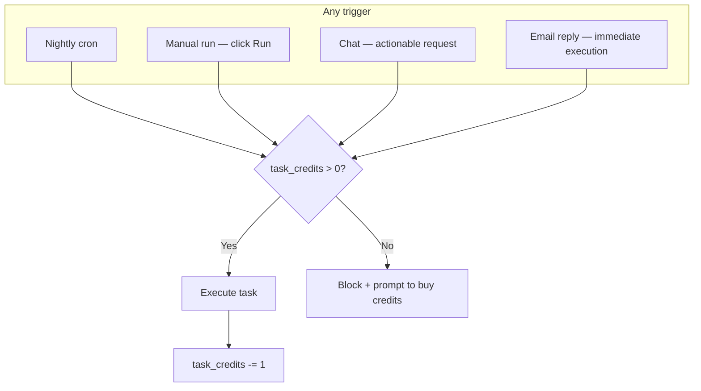
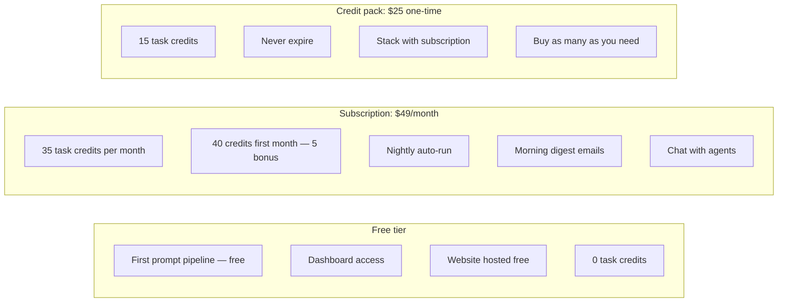
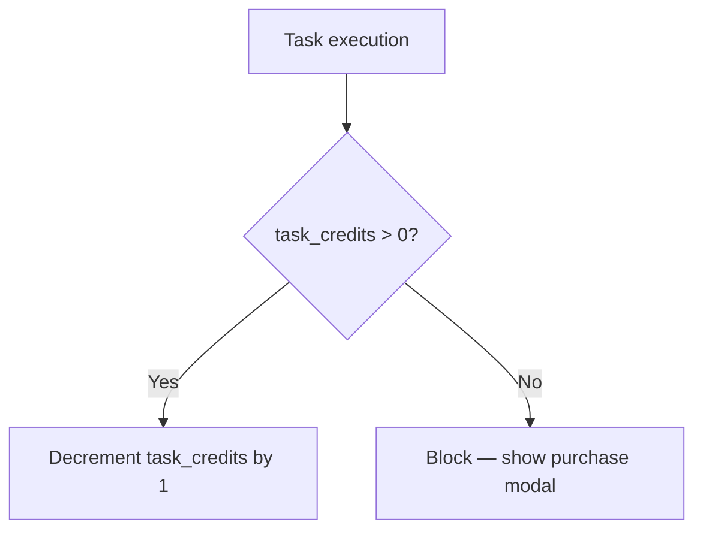
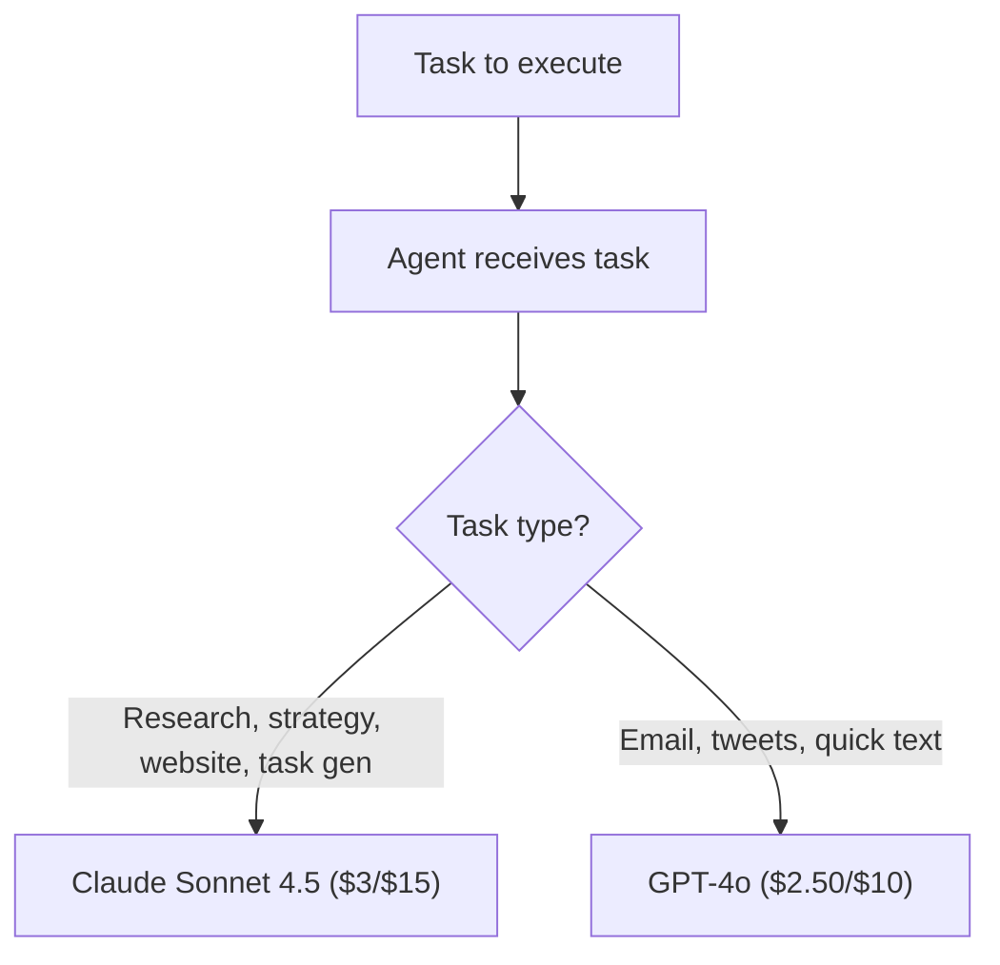
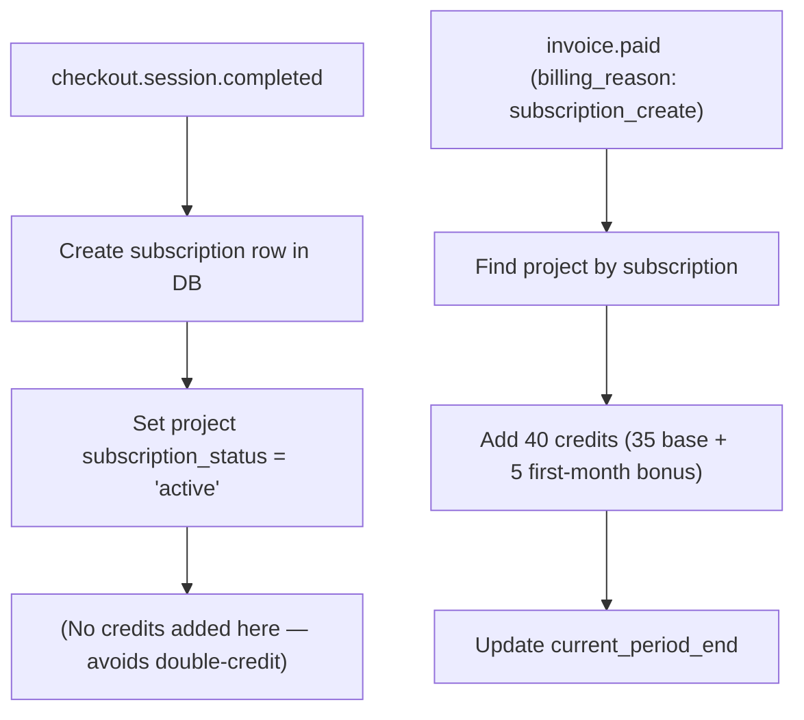
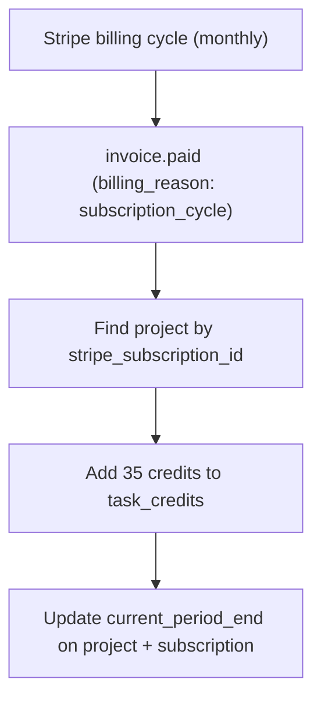
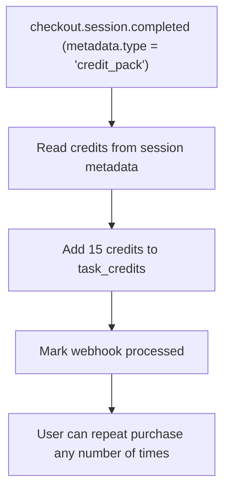
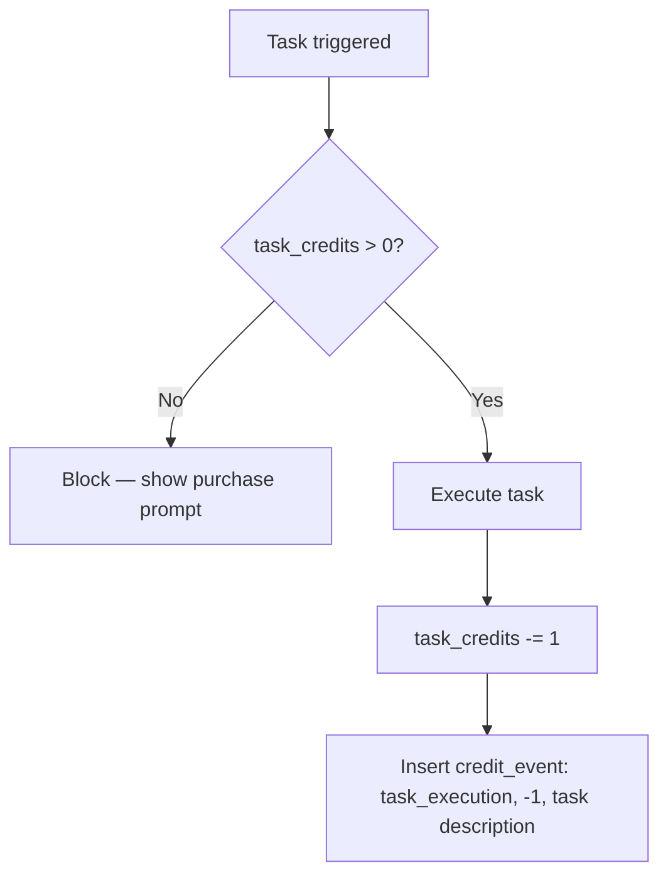
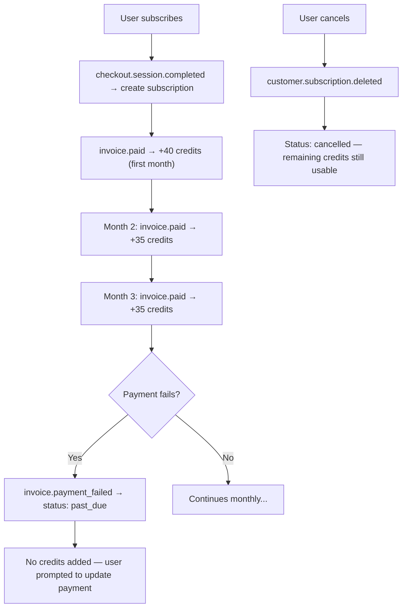

# Credits, pricing & model strategy

How credits work, what they cost us, what we charge, and how agents pick models to stay profitable.

---

## Credit model

One unified pool per project: `task_credits`. Every task execution decrements the same number regardless of how it was triggered.



### What costs a credit

| Action | Credits | Why |
|--------|---------|-----|
| Any task execution (research, outreach, website, tweet, etc.) | 1 | One agent call |
| Chat question (no agent needed) | 0 | Direct answer from context, cheap |
| Task Generator refresh (after task completes) | 0 | Bundled with the task that triggered it |
| Morning digest email | 0 | Included with subscription, lightweight |
| First prompt / onboarding pipeline | 0 | Free — this is how we convert users |

### What does NOT cost a credit

- Answering questions in chat (no agent dispatch)
- Viewing dashboard, documents, tasks
- Task Generator creating new tasks (it's a follow-up to a credited task)
- Morning digest (subscription perk)
- Welcome email
- The entire first prompt pipeline (free onboarding)

---

## How we block and prompt per trigger type

When `task_credits = 0`, we don't just silently fail — we tell the user exactly what happened and how to fix it, via the channel they're already in.

### Chat

The orchestrator detects `creditsAvailable <= 0` before running any agents. The response message includes a direct purchase link:

```
You need credits to execute this request.
→ Get more credits: https://artha.run/pricing
```

The frontend receives a `credits_exhausted` SSE event and can additionally show a purchase modal.

### Email reply (founder → agent)

The inbound email handler calls `orchestrateEmail`. If `noCredits: true` is returned, we immediately reply to the founder's email with:

```
You're out of task credits. To execute tasks, subscribe to Pro ($49/mo for 35 credits)
or buy a credit pack ($25 for 15 credits).

[Get Credits] → https://artha.run/pricing
```

### Manual run (click Run button)

The `/api/tasks/run` route returns HTTP 402 with:
```json
{
  "error": "No task credits remaining",
  "message": "You're out of task credits. Buy a credit pack or subscribe to keep running tasks.",
  "purchaseUrl": "https://artha.run/pricing"
}
```

The frontend uses `purchaseUrl` to show a prompt or redirect.

### Nightly cron

The cron only queues tasks for projects with `task_credits > 0`, so zero-credit projects are automatically skipped. After running, the cron checks for **active subscribers with 0 credits** and sends them a "you're out" email:

> **Subject:** {Company} is out of task credits
>
> Nightly tasks are paused. Buy a credit pack ($25 for 15 credits) — credits never expire and stack with your subscription.
>
> [Buy Credits →] https://artha.run/pricing

This runs once per night (when the cron fires) — no spam.

---

## Pricing



| Plan | Price | Credits | Nightly auto-run | Notes |
|------|-------|---------|-----------------|-------|
| **Free** | $0 | 0 | No | First prompt pipeline is free. User sees their company, website, research, task queue — but can't execute tasks. |
| **Subscription** | $49/month | 35/month (40 first month) | Yes | Credits added each billing cycle via Stripe `invoice.paid` webhook. Unused credits carry over (single pool). |
| **Credit pack** | $25 one-time | 15 | No (unless also subscribed) | Credits never expire. Stack on top of subscription credits. **Purchase as many packs as you need** — each purchase adds 15 more credits. |

### Credit stacking

All credits go into a single `task_credits` pool. Subscription renewals and credit pack purchases both add to the same column.

**Implementation:** Single `task_credits` column. On first subscription, add 40 (35 + 5 bonus). On monthly renewal, add 35. On pack purchase, add 15 (repeatable — user can buy multiple packs). On task execution, subtract 1. Simple.



For credit stacking with expiry tracking (subscription credits expire, pack credits don't), we'd need a `credit_ledger` table — but for now, the simple single-pool approach works. We can add ledger tracking later if needed.

---

## Cost analysis: can we be profitable?

### Model pricing (per 1M tokens, as of 2026)

| Model | Input | Output | Best for |
|-------|-------|--------|----------|
| **Claude Opus 4.6** | $5.00 | $25.00 | Complex reasoning, strategy |
| **Claude Sonnet 4.5** | $3.00 | $15.00 | Good balance of quality + cost |
| **Claude Haiku 4.5** | $1.00 | $5.00 | Fast, cheap, simple tasks |
| **GPT-4o** | $2.50 | $10.00 | Email, tweets, quick text generation |
| **GPT-4o-mini** | $0.15 | $0.60 | Cheapest, good for simple tasks |

### Cost per task by agent

Typical task: ~2-3K input tokens (context + prompt), ~2-6K output tokens (response).

| Agent | Task type | Model | Input tokens | Output tokens | Cost per task |
|-------|-----------|-------|-------------|---------------|--------------|
| **Research Agent** | Mission doc | Sonnet 4.5 | ~3K | ~3K | ~$0.054 |
| **Research Agent** | Market research | Sonnet 4.5 | ~3K | ~6K | ~$0.099 |
| **Research Agent** | Lead research | Sonnet 4.5 | ~3K | ~3K | ~$0.054 |
| **Website Builder** | Landing page | Sonnet 4.5 | ~3K | ~3.5K | ~$0.061 |
| **Website Builder** | New page | Sonnet 4.5 | ~3K | ~3.5K | ~$0.061 |
| **Email Writer** | Outreach batch (10) | GPT-4o | ~3K | ~3K | ~$0.038 |
| **Email Writer** | Digest | GPT-4o | ~2K | ~1K | ~$0.015 |
| **Task Generator** | Generate 3 tasks | Sonnet 4.5 | ~3K | ~1K | ~$0.024 |
| **Twitter Agent** | Single tweet | GPT-4o | ~2K | ~0.5K | ~$0.010 |
| **Twitter Agent** | Thread | GPT-4o | ~2K | ~1.5K | ~$0.020 |

**Average cost per task: ~$0.044** (weighted across task types)

### First prompt pipeline cost (free to user)

| Step | Model | Cost |
|------|-------|------|
| User research | Sonnet 4.5 | ~$0.05 |
| Name company | Sonnet 4.5 | ~$0.01 |
| Idea research | Sonnet 4.5 | ~$0.02 |
| Mission doc | Sonnet 4.5 | ~$0.054 |
| Market research (2 calls) | Sonnet 4.5 | ~$0.10 |
| Landing page | Sonnet 4.5 | ~$0.061 |
| Welcome email | $0 (template) | $0 |
| Task queue | Sonnet 4.5 | ~$0.024 |
| **Total** | | **~$0.31** |

We spend ~$0.31 per free user onboarding. This is our customer acquisition cost for AI.

### Monthly cost per subscriber

Subscriber uses 35 credits/month. Average cost per task: ~$0.044.

| | Per task | Per month (35 tasks) |
|--|---------|---------------------|
| **AI cost** | ~$0.044 | ~$1.54 |
| **Postmark** (emails) | ~$0.001 | ~$0.04 |
| **Neon DB** | — | ~$0.50 (shared) |
| **Cloudflare** | — | $0 |
| **GitHub** | — | $0 |
| **Total cost** | | **~$2.08** |
| **Revenue** | | **$49.00** |
| **Gross margin** | | **~96%** |

### What if we used Opus 4.6 for everything?

| | Per task | Per month (35 tasks) |
|--|---------|---------------------|
| **AI cost (Opus for all)** | ~$0.15 | ~$5.25 |
| **Other costs** | | ~$0.54 |
| **Total cost** | | **~$5.79** |
| **Revenue** | | **$49.00** |
| **Gross margin** | | **~88%** |

Even with Opus 4.6 for every single call, we're at 88% margin. **We can afford it.** But we shouldn't — because the quality difference between Opus and Sonnet doesn't matter for tasks like tweets or task generation.

---

## Model selection strategy

Agents don't all need the same model. We use two models: **Claude Sonnet 4.5** for complex reasoning, and **GPT-4o** for fast text generation.



### Model assignment by agent + task type

| Agent | Task type | Model | Reasoning |
|-------|-----------|-------|-----------|
| **Research Agent** | User research | Sonnet 4.5 | Needs reasoning to synthesize profile from multiple signals |
| **Research Agent** | Mission / strategy | Sonnet 4.5 | Quality matters — this is a key document |
| **Research Agent** | Market research | Sonnet 4.5 | Competitive analysis needs good reasoning, 6K output tokens |
| **Research Agent** | Lead research | Sonnet 4.5 | Needs to identify and score leads intelligently |
| **Research Agent** | General / content | Sonnet 4.5 | Writing quality matters |
| **Website Builder** | Landing page | Sonnet 4.5 | Claude produces well-structured, creative design briefs |
| **Website Builder** | New page | Sonnet 4.5 | Same — variety and quality over template repetition |
| **Website Builder** | Edit page | Sonnet 4.5 | Needs to understand existing content holistically |
| **Email Writer** | Cold outreach | GPT-4o | Fast, punchy, personalized — GPT-4o excels at this |
| **Email Writer** | Digest | GPT-4o | Simple summary, doesn't need heavy reasoning |
| **Email Writer** | Newsletter | GPT-4o | Writing quality is good, cheaper than Sonnet for volume |
| **Email Writer** | Reply | GPT-4o | Short, contextual reply |
| **Task Generator** | Generate tasks | Sonnet 4.5 | Better strategic reasoning about what actually moves the needle |
| **Twitter Agent** | Tweet | GPT-4o | Short text — GPT-4o is great at punchy hooks |
| **Twitter Agent** | Thread | GPT-4o | Still short text per tweet |
| **Orchestrator** | Intent classification | GPT-4o | JSON routing, well-defined schema |
| **Orchestrator** | Direct answer | GPT-4o | Conversational reply, no deep reasoning needed |

### Why Sonnet 4.5 for website builder (instead of GPT-4o)?

We switched from GPT-4o to Claude Sonnet 4.5 for website generation. The website builder uses a **template-based approach** — Claude generates a JSON content/theme payload (~3K tokens), and a pre-built template engine assembles the full HTML. Sonnet produces more creative, varied design decisions (layout choices, color palettes, section combinations) than GPT-4o, making each site feel more unique.

### Why not Opus 4.6?

Opus is the most capable model, but:
- At $5/$25 per 1M tokens, it's 1.7x more expensive than Sonnet
- For our task types (research docs, emails, tweets, task generation), Sonnet 4.5 produces equivalent quality
- We save ~$3.85/month per subscriber by using Sonnet + GPT-4o instead of Opus for everything

**When to use Opus:** If we add complex multi-step reasoning tasks (e.g. "analyze our entire business and create a 90-day plan"), Opus would be worth it. For now, Sonnet handles everything.

### Output token limits by task type

Limits are generous for paying/converting users — great output that justifies the credit spend. Free users get the same quality (we want them to convert).

| Task type | Max tokens | Notes |
|-----------|-----------|-------|
| Website builder (JSON content payload) | 8000 | More sections, richer copy, more layout variety |
| Market research report | 6000 | Comprehensive 7-section report with live web data |
| General research | 5000 | Deeper analysis grounded in web search results |
| Lead research | 4096 | Lead list + personas + outreach angles (web-grounded) |
| Mission doc | 4000 | Full strategy document with all 8 sections |
| Document update | 4000 | Full rewrite incorporating requested changes |
| Task execution (custom) | 4000 | Plans, analysis, content — whatever the task needs |
| Task generation (5-8 tasks) | 3000 | Detailed, specific execution briefs per task |
| Email (outreach / newsletter) | 2000 | Full draft with strategy notes |
| Direct chat answer | 2000 | Substantive, strategic — not a one-liner |
| Email (reply) | 1500 | Contextual reply, conversational tone |
| Tweet thread | 1000 | 4-6 tweets in one call |
| Tweet (single) | 300 | Hard cap — tweets are ≤280 chars |

---

## Profitability scenarios

### Scenario 1: 100 subscribers, smart model selection (current plan)

| | Monthly |
|--|---------|
| Revenue | 100 × $49 = **$4,900** |
| AI costs | 100 × $1.54 = $154 |
| Infra (Neon, Postmark, etc.) | ~$100 |
| **Net** | **~$4,646 (~95% margin)** |

### Scenario 2: 100 subscribers, Opus 4.6 for everything

| | Monthly |
|--|---------|
| Revenue | **$4,900** |
| AI costs | 100 × $5.25 = $525 |
| Infra | ~$100 |
| **Net** | **~$4,275 (~87% margin)** |

### Scenario 3: 1000 subscribers, smart model selection

| | Monthly |
|--|---------|
| Revenue | **$49,000** |
| AI costs | 1000 × $1.54 = $1,540 |
| Infra | ~$500 |
| **Net** | **~$46,960 (~96% margin)** |

### Scenario 4: 1000 free users (onboarding cost only)

| | Monthly |
|--|---------|
| Revenue | $0 |
| AI costs | 1000 × $0.31 = $310 |
| Infra | ~$200 |
| **Total cost** | **~$510** |

1000 free users costs us $510/month. If 5% convert to $49/month, that's 50 × $49 = $2,450 revenue. **Very profitable even at 5% conversion.**

---

## Web search (Tavily)

All research agents now run live web searches before generating content. This means the output is grounded in real, current data — not just LLM training knowledge.

**Powered by:** [Tavily](https://tavily.com) — purpose-built search API for AI agents. Returns clean, structured results optimized for LLM context injection.

**Requires:** `TAVILY_API_KEY_DEV` (local) or `TAVILY_API_KEY_PROD` (production). Falls back to `TAVILY_API_KEY` if the env-specific key is not set. Falls back gracefully to LLM-only mode if no key is available.

### Which agents use web search

| Agent / Step | Queries | Depth | Purpose |
|---|---|---|---|
| **Market researcher** | 3 queries (competitors, market size, trends) | advanced | Ground competitive analysis in live data |
| **Research agent** — general research | 1 query (the user's prompt) | advanced | Current, factual findings |
| **Research agent** — lead research | 2 queries (persona + companies) | advanced | Real companies and contacts to reach out to |
| **User research** (onboarding) | 1-2 queries (person's name + domain) | basic | Personalize the onboarding experience |
| **Pipeline** — idea research | 2-3 queries (competitors + market) | advanced | Better initial competitive landscape |
| **Pipeline** — market research | 3 queries (same as market researcher) | advanced | Real data for the onboarding report |

### Search cost (Tavily)

| Plan | Searches/month | Cost |
|------|---------------|------|
| Free | 1,000 | $0 |
| Pay-as-you-go | Beyond free tier | ~$0.008/search |

At 35 tasks/month per subscriber with ~40% being research tasks = ~14 research tasks × 3 searches = ~42 Tavily searches/month per subscriber. Well within the free tier for the first ~23 subscribers. After that, ~$0.34/subscriber/month — still negligible.

---

## Cost optimization levers

### 1. Prompt caching (biggest win)

Anthropic's prompt caching reduces input costs by 90% on repeated context. Since we build similar context blocks for the same company across multiple tasks, caching saves significantly.

**Without caching:** ~$1.54/month per subscriber
**With caching:** ~$1.00/month per subscriber (estimated 35% savings on input tokens)

### 2. Batch API (for nightly tasks)

Anthropic's Batch API offers 50% discount. Since nightly tasks aren't time-sensitive (they run at night, results shown in morning), we can batch them.

**Savings:** ~25% on nightly task costs

### 3. Output token limits

Already enforced — strict `max_tokens` per task type prevents verbose waste. Market research capped at 6K tokens (was 4K) for better output quality while staying controlled.

### 4. Model downgrade for simple tasks

Could push further by using GPT-4o-mini for very simple tasks (digest emails, tweet threads) as prompt engineering improves. Not worth the quality trade-off yet.

---

## Schema

### Platform DB

The canonical platform schema now lives in `schema/platform.sql`.

```sql
-- Single credit column (replaces nightly_tasks_remaining + ondemand_credits_remaining)
ALTER TABLE projects ADD COLUMN IF NOT EXISTS task_credits INTEGER DEFAULT 0;

-- Migrate existing split credits into unified pool
UPDATE projects
SET task_credits = COALESCE(nightly_tasks_remaining, 0) + COALESCE(ondemand_credits_remaining, 0)
WHERE task_credits = 0
  AND (COALESCE(nightly_tasks_remaining, 0) + COALESCE(ondemand_credits_remaining, 0)) > 0;

-- Single decrement function
CREATE OR REPLACE FUNCTION decrement_task_credits(p_project_id UUID)
RETURNS VOID AS $$
BEGIN
  UPDATE projects
  SET task_credits = GREATEST(task_credits - 1, 0)
  WHERE id = p_project_id AND task_credits > 0;
END;
$$ LANGUAGE plpgsql;
```

### Credit events (for tracking)

```sql
CREATE TABLE credit_events (
    id UUID PRIMARY KEY DEFAULT uuid_generate_v4(),
    project_id UUID NOT NULL REFERENCES projects(id) ON DELETE CASCADE,
    type TEXT NOT NULL,            -- 'subscription_renewal', 'pack_purchase', 'task_execution', 'bonus'
    amount INTEGER NOT NULL,       -- positive = add, negative = subtract
    balance_after INTEGER NOT NULL,
    description TEXT,              -- "Monthly renewal: +35", "Task: Research competitor pricing"
    task_id UUID,                  -- links to job_queue if task execution
    created_at TIMESTAMPTZ DEFAULT NOW()
);
CREATE INDEX idx_credit_events_project ON credit_events(project_id, created_at);
```

This gives us a full audit trail: when credits were added, when they were spent, what task consumed them.

---

## Credit flow diagrams

### New subscription (first month)

When a user subscribes, two Stripe webhooks fire in sequence:



**Why split across two events?** Stripe fires both `checkout.session.completed` and `invoice.paid` for the first payment. Credits are only added in `invoice.paid` to prevent double-crediting. The `billing_reason` field distinguishes first payment from renewals.

### Monthly subscription renewal (automatic)

Every month while the subscription is active, Stripe automatically charges the customer and fires `invoice.paid`. No cron job or manual trigger needed — Stripe handles the billing cycle.



**Key points:**
- Credits are added automatically every month as long as the subscription is active
- Stripe manages the billing cycle — we just respond to the `invoice.paid` webhook
- If payment fails, `invoice.payment_failed` fires instead and the subscription goes to `past_due`
- Credits stack: unused credits from previous months are not removed (single pool, no expiry tracking yet)

### Credit pack purchase



Credit packs use `mode: 'payment'` (one-time), not `mode: 'subscription'`. The webhook distinguishes them via `session.metadata.type === 'credit_pack'`. **There is no limit on how many packs a user can buy** — each purchase adds 15 credits to the pool.

### Task execution (any trigger)



### Subscription lifecycle and credits



### Stripe webhook events handled

| Event | What happens |
|-------|-------------|
| `checkout.session.completed` (subscription) | Create subscription row, set project active. **No credits** (handled by `invoice.paid`). |
| `checkout.session.completed` (credit_pack) | Add pack credits to `task_credits`. Repeatable. |
| `invoice.paid` (subscription_create) | First month: add 35 + 5 bonus = **40 credits**. Update period dates. |
| `invoice.paid` (subscription_cycle) | Renewal: add **35 credits**. Update period dates. |
| `invoice.payment_failed` | Set status to `past_due`. Send payment-failed email. No credits added. |
| `customer.subscription.updated` | Sync status and period dates. |
| `customer.subscription.paused` | Set status to `paused`. |
| `customer.subscription.resumed` | Set status to `active`. |
| `customer.subscription.deleted` | Set status to `cancelled`. Send cancellation email. |

### Dashboard display

```
┌──────────────────────────────────┐
│  Credits: 28 remaining           │
│  ████████████████░░░░░  28/35    │
│                                  │
│  Plan: $49/month                 │
│  Renews: Mar 15                  │
│  [Buy 15 more credits — $25]    │
└──────────────────────────────────┘
```
