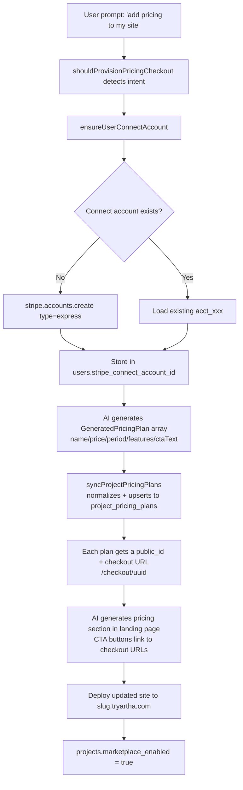
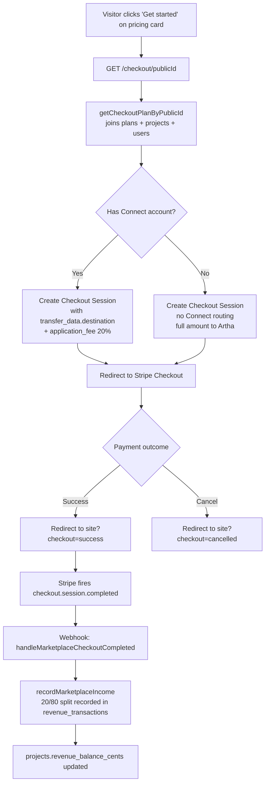
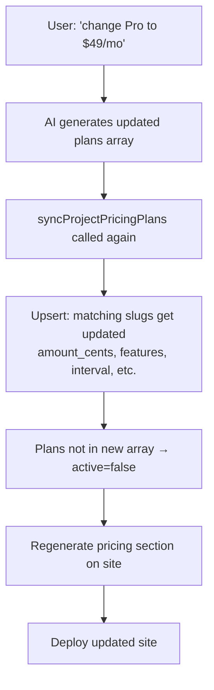
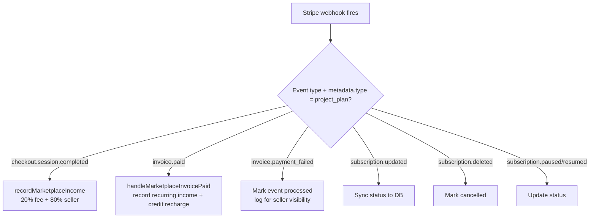

# Stripe Pricing for Company Websites

Artha manages all Stripe infrastructure on behalf of companies. The Artha user never touches Stripe — they just describe what pricing they want, and Artha provisions everything automatically.

**Status: Implemented** — see key files below.

---

## Architecture: Stripe Connect (Destination Charges)

We use **Stripe Connect (Express accounts)** with **destination charges**:
- Artha is the **platform** (one Stripe account, `STRIPE_SECRET_KEY`)
- Each company owner gets a **Stripe Express connected account** (`users.stripe_connect_account_id`)
- Payments from end-customers flow through Artha, with 95% transferred to the seller's connected account
- Artha takes **5% platform fee** automatically via `application_fee_amount` / `application_fee_percent`
- If the company hasn't onboarded their bank yet, funds hold in Stripe until they do

---

## Key Files

| File | Purpose |
|---|---|
| `src/lib/marketplace.ts` | Core: plans CRUD, Connect accounts, fee calculation, income recording |
| `src/app/checkout/[publicId]/route.ts` | Checkout session creation with Connect routing |
| `src/app/api/stripe/webhook/route.ts` | Webhook handler (checkout, invoices, subscriptions) |
| `src/app/api/stripe/connect/route.ts` | Connect onboarding link generation |
| `src/lib/ai/website-builder/landing-page-builder.ts` | AI pricing page generation |
| `src/lib/stripe.ts` | Stripe client + plan config |
| `schema/platform.sql` | DB schema (project_pricing_plans, revenue_transactions, stripe_webhook_events) |

---

## Flow 1: Initial Setup (Company Creates Pricing)

When the Artha user asks to add pricing to their site:



**Implementation:** `syncProjectPricingPlans()` in `marketplace.ts` handles the full plan lifecycle — normalizes AI output, upserts to DB, deactivates removed plans, and returns `SyncedPricingPlan[]` with checkout URLs.

---

## Flow 2: End-Customer Subscribes

When a visitor on the company's website clicks a pricing CTA:



**One-time payments:** `payment_intent_data.application_fee_amount` + `transfer_data.destination`
**Subscriptions:** `subscription_data.application_fee_percent` + `transfer_data.destination`

---

## Flow 3: User Changes Pricing

Plans are mutable in our DB (we use inline `price_data`, not pre-created Stripe Prices):



Since we use `price_data` (inline pricing) in Checkout Sessions rather than pre-created Stripe Price objects, price changes are instant — the next checkout session uses the new amount from the DB. No Stripe migration needed.

---

## Flow 4: Subscription Lifecycle (Webhooks)

All handled in `src/app/api/stripe/webhook/route.ts`:



**Idempotency:** Every event is logged in `stripe_webhook_events` with `stripe_event_id`. Duplicates are rejected before processing.

---

## DB Schema (Platform DB)

Already in `schema/platform.sql`:

```sql
-- On users table
stripe_connect_account_id TEXT  -- acct_xxx (Express account)

-- On projects table
marketplace_enabled BOOLEAN DEFAULT false
marketplace_fee_percent INTEGER DEFAULT 20
revenue_balance_cents BIGINT DEFAULT 0
stripe_subscription_id TEXT

-- Pricing plans per project
CREATE TABLE project_pricing_plans (
  id               UUID PRIMARY KEY DEFAULT gen_random_uuid(),
  project_id       UUID REFERENCES projects(id),
  public_id        UUID NOT NULL UNIQUE,           -- used in checkout URL
  slug             TEXT NOT NULL,
  name             TEXT NOT NULL,
  amount_cents     INTEGER NOT NULL,
  currency         TEXT DEFAULT 'usd',
  billing_interval TEXT DEFAULT 'month',            -- 'month' | 'year' | 'one_time'
  interval_count   INTEGER DEFAULT 1,
  cta_text         TEXT,
  features         JSONB DEFAULT '[]',
  active           BOOLEAN DEFAULT true,
  sort_order       INTEGER DEFAULT 0,
  metadata         JSONB DEFAULT '{}',
  created_at       TIMESTAMPTZ DEFAULT now(),
  updated_at       TIMESTAMPTZ DEFAULT now(),
  UNIQUE (project_id, slug)
);

-- Revenue tracking with fee breakdown
CREATE TABLE revenue_transactions (
  id                          UUID PRIMARY KEY DEFAULT gen_random_uuid(),
  project_id                  UUID REFERENCES projects(id),
  type                        TEXT NOT NULL,                -- 'income' | 'withdrawal'
  amount_cents                BIGINT NOT NULL,              -- seller net
  gross_amount_cents          BIGINT,
  platform_fee_cents          BIGINT,
  seller_net_amount_cents     BIGINT,
  currency                    TEXT DEFAULT 'usd',
  description                 TEXT,
  stripe_checkout_session_id  TEXT,
  stripe_payment_intent_id    TEXT,
  stripe_invoice_id           TEXT,
  stripe_subscription_id      TEXT,
  status                      TEXT DEFAULT 'completed',
  metadata                    JSONB DEFAULT '{}',
  created_at                  TIMESTAMPTZ DEFAULT now()
);

-- Webhook event log (idempotency)
CREATE TABLE stripe_webhook_events (
  id               UUID PRIMARY KEY DEFAULT gen_random_uuid(),
  stripe_event_id  TEXT NOT NULL UNIQUE,
  type             TEXT NOT NULL,
  livemode         BOOLEAN DEFAULT false,
  processed        BOOLEAN DEFAULT false,
  project_id       UUID,
  user_id          UUID,
  error_message    TEXT,
  payload          JSONB,
  created_at       TIMESTAMPTZ DEFAULT now()
);
```

---

## Artha Platform Fee

Artha takes **20%** of every payment processed through a company's site. This covers: Stripe Connect infrastructure, AI, hosting, email, analytics, and ongoing automation.

Defined as `PLATFORM_FEE_PERCENT = 20` in `marketplace.ts`.

**One-time payment:**
```ts
payment_intent_data: {
  application_fee_amount: Math.round(amountCents * 0.20),
  transfer_data: { destination: stripeConnectAccountId }
}
```

**Subscription:**
```ts
subscription_data: {
  application_fee_percent: 20,
  transfer_data: { destination: stripeConnectAccountId }
}
```

The remaining 80% is transferred directly to the company's connected bank account. Stripe's own processing fee (~2.9% + $0.30) comes out of the seller's 80%.

---

## Connect Onboarding

Handled by `createConnectManagementLink()` in `marketplace.ts`:

1. `ensureUserConnectAccount()` creates Express account if none exists
2. If `details_submitted` → returns Stripe dashboard login link
3. If not onboarded → returns `account_onboarding` link
4. API route: `POST /api/stripe/connect` (authenticated)
5. Return/refresh URLs point to `/dashboard?connect_success=true`

---

## Summary

| What | Status | Where |
|---|---|---|
| Connect account creation | Done | `ensureUserConnectAccount()` |
| Pricing plan CRUD | Done | `syncProjectPricingPlans()` |
| AI pricing detection | Done | `shouldProvisionPricingCheckout()` |
| Checkout with Connect routing | Done | `/checkout/[publicId]/route.ts` |
| 20% fee enforcement (one-time) | Done | `application_fee_amount` |
| 20% fee enforcement (subscription) | Done | `application_fee_percent` |
| Webhook income recording | Done | `handleMarketplaceCheckoutCompleted()` |
| Recurring income recording | Done | `handleMarketplaceInvoicePaid()` |
| Revenue balance tracking | Done | `recordMarketplaceIncome()` |
| Connect onboarding UI | Done | `POST /api/stripe/connect` |
| Pricing page generation | Done | `landing-page-builder.ts` |
| Event idempotency | Done | `stripe_webhook_events` table |
