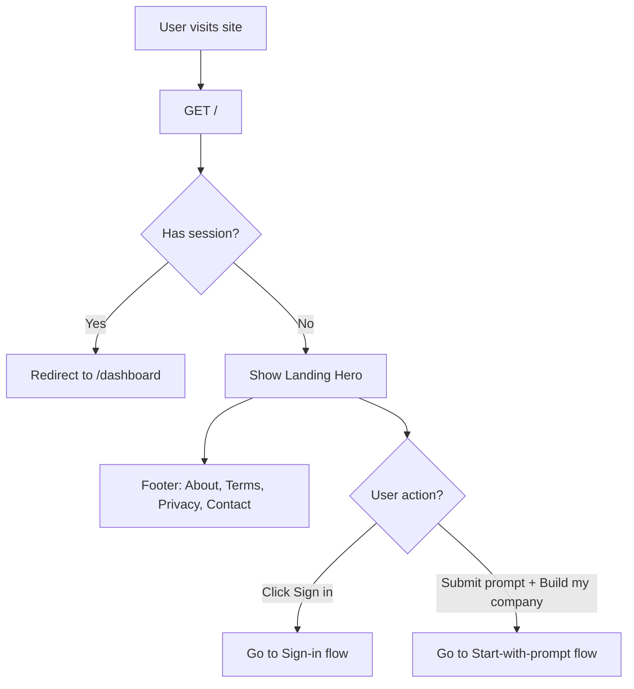
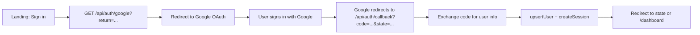
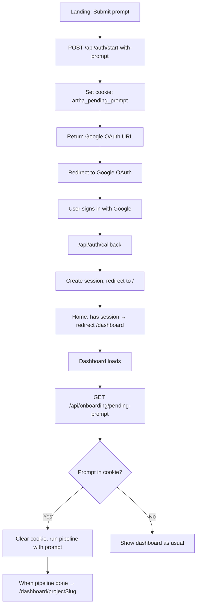
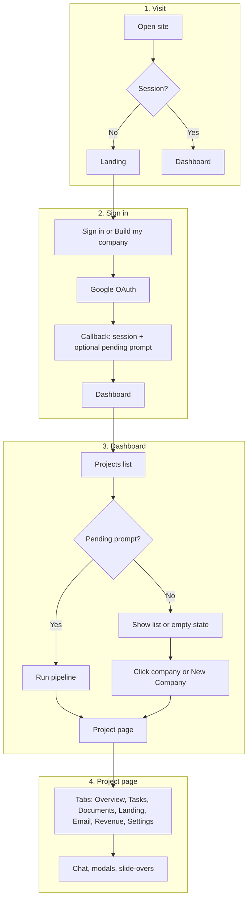

# Artha — User flow & app sections

A step-by-step flow from first visit through sign-in and each section of the app.

---

## 1. Visit & landing

When someone opens your site:



- **`/`** — Server checks `getSession()`. If logged in → redirect to `/dashboard`. Else → render `LandingHero`.
- **Footer** — Links to `/about`, `/terms`, `/privacy`, and `mailto:parth@artha.run`.

---

## 2. Sign-in flow (no prompt)

User clicks **“Sign in”** (no idea in the textarea):



- **`/api/auth/google`** — Builds Google OAuth URL with `return` path in `state`, redirects to Google.
- **`/api/auth/callback`** — Receives `code`, exchanges for tokens, gets user profile, upserts user, creates session cookie, redirects to `state` (or `/dashboard`).

---

## 3. Start-with-prompt flow (Build my company)

User types an idea and clicks **“Build my company”**:



- **`/api/auth/start-with-prompt`** — Stores prompt in httpOnly cookie (10 min), returns Google OAuth URL; client redirects to Google.
- After callback, user lands on `/` → session exists → redirect to `/dashboard`.
- Dashboard fetches **`/api/onboarding/pending-prompt`** once; if cookie had a prompt, it’s returned and cookie is cleared, then the dashboard runs the onboarding pipeline with that prompt and later redirects to `/dashboard/{projectSlug}`.
- **Full pipeline walkthrough** → See [first-prompt.md](./first-prompt.md).

---

## 4. After sign-in — Dashboard (`/dashboard`)

Logged-in user on the main dashboard:

```mermaid
flowchart TD
    A[/dashboard] --> B[Fetch /api/projects]
    A --> C[Fetch /api/onboarding/pending-prompt]
    B --> D{401?}
    D -->|Yes| E[Redirect /]
    D -->|No| F{Pending prompt?}
    C --> F
    F -->|Yes| G[Run pipeline with prompt]
    F -->|No| H{Projects empty?}
    G --> I[Show LivePipelineFeed]
    I --> J[Pipeline done → /dashboard/projectSlug]
    H -->|Yes| K[No companies yet + Build Your First Company]
    H -->|No| L[Grid of company cards]
    K --> M[+ New Company → NewCompanyModal]
    L --> N[Click card → /dashboard/projectSlug]
    L --> M
    M --> O[Submit prompt → run pipeline → then /dashboard/projectSlug]
```

- **Header** — “artha”, “+ New Company”, “Sign out” (POST `/api/auth/logout`).
- **Pipeline running** — Shows `LivePipelineFeed` and spinner until done, then redirect to project.
- **No companies** — CTA “Build Your First Company” opens `NewCompanyModal`.
- **Has companies** — Cards (name, slug, status, revenue, “Website live”); click → project page; “+ New Company” card/modal to create another.

---

## 5. Project dashboard (`/dashboard/[projectSlug]`)

Single company view:

```mermaid
flowchart TD
    A[/dashboard/projectSlug] --> B[Fetch /api/projects]
    B --> C{Project found?}
    C -->|No| D[Project not found → link to /dashboard]
    C -->|Yes| E{Pipeline running?}
    E -->|Yes| F[TopBar + LivePipelineFeed + spinner]
    E -->|No| G[Full project UI]
    G --> H[TopBar: project switcher, + New Company]
    G --> I[ChatSidebar]
    G --> J[PanelTabs + content]
    J --> K[Overview]
    J --> L[Tasks]
    J --> M[Documents]
    J --> N[Landing Page]
    J --> O[Email]
    J --> P[Revenue]
    J --> Q[Settings]
    G --> R[SubscriptionPaywallModal if active & no sub]
    G --> S[Slide-overs: DocumentDetail, TaskDetail]
```

**Top bar** — List of projects, current project, “+ New Company” (opens `NewCompanyModal`).

**Chat sidebar** — Toggle open/close; chat for this project; can create tasks and refresh data. Has a fixed input at the bottom and a scrollable chat area. Width is increased to `w-96` for better task details visibility.

**Tabs & panels**

| Tab          | Panel             | Purpose |
|-------------|-------------------|--------|
| Overview    | `OverviewPanel`    | Summary, subscribe CTA, docs/tasks links, switch to other panels |
| Tasks       | `TasksPanel`       | Task list, run task, open task/doc slide-overs; contains subscription CTA for non-pro users |
| Documents   | `DocumentsPanel`   | Document list, open document slide-over |
| Landing Page| `LandingPagePanel` | Preview/edit landing; link to live site `slug.tryartha.com` |
| Email       | `EmailPanel`       | Email-related UI for project |
| Revenue     | `RevenuePanel`     | Revenue for project; contains subscription CTA for non-pro users |
| Settings    | `SettingsPanel`    | Project settings, billing activity, integration recovery actions (create company email address / post launch tweet) |


**Modals** — `NewCompanyModal` (new company from prompt); `SubscriptionPaywallModal` (shown when project is active but subscription is none).

**Slide-overs** — `DocumentDetail`, `TaskDetail` (from panels).

**Post-subscribe** — If URL has `?subscribed=true`, project data is refreshed.

### Integration fallback behavior

- Onboarding does **not** fail if Postmark or Twitter is unavailable.
- If company email setup or launch tweet posting is skipped/failed during onboarding, the project still becomes active.
- In **Settings → Integrations**, users can click:
  - **Create email address**
  - **Post launch tweet**
  to retry those steps manually.

---

## 6. Other routes

```mermaid
flowchart LR
    A[/login] --> B[Redirect /]
    C[/terms] --> D[Terms page]
    E[/privacy] --> F[Privacy page]
    G[/about] --> H[About page if exists]
    I[/site/slug] --> J{Project published?}
    J -->|Yes| K[Render landing_page_html]
    J -->|No| L[404]
```

- **`/login`** — Redirects to `/`.
- **`/terms`**, **`/privacy`** — Static content; link back to `/`.
- **`/about`** — Linked from landing footer (create page if you want it).
- **`/site/[slug]`** — Public landing: loads project by `slug`; if `landing_page_published` and `landing_page_html` exist, renders HTML; else 404. (Panel links to `https://slug.tryartha.com` for live site.)

---

## 7. End-to-end flow (one diagram)

High-level path from visitor to project dashboard:



Use this doc to walk through “visit → sign-in → after sign-in → each section” when explaining the app.
