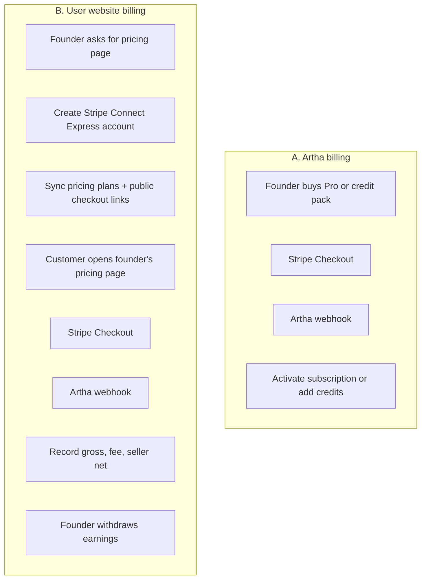
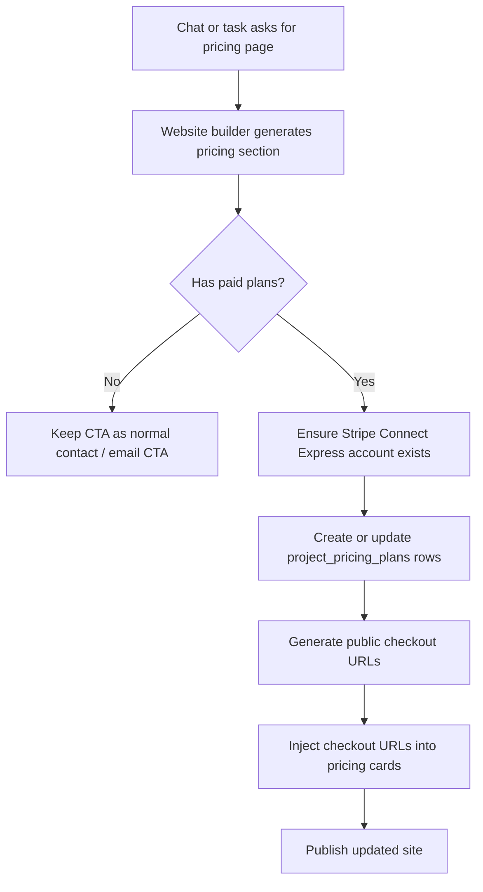
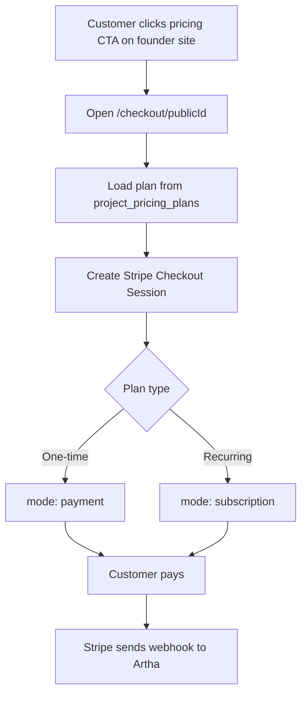
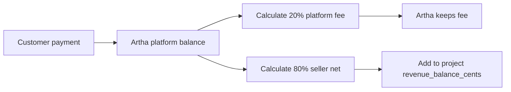
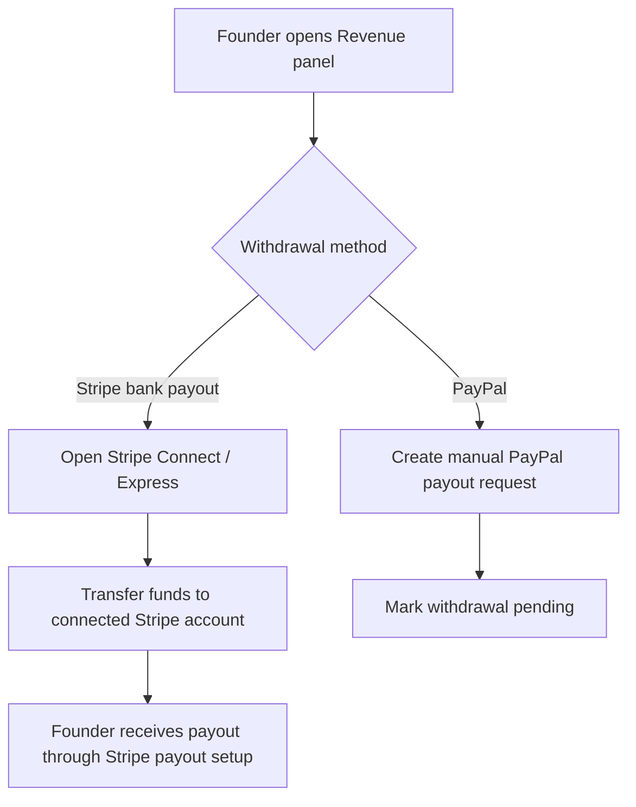

# Stripe marketplace checkout & revenue flow

How Artha handles its own subscription billing, how user websites sell plans through Stripe Checkout, how the 20% / 80% split is recorded, and how withdrawals work.

**Code:** `src/lib/marketplace.ts`, `src/app/checkout/[publicId]/route.ts`, `src/app/api/stripe/webhook/route.ts`, `src/app/api/revenue/withdraw/route.ts`, `src/lib/ai/website-builder/landing-page-builder.ts`, `schema/platform.sql`

---

## 1. Two separate Stripe flows

Artha now has **two billing tracks**:

1. **Artha subscription billing** — the founder pays Artha for Pro and credit packs.
2. **Marketplace billing for user websites** — the founder's customers buy plans from the founder's site, the money lands on Artha first, Artha keeps 20%, and the founder earns 80%.

---

## 2. What happens when a founder asks for a pricing page

If the website build request clearly asks for pricing, plans, subscriptions, checkout, monthly billing, or annual billing:

### Auto-provisioning rules

- A Stripe Connect Express account is created automatically for the founder if one does not exist yet.
- Paid plans from the generated pricing section are normalized and saved in `project_pricing_plans`.
- Each paid plan gets a public checkout URL: `/checkout/{publicId}`.
- Those URLs are inserted into the generated pricing cards so the buttons open real Stripe Checkout.
- If a pricing section contains only free/custom/contact plans, no paid checkout URLs are created.

---

## 3. Customer checkout flow

The founder's customer does **not** need an Artha account.

### Checkout behavior

| Plan type | Stripe mode | Revenue is recognized on |
|----------|-------------|--------------------------|
| One-time plan | `payment` | `checkout.session.completed` |
| Subscription plan | `subscription` | `invoice.paid` |

This avoids double-counting subscription revenue on both checkout completion and invoice payment.

---

## 4. Revenue split: 20% to Artha, 80% to founder

Artha is the platform receiving the customer payment first.

### Example

| Gross sale | Artha fee (20%) | Founder net (80%) |
|-----------|------------------|-------------------|
| $10.00 | $2.00 | $8.00 |
| $49.00 | $9.80 | $39.20 |
| $100.00 | $20.00 | $80.00 |

### How it is stored

For marketplace income, `revenue_transactions` stores:

- `gross_amount_cents`
- `platform_fee_cents`
- `seller_net_amount_cents`
- Stripe object ids (`stripe_checkout_session_id`, `stripe_invoice_id`, `stripe_subscription_id`, etc.)
- `amount_cents` = seller net amount for balance accounting

The founder's available balance lives in `projects.revenue_balance_cents`.

---

## 5. Withdrawal flow

Founders can withdraw their earned 80% in two ways.

### Bank withdrawals

- Founder completes Stripe Connect Express onboarding.
- Withdrawal creates a Stripe `transfer` to the founder's connected account.
- The transaction is recorded as a completed withdrawal.

### PayPal withdrawals

- Founder enters a PayPal email.
- Artha records a **pending** withdrawal request.
- Balance is reserved immediately by reducing `revenue_balance_cents`.
- This is **manual payout handling**, not an automatic Stripe payout.

### Important note

Stripe Connect supports bank/debit payout destinations. It does **not** provide native PayPal payout rails in this flow, so PayPal remains a manual process unless Artha adds a separate PayPal integration later.

---

## 6. Webhook behavior

The webhook now handles both Artha billing events and marketplace revenue events.

| Event | Artha billing behavior | Marketplace behavior |
|------|-------------------------|----------------------|
| `checkout.session.completed` | Create Artha subscription row or add credit pack credits | Record one-time sale income, or just mark subscription checkout complete |
| `invoice.paid` | Add monthly credits for Artha subscription | Record subscription revenue for founder plans |
| `invoice.payment_failed` | Mark Artha subscription `past_due` | Mark marketplace event processed without adding revenue |
| `customer.subscription.updated` | Sync Artha subscription state | Mark processed for marketplace subscriptions |
| `customer.subscription.deleted` | Cancel Artha subscription in DB | Mark processed for marketplace subscriptions |

### Why this split matters

- Artha subscription webhooks update product access and credits.
- Marketplace webhooks update revenue accounting.
- The two flows share Stripe, but they should **not** write into the same subscription logic.

---

## 7. Data model added for marketplace billing

### New / expanded tables

| Table / field | Purpose |
|--------------|---------|
| `project_pricing_plans` | Stores each founder plan, amount, interval, features, and public checkout id |
| `users.paypal_payout_email` | Stores founder PayPal payout email |
| `projects.marketplace_enabled` | Tracks whether marketplace pricing is active for the site |
| `projects.marketplace_fee_percent` | Current platform fee percentage (20) |
| `revenue_transactions` new amount + Stripe columns | Stores gross, fee, seller net, payout method, and Stripe ids |

### Idempotency

- `stripe_webhook_events` still protects webhook processing.
- `revenue_transactions` also has unique indexes for checkout session ids and invoice ids so income rows are not duplicated.

---

## 8. Founder-facing UI behavior

### Pricing page

- Pricing cards open Stripe Checkout instead of `mailto:` when paid plans are provisioned.
- If checkout is not provisioned, cards fall back to the normal CTA behavior.

### Revenue panel

The revenue panel now shows:

- **Gross Sales**
- **Artha Fee (20%)**
- **Net Earnings**
- **Available Balance**

It also lets the founder:

- manage Stripe bank payout setup
- withdraw to Stripe bank payout flow
- request PayPal payout manually

---

## 9. Required environment + ops checklist

### Stripe environment

| Variable | Purpose |
|---------|---------|
| `STRIPE_SECRET_KEY` / `STRIPE_SECRET_KEY_TEST` | Stripe API key |
| `STRIPE_WEBHOOK_SECRET` / `STRIPE_WEBHOOK_SECRET_TEST` | Webhook signature verification |
| `NEXT_PUBLIC_STRIPE_PUBLISHABLE_KEY` / `_TEST` | Client-side Stripe key |
| `STRIPE_PRO_PRICE_ID` | Artha Pro price id |
| `STRIPE_CREDIT_PACK_PRICE_ID` | Artha credit pack price id |
| `NEXT_PUBLIC_APP_URL` | Public app URL used in checkout links |
| `NEXT_PUBLIC_COMPANY_DOMAIN` | Founder site domain for return URLs |

### Deployment checklist

1. Apply `schema/platform.sql` to the platform database.
2. Make sure the correct Stripe webhook secret is present for the active mode.
3. Verify Stripe webhook endpoint points to `/api/stripe/webhook`.
4. Build or update a site with a pricing page.
5. Click a pricing CTA on the published site and confirm it opens Stripe Checkout.
6. Complete a test purchase and confirm revenue appears in the Revenue panel.
7. Test Stripe bank withdrawal and PayPal withdrawal request flow separately.

---

## 10. Current limitations

- PayPal payouts are manual, not automatic.
- There is no custom founder backoffice for approving PayPal requests yet.
- If a founder wants more advanced billing logic later (trials, coupons, metered billing, taxes, seat-based pricing), this layer will need to expand.
- The current auto-provisioning logic only turns on checkout when the page build clearly requests pricing and the generated plans are paid.

---

## Summary

Artha now acts as the payment platform for founder sites:

- founder asks for pricing page
- Artha creates or reuses the founder's Stripe Connect account
- Artha publishes paid plan checkout links
- customer pays via Stripe Checkout
- Artha keeps 20%
- founder earns 80%
- founder withdraws via Stripe bank payout or manual PayPal request

That keeps Artha's own subscription billing separate from founder revenue billing while using the same Stripe account and webhook pipeline.
